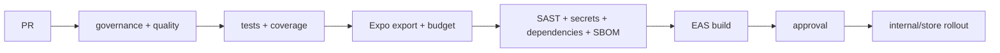

# DevSecOps, CI/CD Y GitHub Mobile

## Pipeline

## Velocidad sin perder controles

- jobs independientes para quality, security y export;
- cachés con lockfile y cancelación de PR obsoleto;
- filtros de paths solo si no omiten contratos/tooling compartido;
- EAS `--no-wait` entrega build ID y libera runner;
- matriz extensa de dispositivos nocturna, smoke crítico en PR/main;
- construir una vez por commit/perfil y promover el mismo artefacto.

## Workflows reutilizables

`platform-actions` ofrece CI Expo, EAS build y security. Un consumidor fija el reusable workflow a
SHA publicado; jamás apunta a cambios locales no publicados. `working-directory` permite monorepos,
pero la instalación ocurre explícitamente dentro de la app.

## Seguridad GitHub

- `permissions` por job y `persist-credentials: false`.
- OIDC para cloud; tokens de store/EAS en environment secrets.
- Actions por SHA, actionlint y política propia.
- Expresiones no confiables pasan por `env`, nunca se interpolan en shell.
- Production environment requiere reviewers y evita self-approval según gobierno.

## Estrategia por evento

| Evento | Resultado |
|---|---|
| PR | quality, tests, export y security; sin distribución |
| main | development/test build según política |
| promoción | staging/production con approval |
| schedule | security y matriz E2E ampliada |

## Evidencia

Coverage, SBOM, SARIF, export, build ID, commit SHA y perfil tienen retención definida. Logs no
contienen secrets. Jira recibe transición/comentario solo después del estado real, no por anticipado.

## Rollback

OTA, backend y binary store tienen caminos distintos. La release registra runtime compatible,
versión anterior, responsable y criterio de abortar rollout.

## Definition of Done

Workflow validado con actionlint, reusable publicado a SHA, branch/environment protections activas y
al menos una ejecución real con artefactos antes de declararlo operativo.
