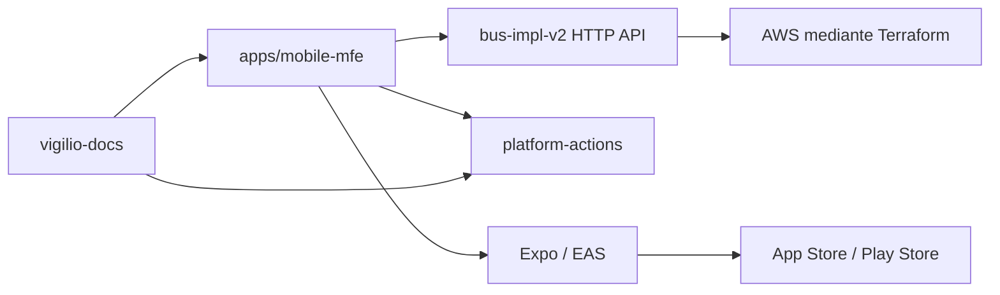

# Documentación Arquitectónica Frontend Mobile MFE 2026

Guía canónica para aplicaciones móviles con Expo SDK 56, React Native 0.85, React 19.2, Expo
Router, NativeWind 4, TanStack Query 5, Preact Signals, React Hook Form, Zod, Jest y Maestro.
`apps/mobile-mfe` es la referencia ejecutable; esta sección define las decisiones que deben
mantenerse al crear una aplicación real.

## Fuentes de verdad

1. Contratos HTTP y OpenAPI publicados por el backend.
2. Código y pruebas de la aplicación consumidora.
3. Workflows reutilizables fijados a SHA en `platform-actions`.
4. ADR, threat model y estas guías.

Una captura, un diagrama o una afirmación de “producción” no reemplaza evidencia ejecutable.

## Qué significa MFE en mobile

`mobile-mfe` describe una plantilla modular por dominios y ownership. No implica Module Federation
en runtime ni descargar JavaScript arbitrario desde otros equipos. Una sola app nativa mantiene un
shell, navegación y binario firmados; las features se aíslan mediante APIs públicas, contratos y
límites de dependencia. Un super-app con módulos nativos separados necesita un ADR específico.

## Relación entre proyectos

Terraform, Kubernetes, S3, colas y bases de datos pertenecen a backend/plataforma. La app consume
contratos; no contiene credenciales cloud ni administra infraestructura.

## Índice canónico

1. [Contratos, Zod, formularios y TanStack](./1-contratos-zod-formularios-tanstack.md)
2. [Skills, agentes, OpenSpec y DevSecOps](./2-skills-agentes-openspec-devsecops.md)
3. [Arquitectura, estructura, estado y navegación](./3-arquitectura-estructura-estado-navegacion.md)
4. [Flujo local, entornos y runtime config](./4-flujo-local-entornos-runtime-config.md)
5. [HTTP, autenticación, deep links y uploads](./5-http-auth-deep-links-uploads.md)
6. [Golden path de una feature mobile](./6-golden-path-feature-mobile.md)
7. [Testing con Jest, RNTL y Maestro](./7-testing-jest-rntl-maestro.md)
8. [Accesibilidad, rendimiento y calidad nativa](./8-accesibilidad-rendimiento-calidad.md)
9. [Seguridad, hardening y privacidad](./9-seguridad-hardening-privacidad.md)
10. [Observabilidad mobile, SLI y SLO](./10-observabilidad-mobile-sli-slo.md)
11. [Tooling, pnpm, Biome y supply chain](./11-tooling-pnpm-biome-supply-chain.md)
12. [DevSecOps, CI/CD y GitHub](./12-devsecops-cicd-github.md)
13. [EAS, tiendas, OTA y FinOps](./13-eas-stores-ota-finops.md)
14. [Gobierno, releases y ownership](./14-gobierno-releases-ownership.md)
15. [Evaluación, roadmap y operación](./15-evaluacion-roadmap-operacion.md)
16. [Design system, NativeWind y tokens](./16-design-system-nativewind-tokens.md)
17. [Scaffold de una aplicación mobile](./17-scaffold-app-feature.md)

## Owners

- Mobile Platform: toolchain, Expo/EAS, navegación raíz y observabilidad.
- Feature teams: dominio, UX, contratos, pruebas y runbook de su feature.
- Backend: compatibilidad de contratos, auth y políticas de upload.
- Security/SRE: controles, privacidad, SLO y respuesta a incidentes.

## Regla principal

Una plantilla local puede demostrar ingeniería, pero solo se declara operativa después de compilar
binarios firmados, ejecutar recorridos Maestro en dispositivos representativos, comprobar telemetría
y ensayar rollback de build/OTA con evidencia.
