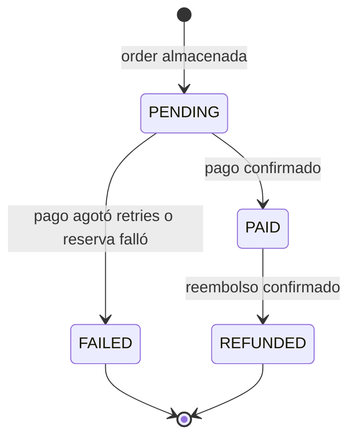

# MASTER PROMPT — Deterministic Spec-Driven Agentic Software Factory + OpenSpec + Agent Skills/Plugins (Senior 2026)

> **ESTADO:** Arquitectura objetivo 2026 — single repository por defecto y perfiles federados materializados. `{{BACKEND}}` + `{{FRONTEND}}` forman la línea Kubernetes v2; la pareja activa actual permanece separada. Sus nombres físicos se configuran una sola vez en la tabla de identidad.
>
> **REVISIÓN:** 2026-08-09 — materializa `web-mfe-v2` para `bus-impl-v2`, corrige la identidad de la pareja actual `web-mfe` + `bus-impl`, alinea delivery v2 con OCI/ECR/EKS/Terraform/Helm/GitOps y conserva la matriz version-aware, Prompt Builder y Execution Runner sin afirmar evidencia no ejecutada.
>
> **OBJETIVO:** Este documento define cómo debe organizarse, documentarse, evolucionar, verificarse y operar un proyecto de software asistido por agentes de IA sin permitir que el agente improvise arquitectura, contratos, seguridad, observabilidad o reglas de negocio.
>
> **PRINCIPIO CENTRAL:** La IA NO es la fuente de verdad. La fuente de verdad se reparte de forma explícita entre documentación estable, OpenSpec, contratos ejecutables, migraciones y tests.
>
> **MODELO OPERATIVO BASE:** `reglas estables → OpenSpec change → prompt-pack → skills → implementación → Quality Gauntlet → evidence → sync → archive`.
>
> **MODELO OPERATIVO TARGET DE FACTORY:** `reglas estables → OpenSpec change → prompt-pack/DAG → Capability Resolver → Prompt Builder → prompts pequeños + locks → Execution Runner → coding agent → Quality Gauntlet → evidence → desbloqueo de dependencias → sync/archive`. Una orden humana puede iniciar un plan grande, pero el agente nunca debe recibir el producto completo como un único mega-prompt.
>
> **ALCANCE:** En greenfield, proyecto clásico con un único repositorio que contiene `apps/backend/`, `apps/frontend/`, `infra/`, `contracts/`, `docs/`, `openspec/`, tooling y skills. No usar Nx/Turborepo por defecto. En brownfield federado, conservar `{{BACKEND}}` y `{{FRONTEND}}` como repositorios independientes, coordinar el mismo change de producto mediante IDs, versiones y contratos ejecutables, y no fingir que existe una transacción Git atómica entre repositorios.
>
> **REGLA ANTI-HUMO:** Nunca documentar como "implementado", "probado", "seguro", "observable", "cacheado", "idempotente", "tolerante a fallos" o "listo para producción" algo que no tenga código/configuración ejecutable + test/evidencia verificable.

> **ESTADO DE CAPABILITIES DE FACTORY:** Este master describe arquitectura objetivo y contratos de operación; NO es evidencia de que cada capability exista en runtime. `CURRENT` exige archivo/código/config ejecutable + tests/evidence en el repositorio real. `TARGET` describe el diseño aprobado. `GAP` significa que el target aún no tiene implementación verificable. `NOT_APPLICABLE` se usa cuando una capability no corresponde a esa topología.
>
> **REGLA DE ADOPCIÓN INCREMENTAL:** `Prompt Builder`, Agent Plugins, Capability Resolver y Execution Runner deben poder migrar por etapas. Nunca mantener dos fuentes canónicas manuales para la misma skill, dos Prompt Builders activos ni dos execution plans mutables para la misma ejecución.


---

# CONFIGURACIÓN TECNOLÓGICA CENTRALIZADA — VARIABLES OBLIGATORIAS

> **OBJETIVO:** Ninguna regla del resto de este documento debe depender de escribir una tecnología concreta en múltiples lugares. La tecnología concreta se declara **una sola vez** en esta tabla y el resto del prompt usa `{{VARIABLES}}`.
>
> **REGLA:** Para cambiar stack, proveedor o librería, modificar primero esta tabla/configuración y después regenerar/resolver el prompt. No hacer búsqueda/reemplazo manual por todo el documento.
>
> **NO VARIABLEIZAR:** OpenSpec, `openspec/`, `docs/rules`, ADR, runbooks, IDs `BR-*` / `EP-*` / `SEC-*` / `OBS-*`, nombres conceptuales como bounded context, use case, outbox, idempotencia, SLO o Quality Gauntlet. Esos elementos son parte del método/arquitectura, no una elección tecnológica intercambiable.

## Variables de identidad/topología del producto

> **REGLA:** Los nombres físicos de repositorios/aplicaciones son configuración, no arquitectura. El resto del master DEBE usar estas variables y no repetir nombres concretos. Cambiar el nombre de un repositorio se resuelve aquí + en manifests/CI reales; no mediante search/replace por todo el documento.

| Variable | Valor base 2026 | Qué representa / dónde se usa |
|---|---|---|
| `{{BACKEND}}` | `bus-impl-v2` | Nombre/root físico del repositorio o target backend. Puede cambiar sin renombrar conceptos de dominio ni skills. |
| `{{FRONTEND}}` | `web-mfe-v2` | Frontend/backoffice materializado para `{{BACKEND}}`, con manifest, lockfile, OpenSpec, tests, runtime OCI y CI propios. |
| `{{CURRENT_BACKEND}}` | `bus-impl` | Backend de la pareja activa actual; no participa en el perfil K8s v2. |
| `{{CURRENT_FRONTEND}}` | `web-mfe` | Frontend de la pareja activa actual; no renombrar ni modificar como atajo para construir `{{FRONTEND}}`. |
| `{{FACTORY_CONTROL_PLANE}}` | `platform-actions` | Owner lógico/físico de Agent Plugins, capability catalog, Prompt Builder, Execution Runner, adapters, governance y CI/CD compartido. |

### Regla de identidad vs capability

```text
{{BACKEND}} / {{FRONTEND}} / {{CURRENT_BACKEND}} / {{CURRENT_FRONTEND}}
= identidad física configurable del target

node-nest-* / web-mfe-* / shared-technologies
= IDs estables de capabilities/skills

vigilio-node-nest / vigilio-web-mfe / vigilio-engineering-core
= IDs versionados de Agent Plugins
```

Renombrar el target físico de `{{FRONTEND}}` **NO** autoriza renombrar automáticamente `web-mfe-build-feature`, `web-mfe-technologies` o el plugin `vigilio-web-mfe`; esos IDs tienen versionado propio y solo cambian mediante migración deliberada.

## Tabla única de variables de tecnología y versiones

> **POLÍTICA DE VERSIONES:** Esta tabla define la línea/pin base aprobada por arquitectura. El patch realmente instalado SIEMPRE se verifica contra `package.json`, `pnpm-lock.yaml`, runtime/container/toolchain y exports/types del paquete. Un valor escrito aquí no es evidencia de instalación.
>
> **PRECEDENCIA:** `lockfile/resolution real → package.json → runtime/toolchain ejecutable → exports/.d.ts → documentación oficial de la versión → technology-awareness skill → este master → memoria del modelo`.
>
> **FAIL CLOSED:** Si el pin declarado y la resolución real difieren, usar `STACK_VERSION_MISMATCH`; si la API no corresponde a esa versión, `STACK_API_MISMATCH`; si existen varias APIs válidas y el repo debe decidir, `STACK_REVIEW_REQUIRED`. El agente NO actualiza dependencias como efecto lateral de implementar una feature.

| Variable | Tecnología / valor base | Versión / pin base 2026 | Qué representa / dónde se usa |
|---|---|---|---|
| `{{LANGUAGE}}` | `TypeScript` | `7.0.2` | Lenguaje principal compartido por frontend/backend/tooling. El typecheck semántico pertenece a TypeScript, no a Vite/Biome/tsx. |
| `{{LANGUAGE_STRICT_MODE}}` | `TypeScript strict` | `7.0.2` | Política de compilación/tipado estricto del backend, frontend y tooling crítico. |
| `{{BACKEND_RUNTIME}}` | `Node.js` | `24 LTS` (`24.x` exacto desde runtime/container/toolchain) | Runtime del backend, workers y tooling TypeScript. No inferir un patch inexistente desde documentación narrativa. |
| `{{BACKEND_FRAMEWORK}}` | `NestJS` | `11` / línea `11.1.x`; patch exacto desde lockfile | Framework HTTP/application del backend. No generar semántica de NestJS 10/Express 4 por memoria. |
| `{{SCHEMA_VALIDATION}}` | `Zod` | `4.4.3` | Schemas runtime, validación, inferencia y contratos internos. Usar APIs Zod 4; bloquear patrones v3-only/deprecados. |
| `{{BACKEND_VALIDATION_ADAPTER}}` | `nestjs-zod` | exacto desde `{{BACKEND}}` lockfile | Integración Zod/NestJS. La skill backend determina APIs válidas para la versión resuelta. |
| `{{ORM}}` | `Drizzle ORM` | exacto desde `{{BACKEND}}` lockfile | Persistencia/query builder. No mezclar APIs de Drizzle 1.0 RC con una línea estable distinta. |
| `{{DATABASE_ENGINE}}` | `PostgreSQL` | `17.x` | Motor SQL y semántica relacional base. |
| `{{DATABASE}}` | `PostgreSQL administrado por plataforma` | `17.x`; servicio exacto por ambiente | Servicio/runtime concreto. No afirmar Aurora/RDS si la plataforma ejecutable no lo demuestra. |
| `{{DATABASE_PROXY}}` | `No asumido` | `N/A` | Proxy/pooling solo si la plataforma y concurrencia lo justifican con evidencia. |
| `{{CACHE_ENGINE}}` | `Valkey` | exacto desde plataforma/lockfile cuando exista | Cache solo con port + adapter + infra + tests. |
| `{{BACKEND_RUNTIME_CACHE_SERVICE}}` | `ElastiCache for Valkey` | servicio administrado; engine/version desde IaC real | Runtime administrado de cache cuando `{{CACHE_ENGINE}}` está realmente adoptado. |
| `{{API_CONTRACT_STANDARD}}` | `OpenAPI` | `3.1` | Contrato HTTP ejecutable/generable. No auto-migrar a otra revisión del estándar sin change/ADR. |
| `{{CONTRACT_PACKAGE}}` | `@vigilioyonatan/bus-v2-contracts` | versión exacta publicada/consumida por release | Paquete browser-safe publicado por `{{BACKEND}}`; `{{FRONTEND}}` consume exactamente owner/nombre/versión compatibles. |
| `{{CONTRACT_OWNER_REPO}}` | `{{BACKEND}}` | identidad configurable | Repositorio owner de schemas/DTO request-response/export OpenAPI. |
| `{{CONTRACT_CONSUMER_REPO}}` | `{{FRONTEND}}` | identidad configurable | Repositorio consumidor; valida `unknown` en boundary HTTP y no duplica DTOs. |
| `{{CURRENT_CONTRACT_PACKAGE}}` | `@vigilioyonatan/bus-contracts` | versión exacta de la línea actual | Package de `{{CURRENT_BACKEND}}` consumido solo por `{{CURRENT_FRONTEND}}`; nunca enlazarlo a la línea v2. |
| `{{API_DOCS_UI}}` | `Scalar` | exacto desde `{{BACKEND}}` lockfile | UI de documentación/exploración; nunca sustituye OpenAPI. |
| `{{LOGGING_LIBRARY}}` | `Pino` | exacto desde `{{BACKEND}}` lockfile | Logging estructurado/redaction; no inventar adapter/transport. |
| `{{TELEMETRY_STANDARD}}` | `OpenTelemetry` | paquetes exactos desde `{{BACKEND}}` lockfile | Traces/metrics/context propagation solo cuando la instrumentación existe. |
| `{{UNIT_TEST_FRAMEWORK}}` | `Vitest` | `4.1.10` | Unit/integration TypeScript. Coverage package debe corresponder a la misma línea. |
| `{{E2E_TEST_FRAMEWORK}}` | `Playwright` | `1.62.1` declarado; verificar lockfile | E2E browser/API según riesgo/scope. |
| `{{API_MOCKING_LIBRARY}}` | `MSW` | `2.15.0` | Mocking HTTP para component/integration tests frontend. |
| `{{FRONTEND_BUILD_TOOL}}` | `Vite` | `8.2.1` declarado; verificar resolución real | Build/dev server del frontend. No usar APIs Vite 5/6/7 por memoria. |
| `{{FRONTEND_FRAMEWORK}}` | `Preact` | `10.29.8` declarado; verificar resolución real | Framework UI principal. |
| `{{FRONTEND_REACT_COMPAT}}` | `react`/`react-dom` → `@preact/compat` | alias `18.3.2` declarado | Compatibilidad con ecosistema React sin cambiar Preact como runtime UI. |
| `{{FRONTEND_ROUTER}}` | `wouter-preact` | `3.10.0` | Routing SPA. |
| `{{FRONTEND_SIGNALS}}` | `@preact/signals` | `2.11.0` declarado; verificar resolución real | Estado reactivo local/derivado. |
| `{{FORM_LIBRARY}}` | `react-hook-form` | `7.85.0` declarado; verificar resolución real | Estado de formularios complejos. |
| `{{FORM_RESOLVER}}` | `@hookform/resolvers` | `5.7.1` declarado; verificar resolución real | Bridge RHF ↔ Zod. No asumir API si el lockfile difiere. |
| `{{SERVER_STATE_LIBRARY}}` | `@tanstack/react-query` | `5.101.4` | Server state, cache, queries, mutations e invalidation. |
| `{{FRONTEND_TABLE_LIBRARY}}` | `@tanstack/react-table` | `9.1.1` declarado; `STACK_REVIEW_REQUIRED` hasta confirmar adapter/API real | Tablas/data-grid headless. No mezclar automáticamente ejemplos v8/v9 ni React/Preact adapters. |
| `{{FRONTEND_LOCAL_STATE_LIBRARY}}` | `zustand` | `5.0.14` | Estado cliente compartido solo cuando Signals/URL/Query no son el owner correcto. |
| `{{TOAST_LIBRARY}}` | `sonner` | `2.0.7` | Toast/feedback no bloqueante. |
| `{{CSS_FRAMEWORK}}` | `Tailwind CSS` | `4.3.3` | Utility CSS/tokens; usar flujo v4 y no configuración v3 por memoria. |
| `{{CSS_VITE_PLUGIN}}` | `@tailwindcss/vite` | `4.3.3` | Integración Tailwind v4 con Vite. |
| `{{PACKAGE_MANAGER}}` | `pnpm` | exacto desde `packageManager`/Corepack del repo | Instalación, workspaces y scripts. El master no inventa el patch. |
| `{{PACKAGE_MANAGER_WORKSPACE_FILE}}` | `pnpm-workspace.yaml` | formato del package manager instalado | Descriptor workspace. |
| `{{LINTER_FORMATTER}}` | `@biomejs/biome` | `2.5.7` declarado; verificar resolución real | Lint + format de JS/TS/JSON. No reemplaza TypeScript typecheck. |
| `{{TYPESCRIPT_RUNNER}}` | `tsx` | `4.23.11` declarado; verificar resolución real | Ejecución rápida de scripts TS; no es typechecker. |
| `{{WEB_VITALS_LIBRARY}}` | `web-vitals` | `6.1.0` declarado; verificar resolución real | RUM/Web Vitals cuando la feature/observabilidad frontend lo requiera. |
| `{{AGENT_SKILL_FORMAT}}` | `Agent Skills` | spec/formato resuelto por herramienta instalada | Formato `SKILL.md`; referencias extensas viven en `references/` y se cargan por progressive disclosure. |
| `{{AGENT_PLUGIN_SPEC}}` | `Agent Plugins` | `1.0.0 — Working Draft` | Packaging portable de custom skills y MCP opcional. Aislar detrás de adapters/resolver; no convertir el Working Draft en core semantic dependency. |
| `{{CODE_INTELLIGENCE_PROVIDER}}` | `codebase-memory-mcp` | versión exacta desde MCP config/binario instalado; opcional hasta evidencia real | Knowledge graph de repositorio/símbolos/call graph para orientación, búsqueda, trazado e impacto. No es source of truth ni requisito universal. |
| `{{CLOUD_PROVIDER}}` | `AWS` | servicios administrados; no semver global | Cloud principal; los servicios concretos se versionan/configuran en IaC cuando corresponde. |
| `{{IAC_TOOL}}` | `por superficie` | ver `{{BACKEND_IAC_TOOL}}` / `{{FRONTEND_IAC_TOOL}}` | Está prohibido asumir un único IaC para todas las superficies. |
| `{{BACKEND_COMPUTE_RUNTIME}}` | `Kubernetes / Amazon EKS` | cluster/Kubernetes exactos desde IaC y runtime real | Runtime de API, worker y migraciones de `{{BACKEND}}`. |
| `{{BACKEND_IAC_TOOL}}` | `Terraform/OpenTofu + Helm/GitOps` | versiones exactas desde toolchain/repositorio de plataforma | IaC y delivery backend. No inventar CDK/Lambda dentro de `{{BACKEND}}`. |
| `{{FRONTEND_IAC_TOOL}}` | `Terraform/OpenTofu + Helm/GitOps` | versiones exactas desde `/infra` y `/deploy` | IaC/delivery ejecutable de `{{FRONTEND}}`; no crear CDK paralelo. |
| `{{FRONTEND_DELIVERY_RUNTIME}}` | `OCI distroless + Amazon ECR + Kubernetes/EKS` | digest inmutable + runtime Node mínimo | Hosting/entrega del artefacto Vite de `{{FRONTEND}}`. |
| `{{DNS_SERVICE}}` | `Amazon Route 53` | servicio administrado | DNS público. |
| `{{CDN_SERVICE}}` | `Amazon CloudFront` | servicio administrado | CDN/edge caching. |
| `{{WAF_SERVICE}}` | `AWS WAF` | servicio administrado | Web Application Firewall. |
| `{{API_GATEWAY}}` | `No asumido; ingress/gateway confirmado por plataforma` | `N/A` hasta evidencia | Entrada HTTP pública. No declarar API Gateway por reflejo en un backend EKS. |
| `{{SERVERLESS_HTTP_ADAPTER}}` | `No aplicable al perfil EKS` | `N/A` | Solo para perfil Lambda explícito. |
| `{{COMPUTE_RUNTIME}}` | alias de `{{BACKEND_COMPUTE_RUNTIME}}` | misma versión resuelta | Compatibilidad con templates antiguos. |
| `{{ASYNC_COMPUTE}}` | worker del mismo artefacto/repositorio backend | runtime `{{BACKEND_RUNTIME}}` | Worker asíncrono cuando existe; no crear Lambda/repo ficticio. |
| `{{OBJECT_STORAGE}}` | `Amazon S3` | servicio administrado | Object storage privado + presigned URLs. |
| `{{SECRETS_SERVICE}}` | `AWS Secrets Manager / SSM Parameter Store` | servicio administrado | Secrets/configuración sensible. |
| `{{KMS_SERVICE}}` | `AWS KMS` | servicio administrado | Key management/encryption cuando aplique. |
| `{{EVENT_BUS}}` | `Amazon EventBridge` | servicio administrado | Event bus para integración/async real. |
| `{{QUEUE_SERVICE}}` | `Amazon SQS` | servicio administrado | Cola asíncrona. |
| `{{DLQ_MECHANISM}}` | `Amazon SQS DLQ` | servicio administrado | Dead-letter queue + replay/runbook. |
| `{{OBSERVABILITY_BACKEND}}` | `Amazon CloudWatch` | servicio administrado | Backend operacional de logs/métricas/alarmas AWS. |
| `{{WORKFLOW_ORCHESTRATOR}}` | `AWS Step Functions` | servicio administrado | Workflows externos largos; no reemplaza transacción local. |
| `{{STREAMING_PLATFORM}}` | `Amazon MSK / Apache Kafka` | versión exacta solo tras ADR/IaC | Streaming/replay/ordering; nunca default. |
| `{{CLOUD_SDK}}` | `AWS SDK for JavaScript` | `v3`; package/client patch exacto desde `{{BACKEND}}` lockfile | SDK cloud modular; AWS SDK JS v2 está prohibido para código nuevo. |

### Pins frontend suministrados y verificación obligatoria

Los pins exactos anteriores son el baseline candidato para `{{FRONTEND}}`; mientras el target no tenga manifest/lockfile propios no son versiones instaladas. Al materializarlo deben validarse contra registry, resolución real y exports. Algunas versiones pueden adelantarse al tag público observado; en ese caso el agente detiene la integración con `STACK_VERSION_MISMATCH`/`STACK_REVIEW_REQUIRED`, sin degradar ni actualizar silenciosamente.

### Technology-awareness skills obligatorias

```text
shared-technologies
  → TypeScript / Node shared tooling / pnpm / Zod / Vitest / Playwright / Biome / tsx / contracts / version policy

node-nest-technologies
  → NestJS / nestjs-zod / Drizzle / PostgreSQL / Pino / OTel / AWS backend integration

web-mfe-technologies
  → Preact / compat / Signals / Query / Table / RHF / Zustand / Tailwind / Vite / MSW / delivery por perfil
```

El Prompt Builder resuelve solo las technology skills aplicables y deduplica `shared-technologies` por path/hash. Estas skills son **firewalls de conocimiento obsoleto**, no permiso para auto-upgrade.

## Regla de resolución

Todo ejemplo, template, skill propia o documento generado por este master prompt DEBE preferir la variable sobre el nombre concreto:

```text
✅ {{BACKEND}}
✅ {{FRONTEND}}
✅ {{DATABASE}}
✅ {{BACKEND_FRAMEWORK}}
✅ {{FRONTEND_FRAMEWORK}}
✅ {{QUEUE_SERVICE}}

❌ nombres físicos de repositorios repetidos fuera de la tabla de identidad
❌ Aurora PostgreSQL Serverless v2 escrito repetidamente
❌ NestJS 11 escrito repetidamente
❌ Preact escrito repetidamente
❌ Amazon SQS escrito repetidamente
```

La tabla anterior es la **única configuración humana de defaults tecnológicos** del master prompt.

Si una variable cambia:

```text
{{DATABASE}} = "PostgreSQL administrado X"
```

el resto de reglas siguen hablando de `{{DATABASE}}` y no requieren edición masiva.

## Variables conceptuales vs. tecnológicas

No confundir:

```text
{{DATABASE}}
= tecnología configurable

transaction boundary
= regla arquitectónica

{{QUEUE_SERVICE}}
= tecnología configurable

idempotencia / retry / DLQ semantics
= reglas de resiliencia

{{FRONTEND_FRAMEWORK}}
= tecnología configurable

loading/error/empty/success + a11y
= requerimientos de producto/calidad
```

Cambiar una tecnología **NO autoriza** cambiar las invariantes arquitectónicas sin ADR/OpenSpec cuando el impacto sea material.

## Compatibilidad de variables

Antes de aceptar un cambio de variable, verificar compatibilidad entre variables relacionadas. Ejemplos:

```text
{{BACKEND_FRAMEWORK}} ↔ {{BACKEND_VALIDATION_ADAPTER}}
{{DATABASE_ENGINE}} ↔ {{ORM}} ↔ {{DATABASE}}
{{FRONTEND_FRAMEWORK}} ↔ {{FRONTEND_ROUTER}} ↔ {{FRONTEND_SIGNALS}}
{{CLOUD_PROVIDER}} ↔ {{IAC_TOOL}} ↔ servicios cloud concretos
{{API_CONTRACT_STANDARD}} ↔ generación de tipos frontend / contract tests
{{CONTRACT_OWNER_REPO}} ↔ {{CONTRACT_PACKAGE}} ↔ {{CONTRACT_CONSUMER_REPO}}
{{BACKEND_COMPUTE_RUNTIME}} ↔ {{BACKEND_IAC_TOOL}}
{{FRONTEND_BUILD_TOOL}} ↔ {{FRONTEND_IAC_TOOL}} ↔ {{FRONTEND_DELIVERY_RUNTIME}}
```

No asumir que cambiar `{{CLOUD_PROVIDER}}` de `AWS` a otro proveedor convierte automáticamente `{{API_GATEWAY}}`, `{{QUEUE_SERVICE}}`, `{{OBJECT_STORAGE}}`, etc. Deben cambiarse explícitamente las variables de servicio y validarse mediante ADR/diseño cuando corresponda.

### Perfil objetivo `k8s-v2`: `{{BACKEND}}` + `{{FRONTEND}}`

Este perfil prevalece sobre ejemplos genéricos. `{{BACKEND}}` tiene evidencia ejecutable; `{{FRONTEND}}` es greenfield explícito hasta materializarse:

```yaml
profile: k8s-v2
topology: federated-mixed-current-target
backend_repo: "{{BACKEND}}"
frontend_repo: "{{FRONTEND}}"
backend_state: CURRENT
frontend_state: CURRENT
backend_runtime: Kubernetes/EKS
backend_iac: Terraform/OpenTofu + Helm/GitOps externo
frontend_runtime: Vite/Preact
frontend_iac: Terraform/OpenTofu + Helm/GitOps compartido
frontend_delivery: OCI/ECR + Kubernetes/EKS
contract_owner: "{{CONTRACT_OWNER_REPO}}"
contract_package: "{{CONTRACT_PACKAGE}}"
```

Perfil coexistente que este master debe preservar y nunca cruzar:

```yaml
profile: current-web
backend_repo: "{{CURRENT_BACKEND}}"
frontend_repo: "{{CURRENT_FRONTEND}}"
contract_package: "{{CURRENT_CONTRACT_PACKAGE}}"
mutation_policy: preserve-unless-a-separate-change-targets-it
```

Gate obligatorio de compatibilidad:

1. El `name` de `packages/contracts/package.json` del owner debe coincidir con la dependencia instalada por el consumer de la misma fila.
2. Desarrollo local puede usar `link:` al owner correcto; CI/release usa versión exacta publicada.
3. `{{FRONTEND}}` solo puede consumir `{{CONTRACT_PACKAGE}}` desde `{{BACKEND}}`; `{{CURRENT_FRONTEND}}` solo puede consumir `{{CURRENT_CONTRACT_PACKAGE}}` desde `{{CURRENT_BACKEND}}`.
4. Cualquier cruce entre filas es `BLOCKED: CONTRACT_OWNER_MISMATCH`; no declarar compatibilidad ni intentar resolverlo cambiando el frontend actual.
5. Si un futuro frontend todavía no existe, registrar `TARGET_NOT_MATERIALIZED` y generar primero los packs de scaffold/toolchain/contrato. No falsear un check sobre `{{CURRENT_FRONTEND}}`.
6. El package browser-safe no importa NestJS, Swagger, `nestjs-zod`, Node built-ins ni side effects backend.
7. OpenAPI export/diff y pruebas contractuales deben pasar antes de promover ambas releases.

---

# 0. Resultado que debe conseguir esta arquitectura

La arquitectura debe permitir que un humano o un agente diga:

```text
Implementar: identity.users-store
Cambio OpenSpec: add-user-registration
```

y que el sistema pueda resolver automáticamente:

```text
1. Constitución global
2. Arquitectura global
3. Seguridad global
4. Observabilidad global
5. Quality policy
6. Delivery policy
7. Reglas de migración y compatibilidad
8. Diseño estable del módulo Identity
9. Modelo de dominio Identity
10. Slice de datos de users-store
11. Reglas de negocio users-store
12. Endpoints users-store
13. Pages users-store si aplica
14. Events users-store si aplica
15. Tests users-store
16. Operations users-store si aplica
17. Spec vigente OpenSpec
18. Proposal/delta specs/design/tasks del change activo
19. Skills técnicas requeridas
20. Allowed paths / forbidden paths
21. Quality gates obligatorios
```

El agente NO debe recorrer toda la documentación "a ver qué encuentra".

Debe recibir un contexto:

- explícito;
- determinístico;
- reproducible;
- versionado;
- validable;
- con presupuesto de contexto;
- con hashes;
- limitado al scope del cambio.

---

# 1. Reglas de oro

## 1.1 Fuente de verdad por responsabilidad

| Responsabilidad | Fuente principal |
|---|---|
| Reglas organizacionales/arquitectónicas estables | `docs/rules/00-global/` |
| Diseño estable de un bounded context | `docs/rules/01-modules/<module>/` |
| Reglas estables de un caso de uso | `docs/rules/01-modules/<module>/use-cases/<use-case>/` |
| Comportamiento vigente observable | `openspec/specs/` |
| Cambio temporal en progreso | `openspec/changes/<change>/` |
| Modelo ejecutable de DB | schemas ORM + {{DATABASE_ENGINE}} constraints + migrations |
| Contrato HTTP ejecutable | {{API_CONTRACT_STANDARD}} generado + contract tests |
| Contrato asíncrono ejecutable | schema versionado del evento + consumer/provider tests |
| Implementación | código |
| Evidencia | tests + reports + telemetry + deployment evidence |
| Historia de cambios | Git + `openspec/changes/archive/` |
| Decisión arquitectónica importante | ADR |

### Nunca crear dos fuentes de verdad manuales para lo mismo.

Ejemplo:

```text
business.md
= intención y reglas

spec.md
= comportamiento verificable

{{API_CONTRACT_STANDARD}}
= contrato HTTP ejecutable

controller/service/repository
= implementación

tests
= evidencia
```

No copiar la misma estructura completa en todos.

---

## 1.2 Arquitectura runtime base

El runtime se resuelve por superficie; no mezclar el delivery web con el compute backend:

```text
Browser
  ↓
{{DNS_SERVICE}} → {{CDN_SERVICE}} / {{WAF_SERVICE}}
  ↓
artefacto {{FRONTEND_BUILD_TOOL}} en {{FRONTEND_DELIVERY_RUNTIME}}
  ↓ HTTPS + contrato {{CONTRACT_PACKAGE}}
ingress/gateway confirmado por plataforma
  ↓
{{BACKEND_FRAMEWORK}} Modular Monolith en {{BACKEND_COMPUTE_RUNTIME}}
  ├─ API
  ├─ worker asíncrono del mismo repositorio/artefacto
  └─ migraciones controladas
  ↓
{{DATABASE}}
```

IaC:

```text
{{FRONTEND}}      → {{FRONTEND_IAC_TOOL}}
{{BACKEND}}  → {{BACKEND_IAC_TOOL}}
```

Un perfil alternativo Lambda puede usar `{{API_GATEWAY}}` + `{{SERVERLESS_HTTP_ADAPTER}}`, pero solo si el repositorio y la infraestructura ejecutable lo confirman. No es el default del perfil EKS.

Servicios complementarios solo cuando exista necesidad real:

```text
{{OBJECT_STORAGE}} privado + presigned URLs
{{SECRETS_SERVICE}}
{{KMS_SERVICE}}
{{IAC_TOOL}}
{{EVENT_BUS}}
{{QUEUE_SERVICE}} + {{DLQ_MECHANISM}}
{{ASYNC_COMPUTE}}
{{TELEMETRY_STANDARD}}
{{OBSERVABILITY_BACKEND}}
{{DATABASE_PROXY}} si la concurrencia lo justifica
{{BACKEND_RUNTIME_CACHE_SERVICE}} ({{CACHE_ENGINE}}) únicamente si existe port + adapter + infra + tests
{{WORKFLOW_ORCHESTRATOR}} únicamente para workflows externos largos
{{STREAMING_PLATFORM}} únicamente mediante ADR y necesidad de streaming/replay/partition ordering
```

## 1.3 Monolito modular

Reglas:

1. Un backend deployable principal.
2. Una base {{DATABASE_ENGINE}} principal.
3. Separación por módulos/bounded contexts.
4. Cada módulo es dueño de sus tablas.
5. Ningún módulo importa directamente el repository/adapter de otro módulo.
6. Comunicación síncrona interna mediante application ports/services tipados.
7. Operaciones locales atómicas mediante una transacción {{DATABASE_ENGINE}}.
8. Outbox/{{EVENT_BUS}}/{{QUEUE_SERVICE}} únicamente para asincronismo real.
9. Consumers asíncronos deben ser idempotentes.
10. Circuit breaker únicamente para dependencias remotas/externas.
11. `shared/` solo para infraestructura técnica agnóstica de dominio.
12. No introducir una tecnología por moda.

### Ejemplo correcto

```text
OrderApplicationService
        ↓
CatalogStockPort.reserve(...)
        ↓
Catalog application service
        ↓
misma transacción {{DATABASE_ENGINE}}
```

### Ejemplo incorrecto

```text
Order
  ↓ HTTP interno
Catalog

Order
  ↓ {{QUEUE_SERVICE}} innecesario
Catalog
```

si ambos viven en el mismo proceso y la operación debe ser atómica.

---

# 2. Estructura completa del proyecto

La arquitectura separa dos planos:

```text
PRODUCT / RUNTIME PLANE
= apps + contracts + OpenSpec + docs + infra + deploy + docker

FACTORY / CONTROL PLANE
= {{FACTORY_CONTROL_PLANE}}
  ├─ Agent Plugins / Skills
  ├─ capability resolution
  ├─ Prompt Builder
  ├─ Execution Runner
  ├─ agent adapters
  ├─ governance
  └─ CI/CD compartido
```

`generated/` queda fuera del control plane porque contiene artefactos de una ejecución concreta del producto/factory: prompts, locks, runs y evidence. Nunca es source of truth manual.

### 2.0 Regla de topología física

El árbol siguiente es una **vista lógica objetivo**. La co-localización de carpetas no prueba que exista un único repositorio Git. Antes de planificar, el tooling debe detectar los Git roots reales. Si `{{BACKEND}}`, `{{FRONTEND}}`, `infra/deploy` o `{{FACTORY_CONTROL_PLANE}}` son repositorios independientes, conservar sus commits, PRs, lockfiles, CI, evidence y rollback por separado; no fingir atomicidad cross-repo.

```text
project-or-workspace/
├── AGENTS.md
├── package.json
├── {{PACKAGE_MANAGER_WORKSPACE_FILE}}
├── biome.json
├── tsconfig.base.json
│
├── apps/
│   ├── {{BACKEND}}/                       # backend/API/negocio/persistencia/workers cuando esta sea la topología física
│   │   ├── src/
│   │   ├── drizzle/                       # o database/ según repo real; no inventar ambos
│   │   ├── packages/
│   │   │   └── contracts/                 # owner de {{CONTRACT_PACKAGE}} cuando aplica
│   │   ├── tests/
│   │   ├── openspec/                      # si este repo Git mantiene OpenSpec local en brownfield
│   │   └── package.json
│   │
│   └── {{FRONTEND}}/                           # frontend/backoffice modular
│       ├── apps/<domain>/<app>/src/
│       ├── libs/ui/
│       ├── infra/                         # {{FRONTEND_IAC_TOOL}} si es ownership real del repo
│       ├── tests/
│       ├── openspec/                      # si este repo Git mantiene OpenSpec local en brownfield
│       └── package.json
│
├── contracts/                             # greenfield/shared contract surface; en brownfield puede materializarse desde owner
│   ├── openapi/
│   │   ├── openapi.json
│   │   └── openapi.baseline.json
│   ├── events/
│   └── generated/
│
├── openspec/                              # greenfield single-repo; en brownfield federado usar un root por repo Git target
│   ├── config.yaml
│   ├── specs/
│   └── changes/
│       └── archive/
│
├── docs/
│   └── rules/
│       ├── registry.yaml
│       │
│       ├── 00-global/
│       │   ├── prompt-pack.yaml
│       │   ├── constitution.md
│       │   ├── architecture.md
│       │   ├── context-map.md
│       │   ├── security.md
│       │   ├── observability.md
│       │   ├── quality.md
│       │   ├── delivery.md
│       │   ├── data-migrations.md
│       │   └── compatibility-versioning.md
│       │
│       ├── 01-modules/
│       │   ├── identity/
│       │   │   ├── prompt-pack.yaml
│       │   │   ├── README.md
│       │   │   ├── design.md
│       │   │   ├── domain-model.md
│       │   │   ├── operations.md
│       │   │   └── use-cases/
│       │   │       ├── users-store/
│       │   │       │   ├── prompt-pack.yaml
│       │   │       │   ├── class.md
│       │   │       │   ├── business.md
│       │   │       │   ├── endpoints.md
│       │   │       │   ├── pages.md
│       │   │       │   ├── events.md
│       │   │       │   ├── tests.md
│       │   │       │   └── operations.md
│       │   │       ├── login/
│       │   │       ├── logout/
│       │   │       ├── recover-password/
│       │   │       └── assign-role/
│       │   ├── catalog/
│       │   ├── orders/
│       │   └── payments/
│       │
│       ├── 02-workflows/
│       │   ├── checkout/
│       │   │   ├── prompt-pack.yaml
│       │   │   ├── workflow.md
│       │   │   ├── failure-modes.md
│       │   │   ├── tests.md
│       │   │   └── operations.md
│       │   └── user-registration/
│       ├── 03-adr/
│       ├── 04-runbooks/
│       └── 99-templates/
│
├── infra/                                 # crea infraestructura AWS; owner físico puede ser repo independiente
│   ├── modules/
│   │   ├── network/
│   │   ├── eks/
│   │   ├── ecr/
│   │   ├── rds/
│   │   ├── s3/
│   │   ├── kms/
│   │   ├── sqs/
│   │   ├── iam/
│   │   ├── pod-identity/
│   │   ├── backup/
│   │   └── finops/
│   ├── environments/
│   │   ├── dev/
│   │   ├── staging/
│   │   └── prod/
│   ├── policies/
│   └── tests/
│
├── deploy/                                # despliega workloads en Kubernetes/EKS
│   ├── helm/
│   ├── argocd/
│   │   ├── applications/
│   │   ├── projects/
│   │   └── appsets/
│   ├── rollouts/                          # Argo Rollouts
│   ├── autoscaling/
│   │   ├── keda/
│   │   └── karpenter/
│   ├── security/
│   │   ├── external-secrets/
│   │   ├── kyverno/
│   │   └── network-policies/
│   ├── observability/
│   │   ├── prometheus/
│   │   ├── grafana/
│   │   ├── alerts/
│   │   └── dashboards/
│   └── chaos/
│       └── chaos-mesh/
│
├── docker/                                # build de imagen backend
│   ├── backend/
│   │   ├── Dockerfile
│   │   └── .dockerignore
│   ├── buildkit/
│   ├── policies/
│   └── tests/
│
├── {{FACTORY_CONTROL_PLANE}}/                      # {{FACTORY_CONTROL_PLANE}}
│   │
│   ├── agent-plugins/                     # TARGET canonical source de custom capabilities con Agent Plugins
│   │   ├── vigilio-engineering-core/
│   │   │   ├── plugin.json
│   │   │   └── skills/
│   │   │       ├── shared-technologies/
│   │   │       │   ├── SKILL.md
│   │   │       │   └── references/
│   │   │       │       └── technologies.md
│   │   │       ├── diagnosing-bugs/
│   │   │       │   └── SKILL.md
│   │   │       ├── improve-codebase-architecture/
│   │   │       │   └── SKILL.md
│   │   │       ├── threat-model/
│   │   │       │   └── SKILL.md
│   │   │       ├── performance-review/
│   │   │       │   └── SKILL.md
│   │   │       ├── grill-me/
│   │   │       │   └── SKILL.md
│   │   │       └── token-context-compression/
│   │   │           └── SKILL.md
│   │   │
│   │   ├── vigilio-node-nest/
│   │   │   ├── plugin.json
│   │   │   └── skills/
│   │   │       ├── node-nest-technologies/
│   │   │       │   ├── SKILL.md
│   │   │       │   └── references/
│   │   │       │       └── technologies.md
│   │   │       ├── node-nest-build-feature/
│   │   │       │   └── SKILL.md
│   │   │       ├── node-nest-persistence/
│   │   │       │   └── SKILL.md
│   │   │       ├── node-nest-security-aws/
│   │   │       │   └── SKILL.md
│   │   │       └── node-nest-testing/
│   │   │           └── SKILL.md
│   │   │
│   │   └── vigilio-web-mfe/
│   │       ├── plugin.json
│   │       └── skills/
│   │           ├── web-mfe-technologies/
│   │           │   ├── SKILL.md
│   │           │   └── references/
│   │           │       └── technologies.md
│   │           ├── web-mfe-build-feature/
│   │           │   └── SKILL.md
│   │           ├── web-mfe-contracts/
│   │           │   └── SKILL.md
│   │           ├── web-mfe-quality/
│   │           │   └── SKILL.md
│   │           ├── web-mfe-security-delivery/
│   │           │   └── SKILL.md
│   │           └── web-mfe-testing/
│   │               └── SKILL.md
│   │
│   ├── agent-capabilities/                # Factory policy; NO forma parte del Agent Plugins Spec
│   │   ├── catalog.yaml                   # logical capability → plugin/skill
│   │   ├── plugin-sets.yaml               # backend/frontend/fullstack profiles
│   │   ├── policies.yaml                  # allowlist/trust/version policy
│   │   └── schemas/
│   │
│   ├── tools/
│   │   ├── prompt-builder/                # compiler/planner; NO ejecutor
│   │   │   ├── src/
│   │   │   │   ├── cli.ts
│   │   │   │   ├── registry.ts
│   │   │   │   ├── topology-resolver.ts
│   │   │   │   ├── resolver.ts
│   │   │   │   ├── planner.ts
│   │   │   │   ├── dag.ts
│   │   │   │   ├── build-all.ts
│   │   │   │   ├── builder.ts
│   │   │   │   ├── pack-metadata.ts
│   │   │   │   ├── openspec-reader.ts
│   │   │   │   ├── contract-resolver.ts
│   │   │   │   ├── capability-resolver.ts
│   │   │   │   ├── plugin-resolver.ts
│   │   │   │   ├── skill-resolver.ts
│   │   │   │   ├── legacy-skill-resolver.ts
│   │   │   │   ├── assembler.ts
│   │   │   │   ├── validator.ts
│   │   │   │   ├── preflight.ts
│   │   │   │   ├── token-budget.ts
│   │   │   │   ├── context-compressor.ts
│   │   │   │   └── lockfile.ts
│   │   │   ├── schemas/
│   │   │   │   └── prompt-pack.schema.json
│   │   │   ├── templates/
│   │   │   │   ├── explore.md
│   │   │   │   ├── propose.md
│   │   │   │   ├── apply.md
│   │   │   │   ├── review.md
│   │   │   │   └── fix.md
│   │   │   └── tests/
│   │   │
│   │   ├── execution-runner/              # TARGET hasta existir código + tests/evidence
│   │   │   ├── src/
│   │   │   │   ├── cli.ts
│   │   │   │   ├── runner.ts
│   │   │   │   ├── plan-reader.ts
│   │   │   │   ├── scheduler.ts
│   │   │   │   ├── dependency-guard.ts
│   │   │   │   ├── agent-executor.ts
│   │   │   │   ├── phase-runner.ts
│   │   │   │   ├── quality-runner.ts
│   │   │   │   ├── evidence-writer.ts
│   │   │   │   ├── state-machine.ts
│   │   │   │   ├── failure-classifier.ts
│   │   │   │   ├── fix-planner.ts
│   │   │   │   ├── retry-policy.ts
│   │   │   │   ├── concurrency-controller.ts
│   │   │   │   ├── stale-context-guard.ts
│   │   │   │   ├── replan-coordinator.ts
│   │   │   │   └── run-lock.ts
│   │   │   └── tests/
│   │   │
│   │   └── agent-plugins/
│   │       ├── validate.ts
│   │       ├── resolve.ts
│   │       ├── lock.ts
│   │       └── sync-compat.ts
│   │
│   ├── adapters/
│   │   ├── codex/
│   │   ├── claude/
│   │   └── opencode/
│   │
│   ├── governance/
│   │   ├── architecture/
│   │   ├── security/
│   │   ├── quality/
│   │   ├── dora/
│   │   ├── slsa/
│   │   └── evidence/
│   │
│   ├── skills-compat/                     # GENERATED/compat únicamente durante migración
│   │   └── README.md
│   │
│   └── .github/
│       ├── workflows/
│       └── actions/
│
├── .claude/                               # tool-specific generated integrations cuando corresponda
│   ├── skills/
│   └── commands/
├── .codex/                                # OpenSpec usa skills aquí para Codex según integración vigente
│   └── skills/
├── .opencode/
│   ├── skills/
│   └── commands/
├── .agents/                               # solo si un cliente/adaptador real de la factory lo usa; no asumir universal
│   └── skills/
│
└── generated/
    ├── plans/
    │   └── <plan-id>/
    │       ├── execution-plan.json
    │       └── history/                   # revisiones previas; nunca reescribir historia silenciosamente
    ├── prompts/
    │   └── <plan-id>/
    │       ├── 0001-<pack>.<phase>.md
    │       ├── 0001-<pack>.<phase>.lock.json
    │       └── ...
    ├── capabilities/
    │   └── resolved.lock.json
    ├── runs/
    │   └── <run-id>/
    │       ├── state.json
    │       ├── timeline.jsonl
    │       ├── failures.json
    │       └── result.json
    └── evidence/
        └── <product-change-id>/
            ├── summary.md
            ├── quality.json
            ├── contracts.json
            ├── migrations.json
            ├── capabilities.json
            └── execution.json
```

> No crear carpetas vacías por estética. `pages.md`, `events.md`, `operations.md`, `mcp.json`, un plugin, un runner adapter o cualquier pieza opcional solo existe cuando aporta capacidad real y validable.

### 2.0.1 Propiedad y migración de `{{FACTORY_CONTROL_PLANE}}`

Para el ecosistema Vigilio, `{{FACTORY_CONTROL_PLANE}}` es el **control plane lógico** de la factory. Puede vivir dentro de un workspace greenfield o como repositorio Git independiente en brownfield. Los proyectos consumidores no deben copiar su implementación interna.

Transición segura:

```text
CURRENT posible
├── tools/prompt-builder/
└── {{FACTORY_CONTROL_PLANE}}/skills/

TARGET
{{FACTORY_CONTROL_PLANE}}/
├── agent-plugins/
├── agent-capabilities/
└── tools/
    ├── prompt-builder/
    └── execution-runner/
```

Reglas de cutover:

1. si solo existe `tools/prompt-builder/`, sigue siendo `CURRENT`; documentar `{{FACTORY_CONTROL_PLANE}}/tools/prompt-builder/` como `TARGET/GAP`;
2. mover únicamente mediante PR/change verificable; actualizar scripts/tests en el mismo cambio;
3. si existen simultáneamente dos Prompt Builders candidatos a canonical owner, fallar con `DUAL_PROMPT_BUILDER_SOURCE` hasta resolver ownership;
4. mientras `{{FACTORY_CONTROL_PLANE}}/skills/` siga siendo el source real, no afirmar que Agent Plugins ya es canonical;
5. cuando `{{FACTORY_CONTROL_PLANE}}/agent-plugins/*/skills/` tenga manifests válidos, tests/conformance y consumidores migrados, `{{FACTORY_CONTROL_PLANE}}/skills/` pasa a legacy/compat y se retira en un change posterior;
6. `@vigilioyonatan/vigilio-skills` puede mantenerse como artefacto generado de compatibilidad, pero no como segunda fuente manual;
7. OpenSpec-managed `openspec-*` nunca se reempaqueta ni se sobreescribe desde custom plugins.

### 2.0.2 Agent Plugins: boundary exacto

`{{AGENT_PLUGIN_SPEC}}` se usa únicamente para **packaging/discovery portable** de capabilities custom:

```text
plugin root
├── plugin.json        # obligatorio
├── skills/            # Agent Skills
└── mcp.json           # opcional; solo si existe un MCP real
```

La factory NO debe atribuir al spec capacidades que no define:

```text
Agent Plugins
= packaging portable de skills/MCP

agent-capabilities/catalog.yaml
= política propia de resolución logical capability → plugin/skill

plugin-sets.yaml
= perfiles propios backend/frontend/fullstack

Prompt Builder
= planner/compiler propio

Execution Runner
= orquestador propio
```

`plugin.json` usa únicamente campos permitidos por el spec. Metadata propia va en `extensions` cuando sea realmente client-specific o, preferiblemente para política de factory, en `agent-capabilities/`. No inventar campos root como `dependencies`, `profiles`, `permissions` o `execution`.

---

## 2.1 Perfil brownfield federado `{{BACKEND}}` + `{{FRONTEND}}`

La estructura greenfield anterior sigue siendo la referencia conceptual. Cuando ambos repositorios ya existen separados, no moverlos ni simular un monorepo solo para satisfacer el template:

El workspace/checkout operativo puede mostrar además `infra/`, `deploy/`, `docker/` y `{{FACTORY_CONTROL_PLANE}}/`, pero eso no convierte automáticamente todo en un solo Git repository. El resolver debe detectar cada Git root y registrar commit/evidence por owner.

```text
product-change-id/
├── {{BACKEND}}/                   # Git, OpenSpec y gates backend propios
│   ├── src/<bounded-context>/
│   ├── packages/contracts/        # owner: {{CONTRACT_PACKAGE}}
│   ├── drizzle/
│   ├── tests/
│   └── openspec/
├── {{FRONTEND}}/                       # Git, OpenSpec y gates frontend propios
│   ├── apps/<domain>/<app>/src/
│   ├── libs/ui/
│   ├── infra/                     # {{FRONTEND_IAC_TOOL}}
│   ├── tests/
│   └── openspec/
├── infra/                         # Terraform/OpenTofu AWS, si es repo/owner separado
├── deploy/                        # Helm/Argo/KEDA/Karpenter/etc., si es repo/owner separado
├── docker/                        # imagen/build policies, si es owner separado
└── {{FACTORY_CONTROL_PLANE}}/              # control plane factory/CI/CD compartido
    ├── agent-plugins/
    ├── agent-capabilities/
    └── tools/
        ├── prompt-builder/
        └── execution-runner/      # TARGET hasta evidencia ejecutable
```

Reglas:

- un mismo `product_change_id` enlaza los changes locales;
- cada repositorio conserva su commit, PR, lockfile, CI, evidence y rollback;
- el backend publica primero una versión compatible de `{{CONTRACT_PACKAGE}}`;
- el frontend actualiza la versión exacta y valida el response desconocido con Zod;
- breaking change usa expand/contract: backend compatible → paquete publicado → frontend migrado → retiro posterior;
- una coordinación cross-repo nunca se reporta como atómica; registrar el estado de cada repositorio;
- `allowed_paths` y `forbidden_paths` se expresan por repositorio, no con rutas ficticias `backend/`/`frontend/`;
- los OpenSpec locales pueden existir por restricciones brownfield, pero comparten capability, change ID, versión contractual y matriz de rollout. El comportamiento de producto no se contradice entre ambos.
- la presencia bajo una misma carpeta `apps/` o workspace no prueba atomicidad: detectar `.git`/Git roots y registrar `repository + commit` real por target.
- `{{FACTORY_CONTROL_PLANE}}` es owner de las capacidades de factory; `{{BACKEND}}` y `{{FRONTEND}}` solo consumen adapters/skills/plugins aprobados.

---

# 3. La jerarquía documental

```text
Global
  ↓
Bounded Context / Module
  ↓
Use Case
  ↓
Workflow transversal si aplica
  ↓
OpenSpec current spec
  ↓
OpenSpec active change
  ↓
Skills
  ↓
Código
```

La unidad del prompt-builder es un **use case**, no una tabla y no un endpoint.

Correcto:

```text
identity.users-store
identity.login
catalog.products-store
catalog.reserve-stock
orders.orders-store
payments.capture-payment
```

Incorrecto:

```text
users-table
post-users-endpoint
get-users-endpoint
user-controller
```

---

# 4. `docs/rules/00-global/`

## 4.1 `constitution.md`

Contiene reglas no negociables.

Debe definir como mínimo:

- principios arquitectónicos;
- ownership;
- dependencias permitidas/prohibidas;
- no overengineering;
- política de tecnologías nuevas;
- política de documentación;
- política de evidencia;
- política de seguridad;
- política de breaking changes;
- Definition of Done;
- reglas para agentes.

Ejemplo:

```markdown
# Engineering Constitution

## C-001 Ownership
Cada bounded context posee sus reglas, schemas, tables, ports y adapters.

## C-002 Cross-module
Está prohibido importar repositories/adapters de infraestructura de otro módulo.

## C-003 Local atomicity
Una operación que solo toca la base {{DATABASE_ENGINE}} principal debe intentar resolverse en una transacción local.

## C-004 Async
{{EVENT_BUS}}/{{QUEUE_SERVICE}} se usa solo para trabajo realmente asíncrono, integración externa o desacoplamiento que lo justifique.

## C-005 Evidence
Ningún agente puede marcar una tarea completa sin ejecutar la evidencia aplicable.
```

---

## 4.2 `architecture.md`

Debe documentar:

- C4/System Context;
- backend;
- frontend;
- infraestructura;
- boundaries;
- data ownership;
- request path;
- async path;
- trust boundaries;
- deployment units;
- environments;
- disaster recovery;
- escalamiento;
- decisiones opcionales vs implementadas.

Debe distinguir:

```text
ACTUAL
PLANEADO
OPCIONAL
PROHIBIDO POR DEFAULT
```

Nunca mezclar "podríamos usar {{STREAMING_PLATFORM}}" con "{{STREAMING_PLATFORM}} está implementado".

---

## 4.3 `context-map.md`

Debe listar relaciones entre módulos.

Plantilla:

```markdown
# Context Map

| Source | Target | Tipo | Interface | Consistencia | Permitido |
|---|---|---|---|---|---|
| Orders | Catalog | local port | `CatalogStockPort` | strong/local TX | ✅ |
| Orders | Payments | async | `PaymentRequested.v1` | eventual | ✅ |
| Orders | CatalogRepository | direct import | — | — | ❌ |
```

Reglas:

- FK deliberada no significa permiso para importar repository.
- Diferenciar dependencia compile-time, runtime y data ownership.
- Documentar dirección.
- Documentar fallbacks si aplica.
- Cambios estructurales del context map requieren ADR si cambian el boundary.

---

## 4.4 `security.md`

Debe definir políticas globales reutilizables con IDs estables:

```text
SEC-001 Tenant isolation
SEC-002 Authentication
SEC-003 Authorization
SEC-004 Sensitive data
SEC-005 Secrets
SEC-006 Upload security
SEC-007 Idempotency / replay protection
SEC-008 Audit
SEC-009 Supply-chain
SEC-010 Infrastructure security
```

Contenido mínimo:

### Authentication

- validar issuer/audience/signature/expiration;
- sesiones/tokens según diseño real;
- rotación de refresh token cuando aplique;
- MFA para roles sensibles si el producto lo requiere;
- Argon2id si existe password local;
- anti-enumeration;
- rate limiting.

### Authorization

Toda decisión sensible debe considerar:

```text
identity
+ tenant
+ permission
+ ownership
+ resource state
```

### Multi-tenant

- nunca confiar en `tenant_id` arbitrario del body;
- derivarlo del contexto confiable;
- repositories tenant-aware;
- tests cross-tenant;
- constraints multi-tenant cuando aplique: `UNIQUE (tenant_id, ...)`.

### Secrets

- {{SECRETS_SERVICE}};
- nunca secretos persistentes en Git;
- IAM least privilege;
- credenciales temporales cuando aplique;
- rotación.

### Data protection

- TLS;
- encryption at rest;
- {{KMS_SERVICE}} cuando aplique;
- {{OBJECT_STORAGE}} privado;
- logs sin PII innecesaria;
- retention policy.

### Supply chain

- lockfile;
- SCA;
- secret scanning;
- SBOM por release si pipeline lo soporta;
- provenance/signing cuando el riesgo lo justifique;
- acciones CI fijadas/versionadas;
- no ejecutar dependencias arbitrarias sin revisión.

---

## 4.5 `observability.md`

IDs recomendados:

```text
OBS-001 Context propagation
OBS-002 Structured logging
OBS-003 Tracing
OBS-004 Metrics
OBS-005 SLI/SLO
OBS-006 Alerting
OBS-007 Runbooks
OBS-008 Business telemetry
```

Contexto mínimo por request/evento:

```text
request_id
correlation_id
trace_id
span_id si aplica
tenant_id cuando sea seguro
module
operation
deployment_version
environment
```

Nunca registrar:

```text
password
JWT completo
refresh token
secret
API key
payment data sensible
PII innecesaria
```

### Métricas

Separar:

- RED: rate, errors, duration;
- saturation;
- database;
- queues;
- external dependencies;
- business metrics.

No usar valores de alta cardinalidad como labels:

```text
user_id
order_id
email
coupon_code
```

### SLO

No inventar SLO universales.

Cada SLO debe tener:

- SLI;
- target;
- ventana;
- owner;
- error budget;
- fuente de datos;
- alert policy;
- runbook.

---

## 4.6 `quality.md`

Debe definir Quality Gauntlet.

### Fast / local

- {{LINTER_FORMATTER}};
- {{LANGUAGE_STRICT_MODE}};
- unit tests afectados;
- architecture checks;
- prompt-pack validation;
- OpenSpec validation cuando existe change.

### Pull Request

- build;
- unit;
- integration;
- architecture;
- contract/{{API_CONTRACT_STANDARD}} diff;
- security tests;
- SAST;
- SCA;
- secret scan;
- IaC scan;
- migration validation;
- changed-code coverage.

### Staging

- E2E;
- BDD/Gherkin para workflows críticos;
- DAST cuando aplique;
- accessibility;
- performance smoke;
- observability smoke;
- deployment smoke;
- rollback readiness.

### Nightly / scheduled

- mutation testing de código crítico;
- load tests;
- restore tests;
- chaos/resilience tests cuando exista infraestructura apropiada;
- dependency drift.

### Producción

- canary/progressive delivery si la plataforma lo soporta;
- synthetic checks;
- SLO/error-budget;
- rollback.

### Thresholds

No imponer porcentajes sin contexto, pero como baseline:

```text
global coverage >= 80%
changed critical code >= 90%
critical domain mutation score target >= 80%
```

Los thresholds reales pertenecen al repo y deben poder justificarse.

---

## 4.7 `delivery.md`

Debe definir:

- branching;
- PR gates;
- build reproducible;
- artifacts;
- environments;
- migrations;
- deployment;
- canary;
- rollback;
- release evidence;
- SBOM/provenance si aplica;
- approval policy.

Una feature no termina por compilar.

Definition of Done mínima:

```text
spec alineado
+ arquitectura respetada
+ migration compatible
+ contract compatible
+ tests
+ seguridad
+ observabilidad
+ rollback
+ docs sync
```

---

## 4.8 `data-migrations.md`

Patrón por defecto:

```text
EXPAND
→ deploy compatible
→ backfill idempotente
→ cambiar reads/writes
→ verificar
→ CONTRACT
→ retirar legado
```

Reglas:

- evitar cambios destructivos one-shot en producción;
- backfills reanudables;
- no bloquear tablas grandes innecesariamente;
- migración compatible con versión anterior cuando haya rolling/progressive deployment;
- constraints e índices planificados;
- medir locks;
- rollback lógico;
- restore probado para cambios críticos.

---

## 4.9 `compatibility-versioning.md`

Debe cubrir:

### HTTP API

- {{API_CONTRACT_STANDARD}} diff;
- compatibilidad backward;
- deprecación;
- versionado solo cuando sea necesario;
- no eliminar campos consumidos por frontend desplegado.

### Eventos

- nombre + version;
- campos nuevos preferentemente opcionales;
- consumidores tolerantes;
- breaking event → nueva versión;
- coexistencia temporal cuando aplique.

### DB

- expand/contract;
- dual-read/dual-write solo temporal y justificado.

### Frontend/backend

- permitir convivencia de versiones durante rollout cuando la estrategia lo requiera.

---

# 5. `docs/rules/01-modules/<module>/`

Cada módulo/bounded context contiene conocimiento estable propio.

Ejemplo:

```text
identity/
├── prompt-pack.yaml
├── README.md
├── design.md
├── domain-model.md
├── operations.md
└── use-cases/
```

---

## 5.1 `README.md`

Es el mapa del módulo.

Plantilla:

```markdown
# Identity

## Responsibility
Usuarios, credenciales, sesiones, roles y permisos.

## Owns
- user
- user_credential
- user_session
- role
- permission

## Public application interfaces
- IdentityQueryPort
- AuthenticationPort
- AuthorizationPort

## Allowed dependencies
- TenantContext
- AuditPort
- NotificationPort

## Forbidden dependencies
- CatalogRepository
- OrderRepository
- PaymentRepository

## OpenSpec capabilities
- authentication
- user-registration
- password-recovery

## Use cases
- users-store
- login
- logout
- recover-password
```

No duplicar todos los detalles.

---

## 5.2 `design.md`

Diseño estable del módulo.

Debe incluir:

- layers;
- direction of dependencies;
- public ports;
- aggregates principales;
- repository boundaries;
- transaction boundaries;
- local collaboration;
- async collaboration;
- adapters;
- persistence strategy;
- read models;
- cache policy;
- failure policy;
- security boundaries;
- observability boundaries.

Ejemplo:

```text
presentation
    ↓
application
    ↓
domain

infrastructure
    └── implements application/domain ports
```

No meter aquí el diseño temporal de una feature.

Ese diseño va en:

```text
openspec/changes/<change>/design.md
```

Cuando el change se archiva, únicamente decisiones estables pueden promoverse a:

```text
module/design.md
o
docs/rules/03-adr/
```

---

## 5.3 `domain-model.md`

Modelo canónico del bounded context.

Debe documentar:

- aggregate roots;
- entities;
- value objects;
- relations;
- ownership;
- invariants estructurales;
- DB constraints;
- indexes;
- enums;
- snapshots;
- audit;
- soft delete;
- tenant scope.

### Convenciones DB

- `snake_case`;
- tabla singular si esa es la convención elegida;
- FK `_id`;
- boolean `is_*`;
- enum values en MAYÚSCULAS;
- `tenant_id` en entidades multi-tenant;
- timestamps consistentes;
- `deleted_at` solo cuando aplica;
- `jsonb` solo para estructura realmente flexible;
- no usar JSONB como sustituto de relaciones importantes;
- polimorfismo solo donde se pueda gobernar correctamente, preferiblemente dentro del mismo bounded context;
- snapshots para datos históricos transaccionales;
- constraints reales en DB, no solo validación application-layer.

### Índices

No documentar "indexar todo".

Cada índice debe indicar:

```text
query pattern
selectivity
order/filter
tipo de índice
trade-off escritura
```

---

## 5.4 `operations.md` del módulo

Solo para comportamiento operativo estable del módulo.

Puede contener:

- module SLOs;
- dashboards;
- alerts;
- dependencies;
- capacity;
- known failure modes;
- graceful degradation;
- DR expectations;
- ownership.

No repetir aquí cada métrica de cada use case.

---

# 6. Use cases

Estructura:

```text
<module>/use-cases/<use-case>/
├── prompt-pack.yaml
├── class.md
├── business.md
├── endpoints.md
├── pages.md          # opcional
├── events.md         # opcional
├── tests.md
└── operations.md     # opcional
```

## Regla

Un use case debe representar una intención ejecutable de negocio.

Correcto:

```text
users-store
users-index
users-show
users-update
users-destroy
login
reserve-stock
orders-store
capture-payment
refund-order
```

### Convención canónica de operaciones y archivos

Para CRUD HTTP en `{{BACKEND}}`, los métodos canónicos son:

```text
index | show | store | update | destroy
```

Está prohibido usar como nombres de controller/service/repository:

```text
findAll | getOne | create | remove | listar | registrar | eliminar
```

Los verbos de negocio no CRUD (`login`, `refresh`, `reserve-stock`, `capture-payment`, `refund-order`) conservan su nombre semántico.

En `{{FRONTEND}}`, carpetas, componentes, hooks, services y tests usan minúsculas + kebab-case y la operación canónica:

```text
features/users/components/users-store.tsx
features/users/components/users-store.test.tsx
features/users/hooks/use-users-store-mutation.ts
features/users/services/users-store.api.ts
features/products/components/products-index.tsx
```

No usar `UsersStore.tsx`, `CreateUser.tsx`, `usersCreate.ts`, `ProductForm.tsx` por defecto ni carpetas duplicadas como `features/products/products/`. Un `product-form.tsx` compartido solo existe si `store` y `update` reutilizan realmente la misma UI y reglas. Si no reutilizan usar product-store.tsx, product-update.tsx.

Dividir el use case cuando tenga:

- permisos diferentes;
- lifecycle diferente;
- endpoints independientes;
- reglas diferentes;
- equipo/owner diferente;
- frecuencia de cambio muy distinta.

No dividir solo porque un Markdown tenga muchas líneas.

---

# 7. `class.md` del use case

`class.md` NO reemplaza `domain-model.md`.

Representa el **slice del modelo afectado por ese caso de uso**.

Plantilla:

```markdown
# identity.users-store — Class/Data Slice

## Canonical model
`../../domain-model.md`

## Entities touched
- user
- user_credential
- user_role
- outbox_event

## Stores/Inserts
- user
- user_credential

## Reads
- role

## Updates
- none

## Constraints involved
- UNIQUE (tenant_id, normalized_email)
- status starts as PENDING_VERIFICATION

## Transaction boundary
user + credential + role assignment + outbox record
must commit atomically.

## Indexes used
- (tenant_id, normalized_email)

## Sensitive fields
- password_hash never leaves persistence/application boundary.

## Migration impact
- none | link to OpenSpec change design
```

### Debe contener

- entidades afectadas;
- columnas relevantes;
- relaciones relevantes;
- DB constraints;
- locks/versioning;
- transaction boundary;
- snapshots;
- migration impact;
- source of truth links.

### No debe

- copiar el modelo completo;
- inventar tablas futuras;
- documentar una cache inexistente;
- repetir reglas globales completas.

## 7.1 Convenciones obligatorias de `class.md` (`rules-class.md` en fuentes legacy)

`class.md` conserva el nombre arquitectónico del master. Si una fuente brownfield usa `rules-class.md`, el prompt-builder la registra como alias, pero no mantiene dos copias manuales del mismo modelo.

### Nomenclatura y orden

- tablas/entidades físicas en singular y `snake_case`: `user`, `tenant`, `product`, `product_skill`;
- PK primero;
- `tenant_id` inmediatamente después de la PK cuando existe multi-tenancy;
- campos principales y luego agrupados por texto, URL, números, decimales, booleanos y fechas;
- auditoría de contenido: `user_created_id`, `user_updated_id`;
- timestamps al final: `created_at`, `updated_at`, `deleted_at?` si existe soft delete;
- FKs restantes al final;
- toda bandera booleana empieza con `is_`;
- enums documentan valores exactos en mayúsculas;
- todo `jsonb` documenta sus keys/tipo real;
- nulabilidad explícita: `tipo?` es nullable; sin `?` es requerido;
- usar `text[100]`, no `text(100)`, dentro del Mermaid.

Orden canónico:

```text
1. id
2. tenant_id
3. campos principales
4. grupos por tipo
5. auditoría de contenido
6. timestamps
7. otras FKs
```

### Diagrama Mermaid compatible

El slice debe usar `classDiagram`, dirección `TB`, identificadores simples y comentarios Mermaid. Este ejemplo es conceptual: una FK/cache solo se marca como implementada cuando schema, migration y adapter runtime existen.

```mermaid
%%{init: {'theme': 'dark'}}%%
classDiagram
    direction TB

    class user {
        +id: int [PK]
        +tenant_id: int [Ref:tenant.tenant]
        +email: text[200] [UQ]
        +password_hash: text
        +full_name: text[200]
        +role: enum
        +is_verified: boolean
        +created_at: timestamp
        +updated_at: timestamp
        +deleted_at: timestamp?
    }

    class auth_session_cache {
        <<cache>>
        +key: string [PK]
        +token_hash: string
        +device_info: jsonb
        +ttl: int
    }

    class tenant {
        +id: int [PK]
        +owner_id: int [Ref:identity.user]
        +slug: text[100] [UQ]
        +name: text[200]
        +domain: text[200] [UQ]
        +plan: enum
        +status: enum
        +settings: jsonb
        +created_at: timestamp
        +updated_at: timestamp
    }

    class tenant_cache {
        <<cache>>
        +key: string [PK] -- 'stage:tenant:v1:resolve:domain'
        +value: jsonb -- Keys: id, slug, plan, status
        +ttl: int -- seconds; policy example 5m
    }

    class product {
        +id: serial [PK]
        +tenant_id: int [Ref:tenant.tenant]
        +sku: text[100] [UQ]
        +name: text[200]
        +slug: text[200] [UQ]
        +description: text
        +price: decimal
        +attributes: jsonb
        +stock_qty: int
        +reserved_stock: int
        +user_created_id: int [Ref:identity.user]
        +user_updated_id: int [Ref:identity.user]
        +created_at: timestamp
        +updated_at: timestamp
        +deleted_at: timestamp?
        +category_slug: text[200] [Ref:catalog.category]
    }

    class category {
        +id: serial [PK]
        +tenant_id: int [Ref:tenant.tenant]
        +name: text[200]
        +slug: text[200] [UQ]
        +parent_id: int? [Ref:catalog.category]
        +created_at: timestamp
        +updated_at: timestamp
    }

    class review
    class reaction

    tenant "1" -- "*" user : 1-N
    tenant "1" -- "*" product : 1-N
    category "1" -- "*" product : 1-N
    category "1" -- "*" category : SelfRef
    product "1" -- "*" review : 1-N
    product "1" -- "*" reaction : 1-N-Poly
    review "1" -- "*" reaction : 1-N-Poly

    note for user "role enum: OWNER | ADMIN | MEMBER"
    note for auth_session_cache "key: stage:auth:v1:tenant_id:user_id; token_hash nunca token raw; device_info keys: device_id, user_agent_hash, last_ip_hash; TTL ejemplo 7d. Cache port, no asumir Valkey/ElastiCache sin adapter runtime"
    note for tenant "plan: FREE | PRO | ENTERPRISE; status: ACTIVE | SUSPENDED | TRIAL; settings keys: theme, features, limits"
    note for tenant_cache "key: stage:tenant:v1:resolve:domain; value keys: id, slug, plan, status; TTL ejemplo 5m. Cache-aside; PostgreSQL sigue siendo source of truth"
    note for product "price exact string en HTTP; attributes keys: color, size, material; reserved_stock protege concurrencia si el caso lo implementa"
```



### Tipos PostgreSQL y nulabilidad

| Tipo documental | Uso |
|---|---|
| `int` | IDs/contadores cuando esa sea la estrategia real |
| `serial` | PK autoincremental legacy/confirmada |
| `uuid` | IDs distribuidos |
| `text[50]` | nombres muy cortos/iconos/códigos con límite real |
| `text[100]` | nombres, roles, slugs cortos |
| `text[200]` | títulos/nombres/valores medianos |
| `text[500]` | URLs cuando el schema impone ese límite |
| `text` | descripción larga |
| `decimal` | dinero/montos exactos; string en contrato HTTP |
| `enum` | conjunto cerrado con valores listados |
| `jsonb` | estructura flexible con keys/tipo documentados |
| `boolean` | flags `is_*` |
| `date` | fecha sin hora |
| `timestamp` | instante con política de zona horaria explícita |

No inventar longitudes: deben coincidir con schema/migration o formar parte del change.

```text
+demo_url: text[500]?      # nullable
+end_date: date?           # nullable
+thumbnail: jsonb?         # FileUpload nullable
+deleted_at: timestamp?    # soft delete opcional

+id: int [PK]              # requerido
+tenant_id: int            # requerido en tabla multi-tenant
+name: text[200]           # identificación requerida
+created_at: timestamp     # requerido
+updated_at: timestamp     # requerido
```

PK, tenant multi-tenant, timestamps y FKs obligatorias nunca son nullable. Una excepción requiere invariante y migration explícitas.

### Relaciones

| Tipo | Uso | Notación Mermaid |
|---|---|---|
| 1-N | `tenant` → `product` | `tenant "1" -- "*" product : 1-N` |
| N-M | mediante tabla pivote | `product "*" -- "*" skill : N-M` |
| 1-1 | `user` → `profile` | `user "1" -- "1" profile : 1-1` |
| SelfRef | árbol de categorías | `category "1" -- "*" category : SelfRef` |
| 1-N-Poly | reacción/comentario interno | `product "1" -- "*" reaction : 1-N-Poly` |
| N-M-Poly | asociación polimórfica interna | `entity "*" -- "*" poly : N-M-Poly` |

Una relación N-M siempre documenta su tabla pivote y constraints:

```text
class product_skill {
    +product_id: int [FK]
    +skill_id: int [FK]
}
UNIQUE (product_id, skill_id)
```

El polimorfismo se permite únicamente dentro del mismo módulo/bounded context. Está prohibido un `commentable_type` que apunte a aggregates de módulos distintos porque pierde FK, ownership y consistencia. Documentar targets permitidos:

```text
commentable_type: enum -- 'PRODUCT' | 'CATEGORY'
commentable_id: int
%% Commentable -> catalog.product, catalog.category
```

### Tipos, JSONB y archivos

- `int/serial/uuid`: IDs y contadores según estrategia vigente;
- `decimal`: precios/montos; en contratos HTTP se conserva como string exacto;
- `enum`: valores limitados, siempre enumerados;
- `jsonb`: solo datos flexibles que no requieren FK ni filtro relacional frecuente;
- `boolean`: prefijo `is_`;
- `date` vs `timestamp`: precisión deliberada.

Un archivo puede almacenarse en una columna `jsonb` directamente tipada como `FileUpload`/`FileUpload[]`, pero no esconderse dentro de un `settings`/`branding` genérico:

```ts
interface FileUpload {
  key: string;
  name: string;
  size: number;
  mimetype: string;
  dimension?: number;
  created_at: Date;
}
```

```text
+logo: jsonb? -- FileUpload
+images: jsonb -- FileUpload[]
-branding: jsonb -- Keys: logo: FileUpload     # prohibido
-metadata: jsonb -- Keys: avatar_url           # prohibido para representar archivo
```

### Constraints, snapshot, soft delete y auditoría

- timestamps `created_at` y `updated_at` en toda tabla PostgreSQL salvo excepción ejecutable justificada;
- `deleted_at?` solo cuando la política de borrado lo exige; todos los reads filtran registros eliminados;
- `user_created_id`/`user_updated_id` solo en contenido que necesita auditoría, no por reflejo en toda tabla;
- `UNIQUE`, FK, CHECK e índices se derivan de invariantes/queries reales;
- módulos transaccionales guardan snapshots inmutables cuando el dato histórico no debe cambiar (`product_name_snapshot`, `price_snapshot`);
- operaciones críticas reintentables usan `idempotency_key` con constraint única;
- cache keys siguen `{stage}:{feature}:v{schema}:{scope}:{id}`, evitan PII y siempre declaran TTL/source of truth/fallback;
- DLQ solo para consumers asíncronos reales; circuit breaker solo para dependencias externas.

### Actualizaciones strict

- prohibido exponer `Partial<Entity>` como contrato público;
- el DTO de update se deriva con `.pick({...}).partial()` o `.omit(...).partial()` sobre el conjunto explícitamente permitido, como hace `{{BACKEND}}`;
- prohibido ejecutar `.partial()` directamente sobre el schema completo de persistencia;
- request y response siguen siendo contratos distintos y exactos.

---

# 8. `business.md`

Es la lógica del caso de uso.

`rules-business.md` en fuentes legacy se registra como alias de `business.md`; nunca mantener ambos con contenido duplicado.

Debe documentar únicamente cosas que dos buenos desarrolladores podrían implementar distinto.

Formato recomendado:

```markdown
# identity.users-store — Business Rules

## BR-IDENT-STORE-001 Store user

### Actors
- ADMIN with `users:store`

### Preconditions
- authenticated
- same tenant
- valid input
- email not already registered

### Invariants
- normalized email unique per tenant
- password policy respected
- user starts in allowed state

### Atomic flow
1. Resolve trusted tenant context.
2. Normalize email.
3. Check/attempt uniqueness.
4. Hash password.
5. Start/continue transaction.
6. Insert user.
7. Insert credential.
8. Assign default role if required.
9. Insert outbox event only if an async consumer exists.
10. Commit.

### Postconditions
- user exists
- no partial credential
- outbox record exists if required

### Failures
| Failure | Result |
|---|---|
| duplicate email | 409 / domain conflict |
| invalid permission | forbidden |
| DB error before commit | rollback |
| email provider down after commit | retry async, user remains created |

### Security
- SEC-001
- SEC-003
- SEC-004

### Observability
- OBS-001
- OBS-002
- metric `user_store_total`

### Side effects
...
```

Debe cubrir cuando aplique:

- formulas;
- permissions;
- state machine;
- side effects;
- concurrency;
- idempotency;
- rate limits;
- feature flags;
- graceful degradation;
- compensation;
- privacy/business constraints.

### Regla local vs externa

```text
Misma {{DATABASE_ENGINE}}
→ preferir transaction

Proveedor externo / otro datastore
→ outbox + async + compensation cuando aplique
```

No llamar "SAGA" a una simple transacción local.

## 8.1 Colaboración, transacciones y resiliencia

- **Colaboración local:** invocar application ports/services tipados dentro del proceso. No usar HTTP, EventBridge o SQS entre módulos del mismo monolito por comodidad.
- **Transacción local:** si las escrituras pertenecen al mismo `{{DATABASE_ENGINE}}`, preferir una transacción. SAGA/compensación solo cuando participa un sistema externo o más de un datastore.
- **Async real:** outbox + `{{EVENT_BUS}}`/`{{QUEUE_SERVICE}}` para side effects desacoplados, integraciones externas o trabajo que no debe bloquear el request.
- **Graceful degradation:** documentar qué retorna el caso de uso si falla una dependencia opcional; no ocultar el fallo de una dependencia obligatoria.
- **Feature flags:** indicar owner, default, ambientes, métrica y fecha/condición de retiro.
- **Priority queues:** solo si existe una necesidad de negocio verificable, aislamiento de capacidad, fairness y observabilidad; no inventarlas por tener clientes VIP.

## 8.2 Lógica de cálculo (obligatoria cuando aplique)

Si existen facturación, descuentos, porcentajes, promedios, contadores, prorrateos, penalidades, scores o redondeos, agregar `### 📐 Lógica de Cálculo` con variables, precisión, orden, rounding mode y resultado:

````markdown
### 📐 Lógica de Cálculo

#### Total de orden

```text
subtotal = SUM(price_snapshot * quantity)
discount = round_money(subtotal * (discount_percent / 100))
tax_base = subtotal - discount
igv = round_money(tax_base * 0.18)
total = tax_base + igv
```

#### Rating promedio

```text
avg_rating = SUM(rating) / COUNT(review) WHERE product_id = X
```
````

Además debe definir división por cero, límites, moneda/unidad, precisión decimal, quién calcula y dónde se guarda. Omitir la sección si no existe cálculo.

## 8.3 Permisos por operación (cuando aplique)

Agregar `### 🔐 Permisos` y mantener backend como autoridad:

| Operación | OWNER | ADMIN | MEMBER |
|---|---:|---:|---:|
| `products:index/show` | ✅ | ✅ | ✅ |
| `products:store/update` | ✅ | ✅ | ❌ |
| `products:destroy` | ✅ | según policy | ❌ |
| `reviews:store` | ✅ | ✅ | ✅ |
| `tenants:suspend` | ✅ | ❌ | ❌ |

La tabla es un ejemplo de formato, no una autorización implementada. Los roles/permissions exactos deben coincidir con guards, policies y tests vigentes.

## 8.4 Flujos multi-paso (obligatorios cuando aplique)

Agregar `### 🔄 Flujos / Workflows`. Cada paso indica acción, owner, boundary y fallo:

```text
Flujo: orders-store (transacción local + pago externo)
1. Validar actor/tenant → inválido: reject.
2. Crear order PENDING con idempotency_key.
3. Guardar product_name_snapshot y price_snapshot.
4. Reservar stock mediante application port dentro de la misma transacción.
5. Confirmar order + reserva + outbox process_payment_command y commit.
6. Pago exitoso → nueva transacción: PAID + outbox order_paid.
7. Pago agotó retries → nueva transacción compensatoria: liberar stock + FAILED.
8. Fallo local antes del commit → rollback completo.
```

No llamar SAGA al bloque local; la compensación empieza cuando el flujo cruza un boundary externo.

## 8.5 Máquina de estados (obligatoria cuando aplique)

Toda entidad con `status/state` de ciclo de vida agrega `### 🔀 Máquina de Estados`, estado inicial/final, actor, condición y transición inválida:



El diagrama no sustituye enum, guards de transición, constraints ni tests.

## 8.6 Side effects (obligatorios cuando aplique)

Agregar `### ⚡ Side Effects`:

| Acción trigger | Efecto | Owner/boundary | Consistencia y fallo |
|---|---|---|---|
| `orders:store` | reservar stock | Catalog application port local | misma TX; rollback |
| pago exitoso | persistir `order_paid` | outbox + worker | at-least-once; inbox/idempotencia |
| `products:store` | invalidar cache | cache port de Catalog | después de commit; degradar a DB |
| `reviews:store` | recalcular promedio | mismo módulo o read model | transacción/job según volumen |

No declarar evento, cache, notificación, contador o audit log si no existe código/configuración + test/evidencia.

## 8.7 Rate limits (obligatorios cuando aplique)

Agregar `### 🛡️ Rate Limits`:

| Acción | Límite | Ventana | Scope/key sin PII | Penalidad |
|---|---:|---:|---|---|
| login | política confirmada | política confirmada | tenant + hash de identidad/IP | 429/bloqueo temporal |
| búsqueda | según SLO/costo | según adapter | tenant/actor | 429 |
| `reviews:store` | según abuso observado | según policy | tenant + user | 429/moderación |

Los números de ejemplo no son implementación. Documentar algoritmo, storage, atomicidad, headers, bypass operacional y tests de concurrencia.

---

# 9. `endpoints.md`

Debe documentar el contrato HTTP real del use case.

`rules-endpoints.md` en fuentes legacy se registra como alias de `endpoints.md`; nunca mantener ambos con contenido duplicado.

Cada endpoint tiene ID estable.

Ejemplo:

```markdown
# identity.users-store — Endpoints

| ID | Method | Route | Business | Auth | Permission | Request | Response | Errors | Security | Observability | Tests | Skills |
|---|---|---|---|---|---|---|---|---|---|---|---|---|
| EP-IDENT-STORE-001 | POST | `/users` | BR-IDENT-STORE-001 | JWT | `users:store` | `UserStoreRequestDto` | `UserStoreResponseDto` | 400/401/403/409 | SEC-001, SEC-003 | OBS-001, `user_store_total` | unit/integration/contract/e2e | `$node-nest-build-feature`, `$node-nest-persistence`, `$node-nest-testing` |
```

## Request/response

- derive schemas/types from canonical schemas when appropriate;
- use `Pick`, `Omit`, `.pick()`, `.omit()` instead of retyping structures;
- never expose `password_hash`, secrets or internal metadata;
- responses must describe what repository/application actually returns.

### Paginación

Si el proyecto usa el contrato plano:

```ts
{
  success: true;
  count: number;
  next: string | null;
  previous: string | null;
  results: T[];
}
```

no inventar simultáneamente:

```text
data
pagination
paginator
products + results
```

### HTTP security per endpoint

Documentar cuando aplique:

- public/private;
- permission;
- ownership;
- tenant;
- rate limit;
- idempotency key;
- replay protection;
- body limit;
- upload MIME/magic bytes;
- audit event.

### Endpoint observability

- operation/span name;
- metrics;
- log event;
- status/error classification;
- latency target solo si existe SLO asociado.

### {{API_CONTRACT_STANDARD}}

Cada endpoint público debe tener:

- stable `operationId`;
- request schema;
- response schema;
- error contract;
- generated {{API_CONTRACT_STANDARD}};
- diff/contract test.

{{API_CONTRACT_STANDARD}} es evidencia ejecutable del contrato; `endpoints.md` documenta intención y trazabilidad.

## 9.1 `snake_case` obligatorio

Todos los path params, query params y campos JSON documentados en `class.md`, `business.md` y `endpoints.md` usan `snake_case`:

| Incorrecto | Correcto |
|---|---|
| `:contentId` | `:content_id` |
| `:profileId` | `:profile_id` |
| `:sessionId` | `:session_id` |
| `:idOrSlug` | `:id_or_slug` |
| `sortBy` | `sort_by` |
| `uploadUrl` | `upload_url` |

El código existente puede mantener `:id` cuando ese es su contrato público vigente. Renombrar parámetros públicos requiere OpenSpec, OpenAPI diff y compatibilidad; no hacerlo silenciosamente por estética.

## 9.2 Operaciones y DTOs canónicos

| HTTP | Operación | Request | Response |
|---|---|---|---|
| `GET /entities` | `index` | `EntityIndexQueryDto` | `EntityIndexResponseDto` |
| `GET /entities/:id` | `show` | `EntityShowParamsDto` | `EntityShowResponseDto` |
| `POST /entities` | `store` | `EntityStoreRequestDto` | `EntityStoreResponseDto` |
| `PATCH /entities/:id` | `update` | `EntityUpdateRequestDto` | `EntityUpdateResponseDto` |
| `DELETE /entities/:id` | `destroy` | `EntityDestroyParamsDto` | `EntityDestroyResponseDto` |

`PUT` solo se usa para reemplazo completo e idempotente cuando el contrato lo define. `{{BACKEND}}` usa `PATCH` para updates parciales permitidos.

Cada caso de uso tiene como máximo un `*.request.dto.ts` y un `*.response.dto.ts` canónicos. Los archivos `*.request.doc.ts`/`*.response.doc.ts` son adapters NestJS/OpenAPI y no entran al paquete browser-safe.

## 9.3 Response exacto y enriquecimiento verificable

Todo endpoint tiene columna `Response Type`; debe reflejar la selección real del repository/application service:

- derivar schemas con `.pick()`, `.omit()`, `.extend()` y tipos con `Pick<>`, `Omit<>` e intersecciones;
- excluir `password_hash`, tokens, credentials, claims internos y columnas no seleccionadas;
- `Show`, `Store`, `Update` y `Destroy` usan claves semánticas singulares (`product`, `user`, `message`);
- una FK solo se documenta resuelta si la query hace JOIN/read-model/application-port real;
- relaciones 1:N solo se agregan cuando el caso de uso/página las necesita y existen query + test;
- un enriquecimiento cross-module opcional puede retornar `null` con graceful degradation documentada; uno obligatorio falla de forma explícita;
- prohibido inventar `created_by` si el contrato real expone `user`, o inventar `user` si el backend solo retorna la entidad.

Ejemplos de forma:

```ts
type ProductShowResponseDto = {
  success: true;
  product: Pick<ProductSchema, 'id' | 'sku' | 'name' | 'price'> & {
    category: Pick<CategorySchema, 'id' | 'name'> | null;
    user: Pick<UserSchema, 'id' | 'email' | 'full_name'> | null;
  };
};

type ReviewStoreResponseDto = {
  success: true;
  review: Pick<ReviewSchema, 'id' | 'rating' | 'comment'>;
};
```

Estos ejemplos no afirman que esas relaciones existan en el código. El generador debe comprobar el schema y la query antes de usarlos.

## 9.4 Paginación compatible con `{{BACKEND}}`

Para `Index`, usar exclusivamente `createPaginatorSchema(itemSchema)`:

```ts
{
  success: true;
  count: number;
  next: string | null;
  previous: string | null;
  results: ItemSchema[];
}
```

Reglas de verdad ejecutable:

- `results` es el único array principal;
- nunca `{ data }`, `{ pagination }`, `{ paginator }` ni `products + results`;
- `count` conserva la semántica implementada por el repository; no llamarlo total global si solo es `rows.length`;
- el perfil actual de `{{BACKEND}}` ejecuta `limit/offset` y retorna `next/previous: null`;
- `cursor`, `sort_by`, `sort_dir`, links calculados o total global solo se documentan después de implementarlos y probarlos;
- para datasets grandes, proponer cursor pagination mediante OpenSpec/ADR y migración compatible; no afirmar que ya existe;
- todo query impone límites máximos y orden determinista cuando la persistencia lo soporte.

## 9.5 Upload genérico

Existe una capability reutilizable de uploads; no crear `/users/photo`, `/products/images` o `/tenants/logo` si solo repiten presigned upload.

Perfil verificado `{{BACKEND}}`:

```text
POST /uploads/presigned-url
→ genera una URL presignada corta para upload directo a S3
```

No documentar `POST /uploads` multipart como existente mientras el controller real no lo implemente. Un endpoint especializado se justifica únicamente por post-processing real, por ejemplo encoding de video, parsing de subtítulos o import batch. En todos los casos: MIME allowlist, tamaño, purpose/entity/property, key opaca server-side, expiración, ownership y validación final del objeto.

## 9.6 Tabla obligatoria y detalle senior

Todos los endpoints aparecen como filas; no sustituirlos por listas sueltas. Columnas mínimas:

| ID | Status | Método | Endpoint | Query/Body | Response Type | Business | Roles/Permisos | Descripción/Flujo | Realizado | Testing | Testing Detalle 200,400,403,500,etc | Optimización verificable | Skills |
|---|:---:|---|---|---|---|---|---|---|---|---|---|---|---|
| EP-CAT-STORE-001 | [ ] | POST | `/products` | `ProductStoreRequestDto` | `ProductStoreResponseDto` | BR-CAT-STORE-001 | policy real | validar → invariantes/UQ → store → response; outbox solo si existe consumer | schemas, DTOs, port, service, repository, controller, module, tests | unit/integration/contract/e2e por riesgo | Auth, Happy, Validation, Schema, rollback y race de UQ | constraint UQ, select/returning exacto; sin cache/evento ficticio | `$node-nest-build-feature`, `$node-nest-persistence`, `$node-nest-testing` |

`Status`, `Realizado` y `Testing` empiezan sin marcar. Nunca prellenar PASS.

### Testing Detalle

Cada fila evalúa estas categorías y escribe `N/A — razón` cuando no aplican:

1. **Auth:** 401, 403, ownership y tenant.
2. **Happy:** 2xx y forma exacta.
3. **Validation:** 400, 404, 409, required, límites.
4. **Side effects:** invalidación, outbox, notification, audit solo si existen.
5. **Edge:** vacío, límites, valores máximos, parámetros inválidos.
6. **Cache:** hit/miss/TTL/invalidación/fallo del adapter solo si existe cache runtime.
7. **Concurrency:** unique race, locks/version y atomicidad cuando hay riesgo.
8. **Schema/Contract:** response Zod, Pick/Omit, OpenAPI export/diff.
9. **Integration:** DB real, AWS local, SSE/WebSocket solo si existen.
10. **Performance:** query plan/índice/bulk/budget solo cuando el volumen lo justifica.

No duplicar el mismo escenario en todas las capas; elegir la capa más barata que pruebe el riesgo.

### Optimización verificable

La columna debe ser concreta, pero no inflada. Documentar solo lo demostrado o lo requerido por el change:

- columnas seleccionadas y query real; evitar `SELECT *` cuando existe proyección;
- índice B-tree/GIN/GiST/HNSW únicamente asociado a query y migration reales;
- transacción y locks únicamente para una invariante/concurrencia concreta;
- bulk/chunk size basado en límites y medición; no invocar helpers inexistentes como si estuvieran disponibles;
- cache key/TTL/invalidation/source of truth solo si existe port + adapter + tests;
- circuit breaker solo para dependencia externa;
- ETag/Cache-Control solo con semántica HTTP correcta;
- p95/p99 únicamente si existe SLO/medición, indicando fuente;
- Gzip/Brotli como control del ingress/CDN confirmado, no como propiedad imaginaria del controller.

## 9.7 Skills por endpoint

- feature/DTO/controller/application service/repository port: `$node-nest-build-feature`;
- Drizzle, transaction, migration, cache, idempotencia, outbox/inbox, EventBridge/SQS: `$node-nest-persistence`;
- AuthN/AuthZ, secrets, S3, Bedrock, IAM y delivery AWS: `$node-nest-security-aws`;
- unit, PostgreSQL integration, BDD, E2E API, OpenAPI diff, security y coverage: `$node-nest-testing`;
- contrato consumido por `{{FRONTEND}}`: backend agrega build + testing; frontend agrega `$web-mfe-contracts` + `$web-mfe-testing`;
- observabilidad frontend/calidad visible: `$web-mfe-quality`;
- CSP/runtime config/container/Helm/GitOps/supply chain: `$web-mfe-security-delivery`;
- regression compleja: `$diagnosing-bugs`;
- problema de boundaries: `$improve-codebase-architecture`;
- ambigüedad material antes de implementar: `$grill-me`;
- lifecycle del change: skill OpenSpec de la fase.

Primero skill primaria; agregar soporte solo por trigger real. No llenar todas las filas con todas las skills.

---

# 10. `pages.md`

Solo si el use case tiene UI.

No mezclar diseño visual global con reglas funcionales.

El design system estable pertenece al frontend o a documentación global específica.

Plantilla:

```markdown
# identity.users-store — Pages

## PAGE-IDENT-STORE-001 Users Store

Route:
`/admin/users/new`

Layout:
`#layout-admin`

Role:
ADMIN

Permission:
`users:store`

Endpoints:
- EP-IDENT-STORE-001

States:
- idle
- validating
- submitting
- duplicate
- forbidden
- rate_limited
- server_error
- success

Components:
- `users-store.tsx` → exported symbol `UsersStore`
- `email-field.tsx` → exported symbol `EmailField`
- `role-select.tsx` → exported symbol `RoleSelect`
- `submit-button.tsx` → exported symbol `SubmitButton`

Security:
- no secrets in browser logs
- no sensitive payload in analytics
- backend remains authorization authority

Observability:
- RUM
- form_submit
- form_success
- form_error_class
- no email as analytics dimension

Accessibility:
- labels
- aria-live
- focus first invalid field
- keyboard support

Responsive:
- defined breakpoints/behavior

Testing:
- component
- contract
- E2E
- a11y
```

### Regla

Frontend:

```text
oculta/bloquea UI por UX
```

Backend:

```text
autoriza de verdad
```

## 10.1 Contrato obligatorio de `pages.md` (`rules-pages.md` en fuentes legacy)

`pages.md` conserva el nombre arquitectónico del master. `rules-pages.md` puede registrarse como alias brownfield, nunca como segunda fuente manual.

Orden obligatorio:

1. `# Design System` resuelto para el producto;
2. `# Layouts` con IDs reutilizables;
3. páginas por ruta + rol/permiso;
4. tabla de requerimientos por página;
5. matriz de estados, responsive, a11y, testing y observabilidad;
6. `# 🎮 OGL — Efectos WebGL por Página` solo si aplica.

### Encabezado y variantes por rol

```text
## home (/) (Role:PUBLIC) (business.md BR-HOME-001)
## products (/products) (Role:PUBLIC) (business.md BR-CAT-INDEX-001)
## dashboard (/dashboard) (Role:ADMIN) (business.md BR-DASH-001)
```

- no usar `/*` para agrupar rutas: escribir `/login, /register`;
- si CLIENT/MEMBER/ADMIN ven composición o acciones diferentes, crear variantes explícitas o filas separadas;
- ocultar una acción en UI es UX, no autorización;
- cada role/permission debe existir en `business.md` y en enforcement backend;
- rutas privadas declaran guard, forbidden y session-expired.

### Design System obligatorio, pero fiel al producto

`pages.md` registra el design system resuelto o enlaza su fuente estable y enumera overrides. No imponer “cyberpunk”, glassmorphism, 3D o una estética genérica a todos los productos. El diseño debe corresponder al dominio, marca, audiencia, densidad y tarea: e-commerce parece e-commerce; backoffice prioriza legibilidad/eficiencia; salud evita efectos que degraden confianza o accesibilidad.

Debe definir como mínimo:

- tokens semánticos de color para light/dark;
- tipografía y escala;
- spacing, radius, borders, elevation;
- focus ring, estados disabled/error/success;
- motion y `prefers-reduced-motion`;
- breakpoints y densidad;
- componentes base, ownership y promoción a `libs/ui` solo con dos consumidores reales.

Tailwind v4 usa tokens semánticos:

```css
@theme {
  --color-background: var(--background);
  --color-foreground: var(--foreground);
  --color-primary: var(--primary);
  --color-primary-foreground: var(--primary-foreground);
  --color-secondary: var(--secondary);
  --color-muted: var(--muted);
  --color-destructive: var(--destructive);
  --color-border: var(--border);
  --color-card: var(--card);
  --color-input: var(--input);
  --color-ring: var(--ring);
}
```

Los valores concretos salen de la marca/producto. Un tema “e-commerce cyberpunk” puede definir negro, verde/magenta, esquinas rectas, glitch/scanline/glow únicamente si el brief lo pide y a11y/bundle/performance pasan; no es default universal.

### Layouts

```markdown
# Layouts

## #layout-public-store
**Header:** logo, navegación, búsqueda, cuenta, cart.
**Aside:** null.
**Footer:** soporte, políticas, enlaces.
**Structure:** header + main + footer; ancho y gutters definidos.

## #layout-dashboard
**Header:** búsqueda, contexto de tenant, notificaciones, cuenta.
**Aside:** navegación por permisos; 256px expandido/64px colapsado si el design system lo confirma.
**Footer:** null o metadatos operativos.
**Structure:** sidebar + main; responsive drawer en viewport estrecho.
```

Cada página indica `Inherits from #layout-*` y solo describe sus diferencias.

### Tabla de requerimientos obligatoria

| Status | Tarea/Feature | Endpoint IDs | Roles/Permisos | Componentes | Estados/A11y | Testing | Testeado |
|:---:|---|---|---|---|---|---|:---:|
| [ ] | almacenar usuario | EP-IDENT-STORE-001 | `ADMIN`, policy confirmada | **`users-store.tsx` / `UsersStore`:** email, password reveal, role select, submit pending/disabled, errores de campo y feedback; subcomponentes solo con razón real | idle, validating, submitting, 409, 403, 429, 5xx, success; focus al primer error y `aria-live` | component + MSW + contract + E2E por riesgo | [ ] |

Reglas:

- `Endpoint IDs` referencia filas de `endpoints.md`; si no usa API, escribir `null`;
- `Componentes` usa filename minúsculo/kebab-case y puede indicar el símbolo PascalCase exportado;
- describir inputs, botones, validación, feedback, loading/empty/error/success, subcomponentes y responsive sin dictar píxeles arbitrarios;
- no llamar `fetch`/Amplify desde componentes: page → feature → hook/query/mutation → service → API client + Zod;
- TanStack Query posee server state, React Hook Form posee form state, URL posee filtros compartibles y Signals solo estado visual/local apropiado;
- request DTO alimenta form/mutation; response DTO valida unknown en el boundary; ViewModel solo para transformación visual real;
- rutas públicas definen SEO/canonical/metadata; backoffice usa `noindex`;
- tests consultan por role/name/label; MSW modela HTTP sin mockear internals de Query/RHF.

### Resolución de archivos frontend fiel al target (OBLIGATORIO)

`pages.md` describe comportamiento, rutas, componentes y estados; no autoriza copiar un árbol frontend genérico. Antes de proponer archivos, el prompt-builder/agente debe resolver la topología. En brownfield lee manifest/configuración ejecutable; en greenfield exige un target profile con ruta física exacta y genera primero el scaffold base.

```text
greenfield single-repo → apps/frontend/src/features/<feature>/
brownfield {{FRONTEND}}     → {{FRONTEND}}/apps/<domain>/<app>/src/features/<feature>/
greenfield federado v2 → {{FRONTEND}}/apps/<domain>/<app>/src/features/<feature>/
```

Para brownfield, `<domain>/<app>` sale de una ruta existente y del pack/federated scope. Para un target nuevo debe venir declarado exactamente en `target_profile` + pack; no se adivina. Si hay más de una candidata o falta el target exacto, detenerse con `BLOCKED: FRONTEND_TARGET_AMBIGUOUS`. Nunca elegir por nombre aproximado, crear `apps/frontend` dentro de `{{FRONTEND}}` ni escribir sobre `{{CURRENT_FRONTEND}}`.

Orden mínimo de materialización de un frontend v2: workspace/manifest → app shell/tsconfigs/runtime config → contrato v2/HTTP boundary → providers/router/error boundaries → design primitives → tests/CI → features según DAG → runtime OCI/Helm/GitOps/Terraform cuando delivery entre en scope.

Ejemplo pequeño y canónico:

```text
features/users/
├── components/users-store.tsx
├── hooks/use-users-store-mutation.ts
└── services/users-store.api.ts
```

Reglas:

- la route/app shell existente importa el feature; no crear `users-store-page.tsx` por defecto;
- `users-store.tsx` es el componente del caso de uso; extraer `users-store-form.tsx` solo por complejidad o reutilización real;
- no crear `users-store-schema.ts` si el request schema browser-safe del contrato cubre el formulario; schema local solo para estado/transformación exclusivamente UI, por ejemplo `confirm_password`;
- la mutación vive en `hooks/use-users-store-mutation.ts`, no en un archivo genérico `users-store-mutation.ts`;
- el HTTP del dominio vive en `features/users/services/users-store.api.ts`; `src/services/` queda para adapters transversales realmente agnósticos;
- tests se colocan junto a component/hook/service y siguen la convención real del repositorio;
- filenames son minúsculos/kebab-case; el símbolo JSX puede ser `UsersStore`.

Skills mínimas según trigger real:

| Cambio | Skills |
| :-- | :-- |
| component + hook + service del use case | `$web-mfe-build-feature` |
| DTO/response/paquete browser-safe/OpenAPI | `$web-mfe-contracts` + `$web-mfe-testing` |
| a11y, estados, bundle/performance y calidad visible | `$web-mfe-quality` + `$web-mfe-testing` |
| auth, runtime config, CSP, container/Helm/GitOps o pipeline | `$web-mfe-security-delivery` + `$web-mfe-testing` |

No cargar todas las skills frontend por defecto. Un cambio normal de UI usa build-feature y testing; contracts, quality o security/delivery se agregan únicamente cuando sus triggers existen.

### OGL/WebGL por página (si aplica)

Si OGL está instalado, existe una necesidad visual aprobada y el bundle budget lo permite, agregar:

En el perfil verificado actual de `{{FRONTEND}}`, OGL no está instalado: el estado inicial es `NOT APPLICABLE`. Adoptarlo requiere change explícito, evaluación de dependencia/supply-chain, diseño, fallback accesible, tests y budget; una mención en `pages.md` no autoriza instalarlo.

```markdown
# 🎮 OGL — Efectos WebGL por Página

## Reglas generales
- máximo un canvas OGL por página;
- lazy import + Suspense/fallback estable;
- respetar prefers-reduced-motion y ofrecer versión sin canvas;
- cap de DPR y pausa fuera de viewport/tab;
- cleanup completo de RAF, observers, listeners, buffers y context en unmount;
- medir LCP, INP, CLS, memoria/GPU y bundle antes/después.

## Páginas con OGL ✅
| Página | Layout | Efecto | Componente | Ubicación | Evidencia/budget |
|---|---|---|---|---|---|

## Páginas sin OGL ❌
| Página | Layout | Motivo |
|---|---|---|
```

No instalar OGL ni crear canvas por estética. Formularios, tablas densas, rutas críticas o dispositivos con reduced motion deben priorizar claridad, consumo y accesibilidad.

---

# 11. `events.md`

Solo cuando existe un evento asíncrono real.

Plantilla:

```markdown
# identity.users-store — Events

## EVT-IDENT-001 UserCreated.v1

Direction:
PUB

Producer:
Identity

Consumers:
Notifications, Audit

Delivery:
at-least-once

Ordering:
not guaranteed | partition strategy

Payload:
- event_id
- event_type
- event_version
- tenant_id
- user_id
- occurred_at
- correlation_id
- causation_id

Security:
- no password hash
- no token
- minimum necessary PII

Idempotency:
consumer deduplicates by event_id

Retry:
policy defined in infra

{{DLQ_MECHANISM}}:
queue + alarm + replay runbook

Schema:
`contracts/events/user-created.v1.*`

Compatibility:
new optional fields allowed
breaking payload change => v2
```

### Prohibido

No documentar una llamada local application service como EVENT-PUB solo para "verse distribuido".

Cuando `events.md` resume varios canales, usar una tabla trazable:

| ID | Status | Método | Evento/Channel | Payload strict | Producer | Consumer | Delivery/Descripción | Realizado | Testing | Skills |
|---|:---:|---|---|---|---|---|---|---|---|---|
| EVT-IDENT-001 | [ ] | `EVENT-PUB` | `user_created.v1` | `Pick<UserSchema, ...>` + metadata | Identity | Notifications | outbox después del commit; at-least-once | schema, publisher, idempotency key, retry/DLQ | unit + integration + contract | `$node-nest-persistence` + `$node-nest-testing` |
| EVT-ORDER-001 | [ ] | `EVENT-SUB` | `order_created.v1` | schema versionado | worker | handler owner | dedup/inbox, error retryable/permanent | consumer, inbox, DLQ/runbook | unit + integration | `$node-nest-persistence` + `$node-nest-testing` |

Métodos válidos: `EVENT-PUB`, `EVENT-SUB`, `SSE`, `SOCKET.IO`. SSE/Socket.IO no se etiquetan como queue/event-bus si son transporte en tiempo real. `Consumer`, retry, idempotency y DLQ se documentan solo cuando existen o forman parte explícita del change.

---

# 12. `tests.md`

Define la evidencia requerida por el use case.

Plantilla:

```markdown
# identity.users-store — Test Rules

## Unit
- normalization
- password policy
- allowed initial status

## Integration
- UNIQUE tenant/email
- transaction rollback
- outbox atomicity
- tenant isolation
- FK/constraints

## Concurrency
- two simultaneous stores with same normalized email
- exactly one succeeds

## Contract
- request schema
- response schema
- errors
- {{API_CONTRACT_STANDARD}} operation

## Security
- cross-tenant
- privilege bypass
- mass assignment
- sensitive field leakage

## E2E
- admin creates user
- duplicate user
- forbidden actor

## Mutation
Apply to:
- permission branch
- uniqueness decision
- state transition

## Performance
Only if this flow has an explicit performance requirement.
```

### Regla

Coverage ≠ calidad de tests.

Para dominio crítico agregar cuando corresponda:

- mutation;
- property-based;
- concurrency;
- contract;
- security.

---

# 13. `operations.md` del use case

Solo para casos de uso operacionalmente relevantes.

Debe incluir:

```markdown
# identity.users-store — Operations

## Metrics
- user_store_total{result}
- user_store_duration_ms

## Logs
- user_store_started
- user_stored
- user_store_failed

## Traces
- identity.users_store
  - db.user.insert
  - db.credential.insert
  - outbox.insert

## SLI/SLO
Link to module/global SLO if one exists.

## Alerts
Only actionable alerts.

## Runbooks
- link when alert exists

## Graceful degradation
If notification delivery is down:
- creation commits
- notification retries asynchronously

## Capacity
Document only if measured/limited.
```

---

# 14. `prompt-pack.yaml`

El manifest es la clave para no depender de búsquedas "a ciegas".

No usar glob recursivo como fuente principal.

---

## 14.1 Global pack

```yaml
id: global.core
version: 1
status: active
kind: global

execution:
  enabled: false # contexto heredable; no es una feature ejecutable

documents:
  required:
    - constitution.md
    - architecture.md
    - context-map.md
    - security.md
    - observability.md
    - quality.md
    - delivery.md
    - data-migrations.md
    - compatibility-versioning.md
```

---

## 14.2 Module pack

```yaml
id: module.identity
version: 1
status: active
kind: module

execution:
  enabled: false # el código nace de use cases/workflows concretos

inherits:
  - global.core

documents:
  required:
    - README.md
    - design.md
    - domain-model.md
  optional:
    - operations.md

scope:
  allowed_paths:
    - apps/backend/src/modules/identity/**
    - apps/frontend/src/features/identity/**
    - apps/backend/database/migrations/**
    - contracts/**
    - docs/rules/01-modules/identity/**
```

---

## 14.3 Use-case pack

```yaml
id: identity.users-store
version: 1
status: active
kind: use-case

module: identity
use_case: users-store

inherits:
  - module.identity

# Prerrequisitos de implementación, distintos de `inherits`.
# Al ser el agregado raíz de Identity no depende de otro use case.
depends_on: []

execution:
  enabled: true
  order: 100
  phases:
    - propose
    - apply
    - review

documents:
  required:
    - class.md
    - business.md
    - endpoints.md
    - tests.md

  optional:
    - pages.md
    - events.md
    - operations.md

openspec:
  capabilities:
    - user-registration

skills:
  primary:
    - node-nest-build-feature

  supporting:
    # Progressive disclosure: estas skills NO inyectan el technologies.md completo.
    # El agente lee únicamente las secciones/versiones necesarias para el task.
    - shared-technologies
    - node-nest-technologies
    - node-nest-persistence
    - node-nest-testing

  conditional:
    pages:
      when_document_exists: pages.md
      use:
        - shared-technologies      # deduplicar si ya fue resuelta para backend
        - web-mfe-technologies
        - web-mfe-build-feature
        - web-mfe-contracts
        - web-mfe-quality
        - web-mfe-testing

    frontend_security_delivery:
      when_change_touches:
        - {{FRONTEND}}/infra/**
        - {{FRONTEND}}/.github/workflows/**
        - {{FRONTEND}}/**/runtime-config*
        - {{FRONTEND}}/**/auth/**
      use:
        - web-mfe-security-delivery

    events:
      when_document_exists: events.md
      use:
        - node-nest-persistence
        - node-nest-testing

    aws_security:
      when_change_touches:
        - infra/**
        - apps/backend/src/shared/security/**
      use:
        - node-nest-security-aws

scope:
  allowed_paths:
    - apps/backend/src/modules/identity/**
    - apps/backend/database/migrations/**
    - apps/frontend/src/features/identity/**
    - contracts/openapi/**
    - contracts/events/**
    - docs/rules/01-modules/identity/**
    - openspec/specs/user-registration/**
    - openspec/changes/**

  forbidden_paths:
    - apps/backend/src/modules/payments/**
    - apps/backend/src/modules/orders/**

federated_scope:
  {{BACKEND}}:
    allowed_paths:
      - src/user/**
      - packages/contracts/**
      - drizzle/**
      - tests/**/user/**
      - openspec/**
    forbidden_paths:
      - src/payment/**
      - src/order/**

  {{FRONTEND}}:
    allowed_paths:
      - apps/*/*/src/features/users/**
      - apps/*/*/src/services/**
      - tests/**
      - openspec/**
    forbidden_paths:
      - infra/**        # salvo trigger security/delivery explícito

contract_gate:
  owner_repo: {{BACKEND}}
  consumer_repo: {{FRONTEND}}
  package: "@vigilioyonatan/bus-v2-contracts"
  require_exact_version_in_ci: true

quality_gates:
  required:
    - lint
    - typecheck
    - architecture
    - unit
    - integration
    - contract
    - security
    - openspec

  conditional:
    e2e:
      when_document_exists: pages.md
    event_contract:
      when_document_exists: events.md

documentation_sync:
  - ../../domain-model.md
  - class.md
  - business.md
  - endpoints.md
  - pages.md
  - events.md
  - tests.md
  - operations.md
```

---

## 14.4 Dependencias de construcción del proyecto

`inherits` y `depends_on` no significan lo mismo:

| Campo | Responsabilidad |
| :-- | :-- |
| `inherits` | Componer contexto estable: global → módulo → use case. No prueba que exista código. |
| `depends_on` | Declarar qué pack ejecutable debe estar implementado y con gates aprobados antes de ejecutar este pack. |
| `execution.enabled` | Indicar si el pack genera pasos del plan completo. Global/module normalmente son contexto y usan `false`; use-case/workflow usan `true`. |
| `execution.order` | Desempate determinista entre packs independientes del mismo nivel. Nunca puede saltarse `depends_on`. |
| `execution.phases` | Fases que el pack permite generar por defecto. Para construcción normal: `propose`, `apply`, `review`; `explore` y `fix` son bajo demanda. |

Ejemplo mínimo de una aplicación comercial:

```yaml
# identity.users-store
depends_on: []
execution: { enabled: true, order: 100 }

# identity.login
depends_on:
  - identity.users-store
execution: { enabled: true, order: 200 }

# catalog.products-store
depends_on:
  - identity.users-store
execution: { enabled: true, order: 300 }

# orders.orders-store
depends_on:
  - identity.users-store
  - catalog.products-store
execution: { enabled: true, order: 400 }

# payments.payments-store
depends_on:
  - orders.orders-store
execution: { enabled: true, order: 500 }
```

Orden resultante:

```text
identity.users-store
├── identity.login
└── catalog.products-store
    └── orders.orders-store
        └── payments.payments-store
```

`identity.login` y `catalog.products-store` pueden compartir nivel porque ambos dependen de users, pero solo pueden ejecutarse en paralelo si sus scopes, migraciones y contratos no colisionan. `orders.orders-store` permanece bloqueado hasta que users y products terminen con evidencia válida.

Un pack con `pages.md` no crea un frontend desconectado. El mismo paso lógico incorpora:

```text
apps/backend  → schema/DTO/application/repository/controller/contract/tests
contracts     → OpenAPI/event schemas browser-safe
apps/frontend → service/query-mutation/component/page/tests según pages.md
```

La secuencia interna del paso es backend compatible → contrato generado/verificado → frontend consumidor → contract/UI/E2E gates. Si el frontend no aplica, `pages.md` se omite y no se activan skills ni gates frontend.

### 14.5 Technology-awareness skills y progressive disclosure

Las skills `shared-technologies`, `node-nest-technologies` y `web-mfe-technologies` existen para evitar que el modelo programe con APIs antiguas o incompatibles con el lockfile. No deben convertirse en mega-contexto.

Reglas:

- `shared-technologies` contiene reglas comunes frontend/backend: TypeScript, Node/tooling, Zod, pnpm, Biome, Vitest, contratos y version-awareness;
- `node-nest-technologies` agrega únicamente integración/backend: NestJS, Drizzle, PostgreSQL, Valkey, Pino, OTel, AWS/EKS, etc.;
- `web-mfe-technologies` agrega únicamente integración/frontend: Preact, Signals, TanStack, RHF, Tailwind, Vite, MSW, etc.;
- si frontend y backend requieren `shared-technologies`, el Capability Resolver la deduplica por identity/hash;
- el `SKILL.md` funciona como índice/instrucción y `references/technologies.md` se consulta por sección relevante;
- está prohibido concatenar los tres `technologies.md` completos en cada prompt;
- si la versión declarada por docs contradice `package.json`/lockfile/exports ejecutables, fallar con `STACK_VERSION_MISMATCH` o `STACK_REVIEW_REQUIRED` en vez de adaptar de memoria;
- una versión pre-release/RC no se usa porque sea más nueva: debe coincidir con el lockfile y la política del repo.

---

---

# 15. `registry.yaml`

El registry evita que el builder adivine rutas.

```yaml
version: 1

packs:
  global.core:
    path: ./00-global/prompt-pack.yaml

  module.identity:
    path: ./01-modules/identity/prompt-pack.yaml

  identity.users-store:
    path: ./01-modules/identity/use-cases/users-store/prompt-pack.yaml

  identity.login:
    path: ./01-modules/identity/use-cases/login/prompt-pack.yaml

  catalog.products-store:
    path: ./01-modules/catalog/use-cases/products-store/prompt-pack.yaml

  orders.orders-store:
    path: ./01-modules/orders/use-cases/orders-store/prompt-pack.yaml

  payments.payments-store:
    path: ./01-modules/payments/use-cases/payments-store/prompt-pack.yaml

  workflow.checkout:
    path: ./02-workflows/checkout/prompt-pack.yaml
```

## Registry rules

El validator debe fallar por:

- ID duplicado;
- path inexistente;
- pack inválido;
- inheritance cycle;
- document required inexistente;
- OpenSpec capability mal referenciada;
- skill inexistente;
- forbidden/allowed scope contradictorio.
- `registry key != manifest.id`;
- dependencia de ejecución inexistente, deprecated o marcada `execution.enabled: false`;
- ciclo en `depends_on`;
- fase pedida no permitida por el pack.

El orden textual del YAML y el nombre de las carpetas no definen el orden de construcción. El manifest del pack es owner de `depends_on`; el registry solo resuelve IDs a rutas. Un override de ejecución en registry se permite únicamente durante migraciones controladas y debe quedar registrado en el lockfile.

---

# 16. Prompt Builder

`{{PACKAGE_MANAGER}} context:*` es tooling PROPIO DE LA SOFTWARE FACTORY. En la arquitectura target su owner es `{{FACTORY_CONTROL_PLANE}}/tools/prompt-builder/`; un `tools/prompt-builder/` raíz puede seguir existiendo como path `CURRENT` durante la migración, pero nunca deben operar dos owners canónicos a la vez.

NO es un comando oficial de OpenSpec.

El Prompt Builder es **compiler/planner**, no coding agent y no Execution Runner. Su responsabilidad termina en contexto determinístico + prompts pequeños + locks + `execution-plan.json`.

Comandos recomendados:

```bash
{{PACKAGE_MANAGER}} context:build --pack identity.users-store --change add-user-registration --phase explore

{{PACKAGE_MANAGER}} context:build --pack identity.users-store --change add-user-registration --phase propose

{{PACKAGE_MANAGER}} context:build --pack identity.users-store --change add-user-registration --phase apply

{{PACKAGE_MANAGER}} context:build --pack identity.users-store --change add-user-registration --phase review

{{PACKAGE_MANAGER}} context:validate --pack identity.users-store --change add-user-registration

{{PACKAGE_MANAGER}} context:plan --plan-id full-project --phases propose,apply,review

{{PACKAGE_MANAGER}} context:build-all --plan-id full-project --phases propose,apply,review

{{PACKAGE_MANAGER}} context:conflicts

{{PACKAGE_MANAGER}} context:evidence --change add-user-registration
```

Aliases mínimos del `package.json` raíz. El path debe resolver al owner real; target: `{{FACTORY_CONTROL_PLANE}}/tools/prompt-builder`. Durante migración, `tools/prompt-builder` solo se acepta si es el único owner ejecutable:

> **IMPORTANTE:** El bloque siguiente es una plantilla del master. `{{FACTORY_CONTROL_PLANE}}` se materializa al generar/bootstrappear la configuración. No copiar el placeholder sin resolver a un `package.json` ejecutable.

```json
{
  "scripts": {
    "context:build": "pnpm --dir {{FACTORY_CONTROL_PLANE}}/tools/prompt-builder build --project-root ../../..",
    "context:validate": "pnpm --dir {{FACTORY_CONTROL_PLANE}}/tools/prompt-builder validate --project-root ../../..",
    "context:plan": "pnpm --dir {{FACTORY_CONTROL_PLANE}}/tools/prompt-builder plan --project-root ../../..",
    "context:build-all": "pnpm --dir {{FACTORY_CONTROL_PLANE}}/tools/prompt-builder build:all --project-root ../../.."
  }
}
```

No declarar `context:conflicts` o `context:evidence` como implementados hasta que exista código y tests para esos comandos. El master los mantiene como capacidad objetivo, no como evidencia de runtime actual.

**Compatibilidad de migración:** si el repositorio real todavía ejecuta `tools/prompt-builder`, conservar temporalmente esos scripts y marcar el move a `{{FACTORY_CONTROL_PLANE}}/tools/prompt-builder` como `TARGET/GAP`. No editar `package.json` solo para hacer coincidir este master sin mover código/tests realmente. Si ambos paths contienen implementaciones ejecutables, bloquear hasta establecer un único owner.

---

## 16.1 Resolution algorithm

```text
1. Resolve topology/profile and physical Git roots; record target repository + commit per surface.
2. Resolve the single factory control-plane owner; reject dual Prompt Builder/capability sources.
3. Read executable manifests + AGENTS.md + openspec/config.yaml for the target surfaces.
4. Verify contract owner/package/version and fail closed on mismatch.
5. Read registry and require registry key == manifest.id.
6. Select requested pack (`build`) or all active executable packs (`build-all`).
7. Resolve `depends_on` as an execution DAG; reject missing/inactive/non-executable dependencies and cycles.
8. Topologically sort the DAG; use `execution.order` then pack ID only to break ties in the same level.
9. Resolve `inherits` recursively as context composition and detect inheritance cycles independently.
10. Load required docs and classify current/target/gap.
11. Load existing optional docs, including `pages.md` for frontend delivery.
12. Resolve declared workflows if any.
13. Resolve OpenSpec capability current specs per repository.
14. Resolve active changes sharing product_change_id.
15. Load phase-relevant change artifacts.
16. Resolve logical skills through CapabilityResolver:
    a. OpenSpec-managed skills remain OpenSpec-owned.
    b. Agent Plugin skills resolve through catalog/plugin manifests when Agent Plugins is actually adopted.
    c. Legacy skills resolver is allowed only during migration.
17. Pin capability origin, plugin/version when applicable, canonical path and sha256; reject ambiguous duplicate owners.
18. Resolve technology-awareness skills by trigger and progressive disclosure; do not inline full references by default.
19. Deduplicate files/capabilities by canonical identity/hash.
20. Apply context budget.
21. Validate allowed/forbidden scope per repository.
22. Preflight every selected step before writing any full-plan prompt.
23. Generate numbered small prompts in dependency order.
24. Generate one lock manifest per prompt with repository/commit/contract/capability identity.
25. Generate `execution-plan.json` with plan revision, levels, prerequisites, readiness and exact output paths.
```

---

## 16.2 Context ordering

Orden obligatorio:

```text
A. Task/intention
B. Non-negotiable constitution
C. Global architecture
D. Global security
E. Global observability
F. Global quality/delivery/migration/compatibility
G. Module README/design/domain-model/operations
H. Use-case class/business/endpoints/pages/events/tests/operations
I. Workflow pack if applicable
J. OpenSpec current specs
K. OpenSpec active change artifacts
L. Required capabilities/skills + origin/version/hash (progressive disclosure)
M. Allowed/forbidden scope
N. Quality gates
O. Expected evidence
```

No mezclar aleatoriamente archivos.

---

## 16.3 Token/context budget

El builder debe conocer prioridades.

### Tier 0 — nunca omitir

- task;
- constitution;
- active OpenSpec delta;
- business rules;
- relevant endpoint/event/page contract;
- allowed/forbidden scope.

### Tier 1 — alta prioridad

- module design;
- domain model;
- security;
- tests;
- current spec.

### Tier 2

- observability;
- operations;
- workflow;
- ADRs aplicables.

### Tier 3

- examples;
- historical explanation;
- non-applicable templates.

Si se excede el presupuesto:

1. deduplicar;
2. seleccionar secciones referenciadas;
3. comprimir únicamente Tier 2/3;
4. nunca omitir Tier 0 silenciosamente;
5. registrar cualquier compresión en lock/evidence.

No resumir un contrato crítico de forma que pierda campos/invariantes.

---

## 16.4 Lock file

Salida:

```text
generated/prompts/add-user-registration.apply.md
generated/prompts/add-user-registration.apply.lock.json
```

Ejemplo:

```json
{
  "pack": "identity.users-store",
  "pack_version": 1,
  "change": "add-user-registration",
  "phase": "apply",
  "generated_at": "ISO-8601",
  "topology": "federated-brownfield",
  "repositories": [
    { "name": "{{BACKEND}}", "commit": "..." },
    { "name": "{{FRONTEND}}", "commit": "..." }
  ],
  "contract": {
    "owner": "{{BACKEND}}",
    "package": "@vigilioyonatan/bus-v2-contracts",
    "version": "exact-version",
    "consumer_verified": true
  },
  "documents": [
    {
      "path": "docs/rules/00-global/security.md",
      "sha256": "..."
    }
  ],
  "openspec": {
    "capabilities": ["user-registration"]
  },
  "skills": [
    {
      "id": "shared-technologies",
      "origin": "agent-plugin-or-legacy-current",
      "plugin": "vigilio-engineering-core",
      "plugin_version": "resolved-if-applicable",
      "sha256": "..."
    },
    {
      "id": "node-nest-build-feature",
      "origin": "agent-plugin-or-legacy-current",
      "plugin": "vigilio-node-nest",
      "plugin_version": "resolved-if-applicable",
      "sha256": "..."
    },
    {
      "id": "openspec-apply",
      "origin": "openspec-managed",
      "sha256": "..."
    }
  ],
  "token_estimate": 0
}
```

El lock es evidencia del contexto recibido por el agente.

El lock debe servir también como **stale-context guard**. Antes de ejecutar un prompt ya generado, comparar como mínimo: repo commit/base revision, contract identity/version, hashes de Tier 0, active OpenSpec change y capabilities resueltas. Si cambió un input material, el step pasa a `STALE`/`INVALIDATED`; no ejecutar un prompt viejo "porque ya estaba generado".

---

## 16.5 `context:plan` y `context:build-all`

`context:plan` valida la factory completa sin escribir prompts. Debe devolver como mínimo cantidad de packs ejecutables, cantidad de prompts, niveles del DAG y cualquier bloqueo. Es obligatorio ejecutarlo antes de una generación masiva.

`context:build-all`:

1. lee únicamente packs registrados;
2. excluye `deprecated` y, por defecto, packs de contexto con `execution.enabled: false`;
3. valida todos los manifests, documentos requeridos, scopes, capacidades y dependencias;
4. resuelve targets físicos: rutas single-repo, app brownfield existente o ruta greenfield exacta declarada por `target_profile`;
5. falla con `FRONTEND_TARGET_AMBIGUOUS` si `pages.md` aplica y no existe un único target frontend existente o greenfield explícitamente declarado;
6. falla con `CONTRACT_OWNER_MISMATCH` si un target mezcla las filas `current-web` y `k8s-v2`;
7. calcula el orden topológico;
8. prepara todo el lote antes de escribir para evitar un plan parcialmente válido por un error detectable en preflight;
9. genera las fases solicitadas respetando el orden dado en `--phases`;
10. genera un lockfile por prompt;
11. genera `execution-plan.json`;
12. genera/actualiza `generated/capabilities/resolved.lock.json` cuando CapabilityResolver esté implementado;
13. registra `plan_revision` y nunca reescribe silenciosamente una revisión ya consumida por un run.

Comando canónico para un proyecto desde cero cuya documentación ya fue aprobada:

```bash
{{PACKAGE_MANAGER}} context:plan \
  --plan-id full-project \
  --phases propose,apply,review

{{PACKAGE_MANAGER}} context:build-all \
  --plan-id full-project \
  --phases propose,apply,review \
  --token-budget 60000
```

Salida:

```text
generated/prompts/full-project/
├── 0001-identity.users-store.propose.md
├── 0001-identity.users-store.propose.lock.json
├── 0002-identity.users-store.apply.md
├── 0002-identity.users-store.apply.lock.json
├── 0003-identity.users-store.review.md
├── 0003-identity.users-store.review.lock.json
├── 0004-identity.login.propose.md
├── ...
└── execution-plan.json
```

La numeración representa pasos, no prioridad comercial. Si existen `N` packs ejecutables y todos permiten `P` fases solicitadas, se generan `N × P` prompts y el mismo número de lockfiles. Los packs global/module heredados no multiplican prompts salvo que declaren explícitamente una tarea ejecutable real.

Estado mínimo de cada step:

```text
prompt_status:
  GENERATED | VALIDATED | STALE | INVALIDATED

execution_status:
  PENDING
  | BLOCKED_BY_PREVIOUS_PHASE
  | BLOCKED_BY_DEPENDENCIES
  | READY
  | RUNNING
  | REVIEWING
  | QUALITY_FAILED
  | FIXING
  | COMPLETE
  | STALE
  | INVALIDATED
  | NEEDS_HUMAN_REVIEW
  | CANCELLED
```

Generar el archivo no cambia `execution_status` a completado. Dentro del mismo pack, `apply` queda bloqueado hasta aprobar `propose`, y `review` hasta finalizar `apply`. Un pack dependiente solo se desbloquea cuando todas las fases requeridas de sus `depends_on` terminan, sus quality gates pasan y existe evidence verificable.

## 16.6 Ejecución de principio a fin

El Prompt Builder es compilador/planner; **NO** debe fingir ser el agente ejecutor. La ejecución autónoma completa pertenece a `{{FACTORY_CONTROL_PLANE}}/tools/execution-runner/`.

### Estado anti-humo

```text
Prompt Builder
= CURRENT solo si sus comandos/código/tests existen realmente.

Execution Runner
= TARGET hasta que runner + adapters + state machine + gates + tests/evidence existan.

"one command → final product"
= NO IMPLEMENTADO por el solo hecho de estar documentado aquí.
```

Cuando el Execution Runner exista y pase sus propios tests, consumirá `execution-plan.json` como máquina de control:

```text
VALIDATE PLAN/LOCKS
  → buscar step READY
  → ejecutar prompt pequeño con coding agent
  → propose/apply/review según fase
  → Quality Gauntlet
  → PASS: evidence + COMPLETE
  → FAIL retryable: FIXING → small fix prompt → review
  → FAIL non-retryable/material ambiguity: NEEDS_HUMAN_REVIEW
  → desbloquear dependencias únicamente después de COMPLETE verificable
  → repetir hasta BUILD_COMPLETE
```

Reglas obligatorias del runner/agente que consuma el plan:

- no ejecutar `BLOCKED_BY_DEPENDENCIES`, `STALE` o `INVALIDATED`;
- no marcar `COMPLETE` por la sola existencia del prompt, del commit o del código;
- backend, contrato y frontend definidos por `pages.md` pertenecen al mismo resultado de producto;
- dentro de un use case coordinado: backend backward-compatible → contrato generado/diff → frontend → contract/UI/E2E tests;
- una migración requerida debe estar aplicada/verificada antes de liberar dependientes que consumen su schema;
- un fallo de quality gate mantiene bloqueados los dependientes;
- `fix` se genera bajo demanda para el step fallido y no salta/reordena el DAG;
- no usar retry infinito; la política debe tener límite y escalar a `NEEDS_HUMAN_REVIEW` cuando corresponda;
- toda transición se registra en `generated/runs/<run-id>/timeline.jsonl` + evidence;
- el runner nunca modifica constitution/global gates para hacer pasar un step;
- el runner no hace deployment a producción por defecto;
- `BUILD_COMPLETE` y `PRODUCTION_HEALTHY` son estados distintos.

### 16.6.1 Paralelización segura

Dos steps del mismo nivel solo pueden ejecutarse en paralelo si:

```text
depends_on satisfied
+ allowed_paths no colisionan materialmente
+ no comparten migration lock
+ no publican/modifican el mismo contrato incompatible
+ no modifican el mismo OpenSpec artifact de forma conflictiva
+ no existe resource lock declarado
```

Si el tooling no puede demostrar independencia, usar ejecución secuencial. "Mismo nivel del DAG" no significa automáticamente "safe to parallelize".

### 16.6.2 Una orden humana, muchos prompts pequeños

El modo full-project correcto es:

```text
human: factory run <plan>
        ↓
Prompt Builder
        ↓
DAG + small prompts + locks
        ↓
Execution Runner
        ↓
Agent A/B/... solo sobre steps READY
        ↓
Quality + evidence
        ↓
next
```

Está prohibido sustituir ese flujo por un único prompt del tipo "construye backend + frontend + auth + products + payments + infra". El producto puede ser grande; el contexto de cada ejecución debe seguir siendo pequeño y focalizado.

### 16.6.3 Cambios durante una ejecución: replan incremental

Si cambia una requirement, contrato, OpenSpec delta, arquitectura o input material durante un run:

1. crear/actualizar el OpenSpec change correspondiente; no cambiar requirements silenciosamente desde código;
2. pausar los steps afectados antes de ejecutar más trabajo dependiente;
3. comparar locks/hashes/commits/contracts/capabilities;
4. marcar prompts afectados como `STALE` o `INVALIDATED`;
5. recalcular el DAG usando **dependencias declaradas y scopes verificables**; no inventar impacto semántico que el tooling no puede demostrar;
6. generar una nueva `plan_revision`; conservar la revisión anterior como historia;
7. reutilizar steps `COMPLETE` únicamente si sus inputs/outputs siguen siendo compatibles y sus locks/evidence permanecen válidos;
8. regenerar solo el subgrafo afectado y sus consumidores transitivos cuando corresponda;
9. continuar desde los nuevos steps `READY`.

Ejemplo:

```text
v1
Users ✅ → Products ✅ → Orders ✅ → Payments RUNNING

change: Users gains organization membership

impact explícito por packs/contracts:
Users       AFFECTED
Auth        AFFECTED
Products    AFFECTED si ownership/contract cambia
Orders      AFFECTED si consume el dato cambiado
Payments    UNCHANGED solo si contrato/input realmente permanece compatible

resultado:
plan_revision: 2
old affected prompts → STALE
unaffected COMPLETE + valid locks → reusable
new affected prompts → GENERATED/VALIDATED
```

No existe "impact analysis mágico". Si el proyecto necesita análisis de símbolos/call graph adicional, integrarlo como capability/herramienta separada y conservar `depends_on`, contratos y scopes como fuentes explícitas del plan.

### 16.6.4 Pause / resume

El runner target debe persistir:

```text
generated/runs/<run-id>/
├── state.json
├── timeline.jsonl
├── failures.json
└── result.json
```

Al reanudar:

```text
read state
→ verify repo commits/current refs
→ verify plan revision
→ verify Tier-0/context locks
→ verify contract/capability identities
→ mark stale if needed
→ continue only READY steps
```

Reanudar nunca significa confiar ciegamente en el estado serializado.

### 16.6.5 Failure policy

Clasificar al menos:

```text
RETRYABLE_TOOL_FAILURE
QUALITY_FAILURE
CONTRACT_FAILURE
MIGRATION_FAILURE
STALE_CONTEXT
DEPENDENCY_INVALIDATED
MATERIAL_SPEC_AMBIGUITY
NON_RETRYABLE_ENVIRONMENT_FAILURE
```

`fix-planner` recibe únicamente el failure evidence + contexto relevante + scope original; no todo el proyecto. El número de auto-retries debe ser configurable y finito. Después del límite: `NEEDS_HUMAN_REVIEW`.

### 16.6.6 Build, release y production son gates distintos

```text
BUILD_COMPLETE
  → RELEASE_CANDIDATE
  → approval/policy
  → GitOps/Argo CD
  → progressive rollout si aplica
  → SLI/SLO/smoke verification
  → PRODUCTION_HEALTHY
```

Una factory que terminó el código no puede afirmar `PRODUCTION_HEALTHY` sin deployment evidence real.

---

# 17. OpenSpec — integración correcta 2026

## 17.1 Separación

```text
OpenSpec CLI
= engine/administración desde terminal

OpenSpec skills/commands
= workflow dentro del coding agent

prompt-builder
= contexto propio del proyecto
```

No confundirlos.

---

## 17.2 OpenSpec se mantiene en raíz

```text
project/
├── openspec/
├── apps/
│   ├── backend/
│   └── frontend/
├── infra/
├── contracts/
└── docs/
```

No crear un OpenSpec independiente en backend y otro en frontend para este proyecto.

### Excepción brownfield federada verificada

Si `{{BACKEND}}` y `{{FRONTEND}}` son repositorios Git independientes que ya tienen `openspec/`, conservar un OpenSpec raíz por repositorio. No moverlos ni duplicar specs para simular el layout greenfield.

La coordinación usa:

```text
product_change_id: mismo ID estable
capability: mismo significado observable
backend_change: {{BACKEND}}/openspec/changes/<id>/
frontend_change: {{FRONTEND}}/openspec/changes/<id>/
contract_version: versión exacta de {{CONTRACT_PACKAGE}}
rollout_order: backend compatible → package → web → retiro
```

El validator debe fallar si los deltas se contradicen, si el frontend apunta al owner/package equivocado o si un repositorio se archiva antes de completar su parte. Esta excepción no autoriza dos fuentes manuales de verdad dentro del mismo repositorio.

Una feature puede tocar:

```text
apps/backend
apps/frontend
infra
contracts
docs
```

y debe seguir siendo un solo change de producto.

---

## 17.3 `openspec/specs/`

Representa comportamiento vigente.

Organizar por capabilities:

```text
openspec/specs/
├── user-registration/
│   └── spec.md
├── authentication/
│   └── spec.md
├── product-catalog/
│   └── spec.md
├── checkout/
│   └── spec.md
└── payments/
    └── spec.md
```

No organizar primero por:

```text
backend/
frontend/
controllers/
tables/
```

Los specs describen producto/comportamiento, no estructura técnica.

---

## 17.4 `openspec/changes/`

Ejemplo:

```text
openspec/changes/add-user-registration/
├── .openspec.yaml         # si la versión de OpenSpec actual lo genera
├── proposal.md
├── design.md
├── tasks.md
└── specs/
    └── user-registration/
        └── spec.md
```

No crear a mano artefactos internos si la CLI/skill oficial puede scaffoldarlos.

Usar los workflows generados por la versión instalada.

---

## 17.5 Flujo core

El perfil `core` actual de OpenSpec incluye:

```text
explore
propose
apply
update
sync
archive
```

El ritmo normal de una feature sigue siendo:

```text
explore (opcional)
→ propose
→ apply
→ sync cuando corresponda
→ archive
```

El perfil expanded puede añadir operaciones como:

```text
new
continue
ff
verify
bulk-archive
onboard
```

No asumir que `verify` está instalado: comprobar el profile.

---

## 17.6 Terminal vs agente

Terminal:

```text
openspec init
openspec update
openspec list
openspec view
...
```

Agente:

```text
OpenSpec workflow/skill generado por la herramienta
```

La sintaxis exacta depende del coding agent.

Ejemplos actuales:

```text
Claude Code
→ /opsx:propose
→ /opsx:apply

OpenCode
→ /opsx-propose
→ /opsx-apply

Codex
→ $openspec-propose
→ $openspec-apply-change
```

No hardcodear una sintaxis universal en scripts.

El prompt-builder debe decir:

```text
Execute the OpenSpec propose/apply workflow installed for this agent.
```

y opcionalmente adaptar el hint según `--agent`.

---

# 18. Skills

## 18.1 Principio

Una skill enseña **cómo ejecutar un tipo de trabajo**.

Un prompt-pack decide **qué contexto y qué skills aplican**.

OpenSpec administra **qué cambia**.

No mezclar responsabilidades.

```text
OpenSpec
= change lifecycle / WHAT

prompt-pack
= context selection + DAG + scope + gates

Agent Skill
= execution method / HOW

Agent Plugin
= portable packaging/discovery of custom skills/MCP; NOT orchestration

Capability Resolver
= logical capability → OpenSpec-managed skill | Agent Plugin skill | temporary legacy skill

Prompt Builder
= deterministic compiler/planner

Execution Runner
= execution orchestration when implemented

tests/evidence
= acceptance proof
```

---

## 18.2 OpenSpec-managed skills

OpenSpec genera y administra sus propios `openspec-*`.

No editar manualmente esos directorios porque `openspec update` puede regenerarlos.

Ejemplo actual multi-agent **verificado por la integración instalada/documentación vigente; no hardcodear como universal**:

```text
Claude:
.claude/skills/openspec-*/

OpenCode:
.opencode/skills/openspec-*/

Codex:
.codex/skills/openspec-*/
```

Otros clientes pueden usar otros roots. El adapter/profile del agente resuelve el path real. `.agents/skills/` solo se usa si un cliente concreto de la factory lo requiere; no representa el root universal de Codex/OpenSpec.

---

## 18.3 Custom technical skills

Canonical source se resuelve por estado/topología y debe existir **uno solo**:

```text
LEGACY standalone owner:
skills-src/

CURRENT Vigilio posible durante migración:
{{FACTORY_CONTROL_PLANE}}/skills/
→ @vigilioyonatan/vigilio-skills
→ sync por profile

TARGET Vigilio con Agent Plugins:
{{FACTORY_CONTROL_PLANE}}/agent-plugins/<plugin>/skills/<skill>/
→ plugin.json + Agent Skills
→ adapters/compat únicamente cuando el cliente no consume el formato directamente
```

No crear `skills-src/` local paralelo en `{{BACKEND}}` o `{{FRONTEND}}` cuando `{{FACTORY_CONTROL_PLANE}}` ya es owner. No mantener `{{FACTORY_CONTROL_PLANE}}/skills/` y `{{FACTORY_CONTROL_PLANE}}/agent-plugins/*/skills/` como dos fuentes manuales después del cutover. `pnpm skills:check`/plugin conformance debe detectar drift mediante manifest/checksum.

`@vigilioyonatan/vigilio-skills` puede permanecer como paquete **generado de compatibilidad** durante la transición; una vez Agent Plugins sea canonical, no se edita manualmente como una segunda implementación.

No colocar código de negocio en una skill.

Skills recomendadas:

### Backend

```text
node-nest-technologies
node-nest-build-feature
node-nest-persistence
node-nest-security-aws
node-nest-testing
```

### Frontend

```text
web-mfe-technologies
web-mfe-build-feature
web-mfe-contracts
web-mfe-quality
web-mfe-security-delivery
web-mfe-testing
```

### Transversales

```text
shared-technologies
diagnosing-bugs
improve-codebase-architecture
threat-model
performance-review
grill-me
token-context-compression
```

No activar todas para todas las tareas.

---

## 18.4 Skill routing

Ejemplo:

```text
TypeScript/Zod/pnpm/Biome/Vitest/contratos/version-awareness
→ shared-technologies

NestJS/Drizzle/PostgreSQL/Pino/OTel/AWS/EKS API actual
→ node-nest-technologies

Preact/Vite/Tailwind/TanStack/RHF/Signals/Zustand API actual
→ web-mfe-technologies

DTO/controller/application service
→ node-nest-build-feature

{{ORM}}/migration/transaction/outbox/{{QUEUE_SERVICE}}
→ node-nest-persistence

Auth/IAM/secrets/WAF/{{OBJECT_STORAGE}}/security
→ node-nest-security-aws

Unit/integration/contract/E2E/mutation
→ node-nest-testing

UI feature
→ web-mfe-build-feature

{{API_CONTRACT_STANDARD}}-derived browser contract
→ web-mfe-contracts

Design tokens/a11y/SEO/Web Vitals/bundle/RUM
→ web-mfe-quality

Auth/runtime config/uploads/CSP/container/Helm/GitOps/supply chain
→ web-mfe-security-delivery

Frontend tests
→ web-mfe-testing

Complex regression
→ diagnosing-bugs

Boundary/refactor problem
→ improve-codebase-architecture

Decisión material ambigua antes de implementar
→ grill-me
```

Regla de compatibilidad cloud: `$node-nest-security-aws` cubre seguridad runtime/AWS, pero sus ejemplos Lambda/CDK solo aplican si el repositorio los confirma. En `{{BACKEND}}`, resolver su rama EKS/Pod Identity y coordinar Terraform/OpenTofu/Helm en el repositorio de plataforma; no generar CDK/Lambda ficticio dentro de la aplicación.

### Regla

Primero skill primaria.

Luego solo skills de soporte que tienen trigger real.

Incorrecto:

```text
Every feature:
all skills
```

---

## 18.5 Agent Plugins + Capability Resolver + compatibility sync

### Agent Plugins baseline

La arquitectura target adopta `{{AGENT_PLUGIN_SPEC}}` como formato portable de packaging para **custom capabilities**. El spec v1 define dos component types: Agent Skills bajo `skills/` y MCP opcional mediante `mcp.json`. No define nuestro DAG, profiles, plugin dependencies, policy engine ni Execution Runner.

Plugins target iniciales:

```text
{{FACTORY_CONTROL_PLANE}}/agent-plugins/
├── vigilio-engineering-core/
│   ├── plugin.json
│   └── skills/
│       ├── shared-technologies/
│       ├── diagnosing-bugs/
│       ├── improve-codebase-architecture/
│       ├── threat-model/
│       ├── performance-review/
│       ├── grill-me/
│       └── token-context-compression/
├── vigilio-node-nest/
│   ├── plugin.json
│   └── skills/
│       ├── node-nest-technologies/
│       ├── node-nest-build-feature/
│       ├── node-nest-persistence/
│       ├── node-nest-security-aws/
│       └── node-nest-testing/
└── vigilio-web-mfe/
    ├── plugin.json
    └── skills/
        ├── web-mfe-technologies/
        ├── web-mfe-build-feature/
        ├── web-mfe-contracts/
        ├── web-mfe-quality/
        ├── web-mfe-security-delivery/
        └── web-mfe-testing/
```

No crear un plugin por cada skill y no crear un mega-plugin para todo por defecto. Agrupar por capability/release/trust boundary. Si en el futuro platform/cloud skills tienen lifecycle independiente, crear otro plugin mediante ADR; no por simetría.

### Capability Resolver

El prompt-pack referencia **IDs lógicos**, nunca paths del plugin:

```yaml
skills:
  primary:
    - node-nest-build-feature
  supporting:
    - shared-technologies
    - node-nest-technologies
    - node-nest-persistence
```

Resolución target:

```text
Prompt Builder
  ↓
CapabilityResolver
  ├─ OpenSpecManagedResolver
  ├─ AgentPluginsResolver
  └─ LegacySkillsResolver     # temporal durante migración
```

`{{FACTORY_CONTROL_PLANE}}/agent-capabilities/catalog.yaml` puede mapear:

```yaml
version: 1
capabilities:
  shared-technologies:
    plugin: vigilio-engineering-core
    skill: shared-technologies
  node-nest-build-feature:
    plugin: vigilio-node-nest
    skill: node-nest-build-feature
  web-mfe-build-feature:
    plugin: vigilio-web-mfe
    skill: web-mfe-build-feature
```

`catalog.yaml`, `plugin-sets.yaml` y `policies.yaml` son **schemas propios de la Software Factory**, no campos del Agent Plugins Spec.

### Compatibility sync

Un cliente que no consuma Agent Plugins directamente puede requerir una copia/adaptación generada:

```text
.claude/skills/<custom-skill>/
.codex/skills/<custom-skill>/          # si el cliente/adaptador lo soporta así
.opencode/skills/<custom-skill>/
.agents/skills/<custom-skill>/         # solo clientes que realmente usen este root
```

Reglas:

- nunca sobrescribir `openspec-*`;
- OpenSpec-managed skills siguen siendo owner de OpenSpec;
- checksum de source + plugin/version/digest cuando aplica;
- generated banner;
- CI valida drift;
- tool-specific adapter mínimo;
- no forkear lógica distinta por agente salvo necesidad real;
- si el cliente soporta el plugin directamente, evitar copia innecesaria;
- no meter secrets en `plugin.json`, `mcp.json`, headers o env empaquetado;
- `mcp.json` solo existe si hay un MCP real; skills-only es el default inicial;
- un MCP roto no debe invalidar skills independientes válidas;
- Agent Plugins sigue siendo Working Draft: todo acceso pasa por resolver/adapter para poder migrar formato sin romper el core de la factory.

### Technology-awareness skill policy

`shared-technologies`, `node-nest-technologies` y `web-mfe-technologies` son **version-awareness firewalls**. El agente no programa contra memoria general del modelo. Antes de usar una API debe priorizar:

```text
package.json
+ lockfile real
+ package exports/types instalados
+ repository conventions/tests
+ reference de la skill correspondiente
+ documentación oficial cuando el change actualiza versión/API
```

Si hay contradicción material: fail closed y reportar mismatch; no inventar una API híbrida de dos versiones.

---

## 18.6 Code Intelligence — `{{CODE_INTELLIGENCE_PROVIDER}}` opcional

Code Intelligence observa **cómo está conectado el código actual**. OpenSpec, contratos,
migraciones, tests y ADR continúan definiendo el comportamiento y la arquitectura autorizada.

```text
DECLARED GRAPH
prompt-pack.depends_on + contracts + scopes
= ejecución autorizada/canónica

OBSERVED GRAPH
Code Intelligence
= símbolos, imports, callers/callees, rutas y tests detectados
```

Reglas obligatorias:

1. usar primero `get_architecture`/`search_graph`; cargar el source exacto con
   `get_code_snippet` y trazar impacto con `trace_path` solo después de localizar el símbolo;
2. degradar a filesystem/search/AST cuando el provider no modele configs, strings o el lenguaje;
3. no pegar el grafo ni archivos completos al prompt: aplicar progressive code disclosure;
4. verificar identidad de proyecto e índice fresco antes de permitir que una consulta cambie un
   plan;
5. una relación observada pero no declarada produce `UNDECLARED_DEPENDENCY`; no modifica
   silenciosamente `depends_on`;
6. una ausencia en el grafo nunca reduce por sí sola el affected set;
7. tests, contratos y quality gates deciden aceptación; el grafo decide qué inspeccionar;
8. los ADR versionados en Git siguen siendo canónicos aunque el provider tenga memoria propia.

Flujo de contexto:

```text
arquitectura/resumen
→ símbolos relevantes
→ relaciones/call paths
→ blast radius
→ snippet exacto
→ archivo completo solo si el cambio lo exige
```

El core usa un adapter y no acopla prompt packs a nombres concretos de tools:

```text
Prompt Builder
  → CodeIntelligenceResolver
    → CodeIntelligenceAdapter
      ├─ getArchitecture()
      ├─ searchSymbols()
      ├─ getSymbolSource()
      ├─ traceImpact()
      └─ detectChangedSymbols()
```

Antes de usar resultados como evidencia de impacto:

```text
provider reachable?
→ project/repository identity matches?
→ indexed revision/worktree sufficiently fresh?
→ query + normalized result hash
```

Estados permitidos:

- `NOT_CONFIGURED`: no conectado; la factory sigue funcionando.
- `TARGET`: integración aprobada sin adapter/evidencia completa.
- `CURRENT`: provider + adapter + freshness guard + tests reales.
- `DEGRADED`: configurado pero no confiable para la revisión; usar fallback.

El replan combina impacto declarado y observado verificado:

```text
OpenSpec delta / contract diff / Git diff
        ↓
declared impact + observed impact
        ↓
AFFECTED_CONFIRMED | DISCOVERED_AFFECTED
UNDECLARED_DEPENDENCY | POSSIBLE_ARCHITECTURE_DRIFT
        ↓
new plan_revision
```

Si el grafo cambió el plan, registrar provider, repositorio, indexed revision, versión/schema,
queries usadas y hash normalizado; no copiar el grafo completo al lock.

---

# 19. OpenSpec + prompt pack + skills — flujo real

## 19.1 Nueva feature

```text
Need
 ↓
select/create use-case pack
 ↓
context:build phase=explore/propose
 ↓
OpenSpec explore/propose skill
 ↓
proposal + specs + design + tasks
 ↓
human/agent review when required by policy
 ↓
CapabilityResolver → only applicable skills/plugins
 ↓
context:build phase=apply
 ↓
small prompt + lock
 ↓
CURRENT: coding agent consumes it explicitly
TARGET when Execution Runner is verified: runner consumes next READY step
 ↓
OpenSpec apply skill + technical skills
 ↓
code
 ↓
review + Quality Gauntlet
 ↓
evidence
 ↓
COMPLETE/unlock dependants
 ↓
sync stable docs
 ↓
OpenSpec sync/archive
```

---

## 19.2 Ejemplo

Necesidad:

```text
Permitir a un ADMIN crear usuarios.
```

Pack:

```text
identity.users-store
```

Change:

```text
add-user-registration
```

Build context:

```bash
{{PACKAGE_MANAGER}} context:build \
  --pack identity.users-store \
  --change add-user-registration \
  --phase propose
```

Luego usar en el coding agent el workflow OpenSpec correspondiente.

Después:

```bash
{{PACKAGE_MANAGER}} context:build \
  --pack identity.users-store \
  --change add-user-registration \
  --phase apply
```

El apply recibe:

```text
global rules
+ identity stable context
+ users-store use-case context
+ current specs
+ active change
+ skills
+ scope
+ quality gates
```

---

# 20. Evolución después de terminar

## 20.1 Mejorar algo existente

No crear:

```text
users-store-v2
users-store-final
```

Usar el mismo pack:

```text
identity.users-store
```

y un nuevo change:

```text
add-phone-verification
```

El builder combina:

```text
same stable use case
+ current OpenSpec spec
+ new delta
```

---

## 20.2 Caso de uso nuevo

Crear:

```text
identity/use-cases/setup-mfa/
```

+ prompt-pack

+ OpenSpec change

+ capability cuando exista comportamiento vigente.

---

## 20.3 Módulo nuevo

Crear:

```text
01-modules/subscriptions/
├── prompt-pack.yaml
├── README.md
├── design.md
├── domain-model.md
└── use-cases/
```

No modificar el prompt-builder.

Solo registrar el nuevo pack.

---

## 20.4 Cambio transversal

Usar workflow pack.

Ejemplo:

```text
docs/rules/02-workflows/checkout/
```

Manifest:

```yaml
id: workflow.checkout
version: 1

inherits:
  - global.core
  - module.cart
  - module.orders
  - module.catalog
  - module.payments

documents:
  required:
    - workflow.md
    - failure-modes.md
    - tests.md
  optional:
    - operations.md

use_cases:
  - cart.confirm-cart
  - orders.orders-store
  - catalog.reserve-stock
  - payments.capture-payment
```

El workflow pack evita cargar manualmente cinco prompts.

---

# 21. Cambios paralelos y conflictos

OpenSpec puede tener múltiples changes activos:

```text
changes/
├── add-phone-verification/
├── add-mfa/
└── change-password-policy/
```

El prompt-builder debe detectar cuando dos changes modifican:

- misma capability;
- mismo requirement ID/title;
- misma migration;
- mismo endpoint contract;
- mismas allowed paths críticas.

Comando propio:

```bash
{{PACKAGE_MANAGER}} context:conflicts
```

Salida esperada:

```text
CONFLICT:
add-phone-verification
require-admin-approval

Both modify:
user-registration / Requirement: Store user
```

Resolver:

1. secuenciar;
2. rebasear/reconciliar sobre spec actualizado;
3. combinar changes si son inseparables.

No permitir archive ciego con conflicto conocido.

---

# 22. Qué pasa con `openspec/specs`

`openspec/specs` describe el sistema actual.

NO es un archivo histórico inmutable.

Un change puede:

```text
ADDED
MODIFIED
REMOVED
```

y actualizar el spec vigente.

Si una capability completa desaparece:

1. change explícito de decommission;
2. remove requirements;
3. eliminar código/contratos/UI;
4. verificar migration/compatibility;
5. archive;
6. eliminar spec vacío cuando ya no representa ninguna capability vigente.

La historia queda en:

```text
openspec/changes/archive/
```

Nunca mantener specs muertos "por si acaso".

---

# 23. ADR

Crear ADR para decisiones que cambian el sistema de manera duradera.

Ejemplos:

- modular monolith → service extraction;
- adoptar {{STREAMING_PLATFORM}};
- cambiar auth provider;
- cambiar primary database;
- introducir cache runtime;
- cambiar contract/versioning strategy;
- introducir CQRS/read store;
- multi-region;
- nuevo trust boundary.

No crear ADR para:

- renombrar método;
- cambiar texto;
- bug trivial;
- agregar un campo normal sin impacto arquitectónico.

Plantilla:

```markdown
# ADR-XXX — Decision

Status:
Proposed | Accepted | Superseded | Deprecated

Context:
...

Decision:
...

Alternatives:
...

Consequences:
...

Rollback/Reversal:
...

Evidence:
...
```

---

# 24. Workflows

`docs/rules/02-workflows/` documenta procesos que cruzan varios use cases/módulos.

Ejemplo checkout:

```text
Cart
 ↓
Orders
 ↓ local port / same TX
Catalog reservation
 ↓
Outbox
 ↓
Payment async
 ↓
Order transition
 ↓
Notification
```

Cada paso debe documentar:

- owner;
- consistency;
- transaction boundary;
- event/port;
- failure;
- retry;
- compensation;
- observability;
- security;
- timeout;
- idempotency.

---

# 25. Runbooks

Una alerta accionable debe poder apuntar a un runbook.

Ejemplo:

```text
04-runbooks/
├── api-high-error-rate.md
├── database-saturation.md
├── queue-backlog.md
├── dlq-replay.md
├── payment-provider-down.md
└── security-incident.md
```

Runbook:

```markdown
# Queue backlog

## Trigger
...

## Impact
...

## Dashboard
...

## Diagnosis
1.
2.
3.

## Safe actions
...

## Dangerous actions
...

## Recovery
...

## Verification
...

## Escalation
...

## Owner
...
```

No crear alertas sin owner/acción.

---

# 26. Backend implementation rules

Stack esperado si el repo confirma estas dependencias:

```text
{{BACKEND_RUNTIME}}
{{BACKEND_FRAMEWORK}}
{{LANGUAGE_STRICT_MODE}}
{{SCHEMA_VALIDATION}} + {{BACKEND_VALIDATION_ADAPTER}}
{{ORM}}
{{DATABASE_ENGINE}} / {{DATABASE}}
{{UNIT_TEST_FRAMEWORK}}
{{E2E_TEST_FRAMEWORK}}
{{API_CONTRACT_STANDARD}}
{{API_DOCS_UI}}
{{LOGGING_LIBRARY}}
{{TELEMETRY_STANDARD}} cuando exista instrumentación
{{CLOUD_SDK}}
```

## Layers

```text
src/<feature>/
├── domain/                              # solo con comportamiento real
├── application/
│   ├── dtos/
│   ├── repositories/                   # ports + tokens
│   ├── schemas/
│   └── service/
├── infrastructure/
│   ├── http/controllers/
│   └── persistence/drizzle/
└── <feature>.module.ts
```

No exigir carpetas vacías.

### Domain

No depende de:

```text
{{BACKEND_FRAMEWORK}}
{{CLOUD_SDK}}
HTTP
{{ORM}} adapter
```

salvo decisiones explícitas del proyecto.

### Application

- use cases/services;
- commands/queries si aportan claridad;
- ports;
- transaction coordination.

### Infrastructure

- {{ORM}} repositories;
- adapters de {{CLOUD_PROVIDER}};
- provider adapters;
- cache;
- queues.

### HTTP/presentation adapter

- controllers;
- pipes/decorators OpenAPI;
- HTTP concerns.

En `{{BACKEND}}`, HTTP vive bajo `infrastructure/http/`; no crear una carpeta `presentation/` paralela solo por seguir un ejemplo.

### Golden path obligatorio

```text
schema base
→ request/response DTO puros (Zod + z.infer)
→ repository port + injection token
→ application service
→ Drizzle adapter
→ controller + ZodPipe/ZodQueryPipe + ZodResponse
→ module registration
→ tests por riesgo
→ OpenAPI export/diff
```

- exactamente un `*.request.dto.ts` y un `*.response.dto.ts` por operación;
- `*DocDto` vive en archivo hermano y solo adapta NestJS/OpenAPI;
- `index/show/store/update/destroy` son los métodos CRUD canónicos;
- schemas base no se llenan con DTOs específicos de endpoints;
- no crear `domain/`, entity, factory o mapper si solo hay CRUD sin comportamiento;
- un repository por aggregate root, no por tabla;
- backend privado por defecto; `@Public()` requiere justificación y test;
- dinero/decimales regulatorios son string exacto en el boundary HTTP;
- application depende de ports, nunca de Drizzle/AWS/HTTP;
- filas Drizzle no son automáticamente contratos públicos: la proyección/DTO debe ser deliberada.

### Seguridad/runtime del perfil `{{BACKEND}}`

- imagen/artefacto contiene API, worker y migración; worker no es otro repositorio;
- Kubernetes/EKS usa Pod Identity/IAM roles; nunca access keys cloud estáticas;
- Terraform/OpenTofu, Helm y GitOps se coordinan en el repositorio externo owner de plataforma;
- config no sensible y secrets siguen ownership de plataforma; dentro de Nest usar loader/`ConfigService` validado por Zod y fallar cerrado fuera de local;
- rutas privadas por defecto; `@Public()` solo deliberado y probado;
- AuthN no sustituye AuthZ, ownership ni tenant;
- AWS SDK detrás de providers/adapters y cerrado por su lifecycle owner;
- Pino redacta authorization, cookies, passwords, tokens y PII;
- integración AWS local usa el mecanismo configurado por el repo (actualmente Floci donde aplica), no LocalStack inventado;
- toda afirmación sobre ingress, TLS, WAF, secrets, dashboards o alarms requiere configuración/evidencia del repo de plataforma.

---

# 27. Persistence rules

- parameterized ORM/query builder;
- evitar raw SQL si ORM expresa claramente la query;
- raw SQL permitido cuando haya razón concreta y test;
- `SELECT` mínimo;
- indexes basados en query real;
- transacciones explícitas;
- locks solo cuando una invariante de concurrencia los requiera;
- constraint DB para unicidad/invariantes donde sea posible;
- idempotency unique constraints para operaciones críticas;
- outbox escrito en la misma transaction que el aggregate;
- inbox/dedup para consumer at-least-once;
- {{DLQ_MECHANISM}} + alarm + replay runbook;
- soft-delete filter consistente;
- migrations versionadas.

Además:

- schema Drizzle en `infrastructure/persistence/drizzle/schema.ts`; no llamarlo entity;
- unique/FK/check/not-null protegen invariantes aunque application valide primero;
- queries aplican límites máximos, orden determinista y tenant/ownership cuando corresponde;
- evitar N+1 y columnas sensibles innecesarias;
- cache solo con port, adapter, source of truth, key versionada, TTL, invalidación, fallback, métricas y tests;
- invalidar después de `store`, `update`, `destroy`; optimistic/write-through solo con ADR/rollback determinista;
- migration expand-contract: expandir → desplegar compatibilidad → backfill por batches/checkpoint → verificar → contraer en release posterior;
- outbox se confirma con el aggregate; publisher entrega después del commit;
- consumers at-least-once usan inbox/idempotency y clasifican errores retryable/permanent;
- no usar `number` para dinero ni un mock de DB para llamar integration a una prueba.

---

# 28. API rules

- JSON/path/query convention consistente (`snake_case` si esa es la convención del proyecto);
- request validation;
- exact response DTO;
- no `{ data: any }`;
- no campos secretos;
- `Pick/Omit` o schema projection;
- pagination contract estable;
- {{API_CONTRACT_STANDARD}} generated;
- operationId stable;
- errors estandarizados;
- correlation ID;
- idempotency header para operaciones que lo necesiten;
- max payload;
- content type;
- rate limit por riesgo;
- ETag/cache-control solo donde semánticamente correcto;
- no documentar optimizaciones inexistentes.

Convenciones `{{BACKEND}}`:

- métodos `index/show/store/update/destroy` en controller, service y repository;
- body con `ZodPipe`, query con `ZodQueryPipe`, params con DTO Zod;
- success con `@ZodResponse`; errores esperados con decoradores compartidos;
- request/response DTOs puros exportables; `*.doc.ts` nunca entra al browser;
- backend convierte conflictos previsibles en errores de dominio/HTTP explícitos y no filtra errores Drizzle;
- Pino registra operación e IDs no sensibles, nunca body completo, token, password o PII;
- desarrollo local del contrato puede usar link/watch al owner correcto; CI/release exige versión exacta publicada.

---

# 29. Upload rules

Por defecto preferir un capability de uploads reutilizable solo si el producto realmente lo necesita.

{{OBJECT_STORAGE}}:

- private bucket;
- presigned URL corta;
- allowed MIME;
- magic-byte validation donde aplique;
- file size;
- filename sanitization;
- key generated server-side;
- malware scanning si riesgo lo requiere;
- never expose bucket credentials.

El capability genérico puede usar:

```text
POST /uploads/presigned-url     # perfil vigente {{BACKEND}}
POST /uploads                   # solo si un contrato multipart real lo implementa
```

si sirve múltiples propiedades y la lógica es realmente genérica.

Endpoint especializado solo si existe post-processing específico.

---

# 30. Frontend rules

Stack esperado si el repo lo confirma:

```text
{{FRONTEND_BUILD_TOOL}}
{{FRONTEND_FRAMEWORK}}
{{LANGUAGE}}
{{FRONTEND_ROUTER}}
{{FRONTEND_SIGNALS}}
{{FORM_LIBRARY}}
{{SERVER_STATE_LIBRARY}}
{{SCHEMA_VALIDATION}}
{{CSS_FRAMEWORK}}
{{UNIT_TEST_FRAMEWORK}}
{{E2E_TEST_FRAMEWORK}}
{{API_MOCKING_LIBRARY}}
```

Organizar por feature/use case, no carpetas globales gigantes.

Ejemplo `{{FRONTEND}}`:

```text
apps/<domain>/<app>/src/features/users/
├── components/
├── hooks/
└── services/

components/users-store.tsx
components/users-store.test.tsx
hooks/use-users-store-mutation.ts
hooks/use-users-store-mutation.test.ts
services/users-store.api.ts
services/users-store.api.test.ts
```

Este árbol es un patrón relativo al feature, no una ruta absoluta inventada. El prompt final debe reemplazar `<domain>/<app>` por el target verificado. Ejemplo corto:

```text
apps/customer/portal/src/features/users/components/users-store.tsx
```

Solo usar esa ruta si `apps/customer/portal` existe y el pack la declara. No generar simultáneamente variantes como `users-store-page.tsx`, `users-store-form.tsx`, `users-store-service.ts` y `users-store-schema.ts` por ceremonia.

Global realmente agnóstico:

```text
{{FRONTEND}}/libs/
├── ui/

apps/<domain>/<app>/src/services/
├── http/
├── auth/
├── config/
├── observability/
└── forms/
```

`app/` contiene bootstrap, providers, router, boundaries y layouts; no negocio. `features/` contiene casos de uso. `services/` transversal contiene adapters. `libs/ui` contiene primitivas sin HTTP ni DTOs de dominio.

Routing de skills fiel a `{{FACTORY_CONTROL_PLANE}}`:

- `$web-mfe-build-feature`: route integration, feature component, hooks, service del dominio y form;
- `$web-mfe-contracts`: consumo del package exacto, schemas Zod browser-safe, request/response y compatibilidad OpenAPI;
- `$web-mfe-quality`: a11y, estados UI, performance, bundle, Query/RHF boundaries y observabilidad visible;
- `$web-mfe-testing`: unit/component/MSW/contract/E2E según riesgo;
- `$web-mfe-security-delivery`: únicamente auth, runtime config, secretos, CSP, runtime de entrega confirmado, supply chain o pipeline.

La skill no decide por sí sola una estructura nueva: primero respeta manifests, configuración, Code conventions y carpetas existentes de `{{FRONTEND}}`; después aplica su método dentro del scope permitido.

### Contratos

Frontend no redefine manualmente DTOs backend.

Preferir:

```text
{{CONTRACT_PACKAGE}} con schemas Zod + tipos inferidos browser-safe
respaldado por {{API_CONTRACT_STANDARD}} export/diff
```

El browser recibe `unknown`, valida una vez con response Zod en el API client y solo entonces entrega un tipo confiable. Request DTO alimenta RHF/mutation; response DTO nunca se usa como form schema. Crear ViewModel solo para composición/formato visual real.

### Ownership de estado

| Estado | Owner |
|---|---|
| server state/cache | `{{SERVER_STATE_LIBRARY}}` |
| formulario/errores de campo | `{{FORM_LIBRARY}}` + request DTO |
| URL/filtros compartibles | `{{FRONTEND_ROUTER}}`/query string |
| estado visual local | hook/`{{FRONTEND_SIGNALS}}` cerca del consumidor |
| preferencia global cliente | signal/Zustand solo con varios consumidores reales |

No copiar Query/RHF/URL a Signals o Zustand. No llamar fetch/Amplify desde componentes.

### Estados

Toda vista async:

```text
loading
error
empty cuando aplica
success
forbidden cuando aplica
offline/degraded cuando aplica
```

### A11y

- labels;
- keyboard;
- focus;
- semantics;
- contrast;
- reduced motion;
- screen-reader errors.

### Observabilidad frontend

- RUM;
- Web Vitals;
- error boundaries;
- release version;
- no PII innecesaria.

### Golden path `{{FRONTEND}}`

```text
route/app shell
→ feature container/page
→ query/mutation hook
→ service HTTP
→ API client + response Zod
→ presentational component
→ libs/ui primitive
```

- usar Preact + `@preact/compat` según configuración; no mezclar runtimes;
- filenames minúsculos/kebab-case; símbolos de componentes PascalCase por JSX;
- query keys estables incluyen todo filtro efectivo y evitan valores mutables/no serializables;
- optimistic update solo con rollback determinista y beneficio UX medido;
- promover a `libs/ui` con al menos dos consumidores, API agnóstica de dominio, a11y y test si contiene lógica;
- evitar barrels profundos, wrappers genéricos con decenas de flags y hooks sin complejidad/reutilización;
- la mayoría de forms consume directamente el request DTO publicado; schema local solo para transformación UI excepcional y explícita;
- dinero exacto permanece string; formatting es presentación, no conversión a `number`;
- errores separan transporte, HTTP esperado, incompatibilidad contractual, auth y UI inesperado;
- toda incompatibilidad Zod produce telemetría segura y fallback/error boundary, nunca `safeParse` ignorado.

### Calidad, seguridad y delivery

- rutas públicas: title/description/canonical/robots/metadata social/structured data solo si representan contenido real;
- rutas privadas/backoffice: `noindex`, guard y ausencia de datos sensibles en HTML/bundle;
- a11y: landmarks/headings, label + `aria-describedby`, focus visible/restore, teclado, contraste, touch target y reduced motion;
- performance: medir LCP/INP/CLS, reservar dimensiones, lazy por ruta con sentido, evitar chunks minúsculos y memoización por reflejo;
- artifacts hasheados con cache immutable; HTML/runtime config con política corta;
- browser nunca lleva secretos, credenciales CloudWatch/Grafana, Node polyfills ni DTO adapters NestJS;
- CSP/headers en CDN/IaC, source maps privados/deshabilitados, S3 privado + OAC, OIDC sin access keys persistentes;
- CI mínimo: lint, typecheck, contracts, tests, build, bundle budget y gates security/IaC por superficie;
- deploy promueve artefacto inmutable; production requiere approval, smoke y rollback al artefacto previo, no rebuild.

### Testing frontend por riesgo

- unit: función pura/formatter/schema UI/store;
- component/integration: interacción, RHF, Query states y a11y con Testing Library + MSW;
- contract: schemas publicados, browser-safety y compatibilidad OpenAPI;
- E2E: journeys críticos/auth/navigation/headers;
- visual: layout/componentes con riesgo visual real y snapshot revisada.

Preferir `getByRole` + accessible name, luego `getByLabelText`; `data-testid` es último recurso. No mockear internals de TanStack Query/RHF, no usar sleeps ni retries para ocultar flakiness, y todo bug de producción deja prueba de regresión.

---

# 31. Security per use case vs global security

No duplicar `security.md` completo en `business.md`.

Usar referencias:

```markdown
Security:
- SEC-001
- SEC-003
- además: esta orden debe pertenecer al usuario autenticado.
```

Global:

```text
cómo funciona tenant isolation en todo el sistema
```

Use case:

```text
cómo aplica tenant isolation a esta operación exacta
```

Mismo patrón para observability/quality/delivery.

---

# 32. Observability per endpoint/use case

No poner "usar {{TELEMETRY_STANDARD}}" y listo.

Ejemplo:

```text
Span:
orders.orders_store

Child spans:
db.order.insert
catalog.reserve_stock
outbox.insert

Metric:
order_store_total{result}

Log events:
order_store_started
order_created
order_store_failed

Correlation:
propagate request_id/correlation_id
```

Si no existe tracing runtime, no declarar spans como implementados.

---

# 33. Quality Gauntlet — reglas del agente

El agente no puede:

- bajar coverage para hacer pasar PR;
- borrar tests fallidos sin justificar;
- desactivar security check;
- actualizar snapshots a ciegas;
- cambiar spec para adaptarlo a código defectuoso;
- marcar task completa sin evidencia;
- tocar forbidden paths;
- introducir dependencia nueva sin razón;
- decir "probado en {{CLOUD_PROVIDER}}" sin ejecución real;
- decir "rollback probado" si solo está documentado.

Si un gate no puede ejecutarse:

```text
STATUS: NOT EXECUTED
REASON: ...
RISK: ...
HOW TO VERIFY: ...
```

Nunca `PASS` inventado.

---

# 34. Evidence report

Cada change terminado debe poder producir:

```text
generated/evidence/<change>/
├── manifest.json
├── context-lock.json
├── tests.json
├── coverage.json
├── contracts.json
├── security.json
├── migrations.json
├── observability.json
├── deployment.json
└── summary.md
```

En perfil federado, cada repositorio genera su evidencia local y un manifest de coordinación referencia hashes, commits y estado sin copiar/alterar resultados:

```text
product-evidence/<product_change_id>/
├── coordination.json             # repos, commits, contract version, rollout
├── {{BACKEND}}/                   # links/hashes de evidencia backend
└── {{FRONTEND}}/                       # links/hashes de evidencia frontend
```

Un PASS backend no convierte el frontend en PASS ni viceversa. Un gate no ejecutado conserva `NOT EXECUTED`, razón, riesgo y forma de verificar.

Ejemplo `summary.md`:

```markdown
# Change Evidence

Change:
add-user-registration

Commit:
...

## Specs
PASS

## Typecheck
PASS

## Unit
PASS

## Integration
PASS

## Contract
PASS

## Security
PASS

## Migration
PASS

## E2E
NOT APPLICABLE

## Production deployment
NOT EXECUTED

## Known limitations
...
```

---

# 35. `AGENTS.md`

Debe ser corto.

No copiar todas las reglas.

Ejemplo:

```markdown
# Agent Map

## Source of truth
- Global rules: `docs/rules/00-global/`
- Modules: `docs/rules/01-modules/`
- Use-case registry: `docs/rules/registry.yaml`
- OpenSpec: `openspec/` or the resolved repo-local OpenSpec roots in federated brownfield
- Contracts: resolved owner of `{{CONTRACT_PACKAGE}}` + executable OpenAPI/events
- Factory capabilities: approved catalog/plugins under `{{FACTORY_CONTROL_PLANE}}` when adopted

## Workflow
1. Select a registered prompt pack.
2. Build deterministic context and resolve the real Git targets.
3. Use the appropriate OpenSpec workflow installed for this agent.
4. Resolve capabilities; use only skills declared by the pack/trigger/profile.
5. Use technology-awareness references by progressive disclosure; never dump all references into context.
6. Respect allowed/forbidden paths and dependency state.
7. Run applicable quality gates.
8. Generate evidence.
9. Mark COMPLETE only with passing evidence; otherwise block/fix/escalate.
10. Sync stable docs.
11. Sync/archive OpenSpec change only after coherent completion.

## Never
- invent requirements;
- bypass quality gates;
- read unrelated modules by default;
- modify another module/repository outside allowed scope;
- execute a STALE/INVALIDATED prompt;
- claim Agent Plugins/Execution Runner is implemented without code/tests;
- claim validation or production deployment not executed;
- send the entire product as one mega-prompt.
```

---

# 36. Templates

`99-templates/` debe permitir crear un módulo/use case sin inventar formato.

Plantillas:

```text
module/
use-case/
workflow/
class.md
business.md
endpoints.md
pages.md
events.md
tests.md
operations.md
prompt-pack.yaml
ADR
runbook
```

El generator puede hacer:

```bash
{{PACKAGE_MANAGER}} rules:new-module identity
{{PACKAGE_MANAGER}} rules:new-use-case identity users-store
{{PACKAGE_MANAGER}} rules:new-workflow checkout
```

Estos son comandos propios.

---

# 37. Bootstrap para un proyecto nuevo

No crear 200 specs ni 100 use cases vacíos.

Topología greenfield lógica obligatoria:

```text
project/
├── apps/
│   ├── backend/ | {{BACKEND}}/
│   └── frontend/ | {{FRONTEND}}/
├── contracts/
├── openspec/
├── docs/
├── infra/
├── deploy/                 # solo si Kubernetes/GitOps es parte del target
├── docker/                 # solo si existe image build propio
├── {{FACTORY_CONTROL_PLANE}}/       # control plane factory; local o repo independiente según topología
│   ├── agent-plugins/
│   ├── agent-capabilities/
│   └── tools/
│       ├── prompt-builder/
│       └── execution-runner/   # TARGET hasta implementación verificable
└── generated/
```

`apps/*` son aplicaciones desplegables. `infra`, `deploy`, `docker`, `contracts` y `{{FACTORY_CONTROL_PLANE}}` permanecen separados porque tienen ownership/gates/lifecycle distintos. No crear una carpeta solo porque aparezca en el template: debe corresponder a una superficie real.

Proceso:

```text
1. Crear global rules.
2. Crear bounded contexts iniciales.
3. Crear solo use cases que se implementarán; `pages.md` contiene el slice frontend cuando aplique.
4. Declarar `depends_on` entre packs ejecutables; no inferir orden por nombre o carpeta.
5. Registrar packs y validar registry == manifest.id.
6. Inicializar OpenSpec.
7. Instalar/generar skills OpenSpec para agentes usados.
8. Resolver el estado de custom capabilities: legacy current o Agent Plugins target; nunca dos canonical sources.
9. Validar technology-awareness skills y versiones reales contra package.json/lockfile cuando aplica.
10. Crear/aprobar los OpenSpec changes necesarios.
11. Ejecutar `context:plan` y corregir ciclos, dependencias faltantes, scopes, contracts o documentos.
12. Ejecutar `context:build-all --phases propose,apply,review`.
13. Consumir `execution-plan.json` desde los primeros packs READY: manual/coding-agent en CURRENT; Execution Runner solo cuando esté implementado y verificado.
14. Por pack: backend → contrato → frontend/pages → tests/evidence.
15. Desbloquear dependientes solo después de gates aprobados.
16. Si cambia un input material durante el run: marcar stale, crear nueva plan revision y regenerar solo el subgrafo afectado.
17. Dejar que specs crezcan con cambios reales y archivar únicamente al finalizar.
```

OpenSpec debe crecer incrementalmente.

El modo full-project no autoriza inventar cientos de use cases. Genera todos los packs ejecutables que el producto haya definido y aprobado; si la documentación pegada declara 59 use cases/workflows ejecutables, genera esos 59 en orden, no los packs global/module usados solo como contexto.

---

# 38. Brownfield / proyecto existente

No documentar todo antes de empezar.

Jerarquía obligatoria para `{{BACKEND}}` y `{{FRONTEND}}`:

```text
1. código/configuración/workflows ejecutables del repositorio consumidor
2. tests y contratos que demuestran el comportamiento
3. AGENTS.md + openspec/config.yaml vigentes
4. vigilio-docs como baseline central
5. {{FACTORY_CONTROL_PLANE}} como control plane verificado:
   - CURRENT: `{{FACTORY_CONTROL_PLANE}}/skills` si todavía es el owner ejecutable
   - TARGET: `{{FACTORY_CONTROL_PLANE}}/agent-plugins` + `agent-capabilities` después del cutover verificado
6. este master como arquitectura objetivo
```

Si una práctica central contradice el código actual:

- no afirmar que ya está implementada;
- clasificarla como `current`, `target`, `gap` o `not_applicable`;
- si se adopta, crear OpenSpec/ADR y tareas de migración;
- no copiar ejemplos Lambda/CDK sobre un backend EKS/Terraform;
- no copiar contratos de `bus-impl` cuando el owner target es `{{BACKEND}}`.

Para cambiar login:

```text
1. Crear/validar module.identity mínimo.
2. Crear identity.login pack.
3. Documentar slice actual relevante.
4. Crear OpenSpec change.
5. Implementar delta.
6. Sync.
```

No "boil the ocean".

Si el proyecto ya tiene prompts/plan generados y aparece un cambio en el camino, no reiniciar todo por defecto: crear/actualizar OpenSpec, invalidar por hashes/depends_on/contracts los steps afectados, producir nueva plan revision y conservar evidence de lo que sigue siendo válido.

Para un change coordinado backend/frontend:

```text
1. Confirmar product_change_id y capability.
2. Verificar nombre/versión de {{CONTRACT_PACKAGE}}.
3. Diseñar compatibilidad y rollout cross-repo.
4. Implementar backend backward-compatible.
5. Exportar/diff OpenAPI y publicar contrato exacto.
6. Actualizar {{FRONTEND}}: service → query/mutation → component/page.
7. Ejecutar gates por repositorio y evidencia separada.
8. Promover backend/web según orden y rollback.
9. Retirar compatibilidad antigua en change posterior.
```

---

# 39. Anti-patterns prohibidos

## Documentación

```text
❌ un rules-class gigante por producto
❌ un rules-business gigante por producto
❌ un rules-endpoints gigante por producto
❌ copiar security en todos los archivos
❌ archivos vacíos
❌ users-store-v2-final
❌ specs obsoletos mantenidos para historia
```

## Arquitectura

```text
❌ microservices por moda
❌ queue entre módulos locales
❌ {{STREAMING_PLATFORM}} sin ADR
❌ cache imaginaria
❌ cross-repository
❌ declarar monorepo atómico cuando hay dos repositorios Git
❌ {{FRONTEND}} enlazado al paquete de contratos de un backend distinto al target
❌ Lambda/CDK ficticio dentro de {{BACKEND}} cuando el runtime vigente es EKS/Terraform externo
❌ shared domain models globales
❌ SAGA para una sola DB
```

## Convenciones ejecutables

```text
❌ create/findAll/getOne/remove para CRUD cuando el proyecto usa index/show/store/update/destroy
❌ UsersStore.tsx, usersCreate.ts o carpetas features/products/products
❌ Partial<Entity> público o schema completo partial sin allowlist de campos
❌ afirmar cursor pagination cuando el repository usa limit/offset y next/previous null
❌ helper bulk, cache, índice, ETag, p99 o tracing inexistente
❌ response enriquecido que la query no selecciona
❌ cyberpunk, OGL o canvas impuesto sin brief, dependencia, a11y y budget
```

## IA

```text
❌ "lee todo el repo"
❌ prompt enorme sin manifest
❌ agente cambia requirements silenciosamente
❌ mismo agente desactiva su gate
❌ marcar tests sin ejecutar
```

## Factory / Agent Plugins / Runner

```text
❌ una orden humana convertida en un único mega-prompt para todo el producto
❌ Agent Plugins usado como si definiera DAG/orquestación/profiles propios de la factory
❌ custom fields root no permitidos en plugin.json
❌ secrets/credentials empaquetados en plugin.json o mcp.json
❌ mcp.json creado "por si acaso"
❌ dos canonical sources manuales para la misma skill
❌ {{FACTORY_CONTROL_PLANE}}/skills y agent-plugins/*/skills editados ambos después del cutover
❌ dos Prompt Builders activos como owners canónicos
❌ Execution Runner declarado implementado sin código + tests + evidence
❌ ejecutar prompt STALE/INVALIDATED
❌ mutar execution-plan consumido sin nueva revision/history
❌ retry infinito de agentes
❌ paralelizar solo porque dos steps están en el mismo nivel del DAG
❌ cargar technologies.md completo en cada prompt
❌ BUILD_COMPLETE tratado como PRODUCTION_HEALTHY
```

## OpenSpec

```text
❌ duplicar OpenSpec backend/frontend
❌ modificar archived change
❌ usar archive como estado actual
❌ poner detalles internos innecesarios en specs
❌ confundir `{{PACKAGE_MANAGER}} context:*` con comandos OpenSpec
```

---

# 40. Flujo de cambio — Definition of Ready

Antes de `apply`:

```text
[ ] pack existe
[ ] pack valida
[ ] módulo definido
[ ] use case definido
[ ] OpenSpec change existe
[ ] proposal define scope
[ ] delta spec define comportamiento
[ ] design define data/API/frontend/security/observability/migration/rollback cuando aplica
[ ] tasks son ejecutables
[ ] allowed paths definidos
[ ] skills/capabilities resueltas con un único owner
[ ] technology-awareness/version gate resuelto si se modifica código de stack
[ ] Agent Plugin manifest/conformance válido si el plugin es CURRENT; si no, se usa legacy current sin fingir cutover
[ ] conflictos revisados
[ ] topología + Git roots reales resueltos: single-repo o federated-brownfield
[ ] owner/nombre/versión del paquete contractual coinciden en backend y web
[ ] current/target/gap separados; target no se presenta como implementado
```

Si faltan decisiones materiales:

```text
NO implementar todavía.
```

---

# 41. Flujo de cambio — Definition of Done

```text
## Functional
[ ] requirements implementados
[ ] scenarios pasan
[ ] business invariants verificadas

## Architecture
[ ] ownership
[ ] no forbidden imports
[ ] transaction boundaries correctos
[ ] async justificado

## Data
[ ] migration
[ ] constraints
[ ] indexes
[ ] compatibility
[ ] rollback/backout

## Contracts
[ ] {{API_CONTRACT_STANDARD}}/event schema
[ ] diff
[ ] no unexpected breaking changes
[ ] {{CONTRACT_PACKAGE}} browser-safe publicado/versionado
[ ] {{FRONTEND}} consume owner y versión correctos
[ ] request/response validados en sus boundaries

## Security
[ ] authn/authz
[ ] tenant/ownership
[ ] no sensitive leakage
[ ] scans aplicables

## Quality
[ ] unit
[ ] integration
[ ] architecture
[ ] contract
[ ] e2e if applicable
[ ] mutation if critical

## Observability
[ ] logs
[ ] metrics
[ ] tracing if runtime exists
[ ] SLO/alert/runbook if required

## Delivery
[ ] artifact
[ ] staging
[ ] progressive delivery if applicable
[ ] rollback readiness
[ ] evidencia y rollback separados por repositorio federado

## Factory execution
[ ] prompt/lock utilizado corresponde a la revisión vigente
[ ] no step completado con STALE/INVALIDATED context
[ ] capability/plugin origin + version/hash registrado cuando aplica
[ ] runner state/evidence registrado si Execution Runner fue realmente utilizado

## Documentation
[ ] stable rules synchronized
[ ] OpenSpec synchronized
[ ] evidence generated
[ ] change archived only after completion

## Production status
[ ] BUILD_COMPLETE no se confunde con PRODUCTION_HEALTHY
[ ] si se afirma producción saludable existe deployment + smoke/SLI/SLO evidence real
```

---

# 42. Prompt final que debe recibir el coding agent

Plantilla generada por `context:build`:

```markdown
# Change Execution Context

## Task
<user intent>

## Topology And Targets
<single-repo | federated-brownfield>
<repository + commit per target>

## Contract Identity
<owner repo + package name + exact version + compatibility status>

## Pack
<pack id + version>

## Project Execution Plan
<plan id + sequence + dependency level>
<depends_on + predecessor evidence status>

Do not execute when a required predecessor is not COMPLETE with passing gates.

## Active OpenSpec Change
<change>

## Phase
explore | propose | apply | review | fix

## Non-negotiable Rules
<resolved global core>

## Module Context
<resolved module docs>

## Use Case Context
<resolved use-case docs>

## Workflow Context
<if applicable>

## Current OpenSpec Behavior
<current specs>

## OpenSpec Change Artifacts
<proposal / delta / design / tasks relevant to phase>

## Required Capabilities / Skills
- primary ...
- supporting ...
- origin: openspec-managed | agent-plugin | legacy-current
- plugin/version/hash when applicable

Use the skill invocation appropriate to the active coding agent.
Do not assume the same slash syntax or skill root across Claude/OpenCode/Codex.
Technology-awareness skills use progressive disclosure: read only relevant reference sections for the resolved package versions.

## Code Intelligence Context
<solo cuando sea material y esté verificado>
- provider/status/indexed revision
- símbolos relevantes
- inbound/outbound call paths
- tests/routes/contracts/persistence edges afectados
- drift: `UNDECLARED_DEPENDENCY` | `POSSIBLE_ARCHITECTURE_DRIFT`

No pegar el grafo completo. Resolver símbolos y cargar únicamente los snippets necesarios.

## Allowed Paths
<grouped by repository>

## Forbidden Paths
<grouped by repository>

## Quality Gates
...

## Evidence Required
...

## Execution Rules
1. Do not invent requirements.
2. Do not widen scope silently.
3. Implement one coherent task at a time.
4. Run focused validation after meaningful changes.
5. Do not modify global rules to make code pass.
6. If spec/design is wrong, stop and update the OpenSpec change explicitly.
7. Report tests actually executed.
8. Mark anything not executed as NOT EXECUTED.
9. Sync stable documentation after implementation stabilizes.
10. Archive only when source-of-truth artifacts are coherent.
11. Treat `pages.md` as the frontend implementation contract of this use case when present.
12. Implement backend-compatible contract changes before updating the frontend consumer.
13. Do not mark a dependency complete from generated files alone; require gates and evidence.
14. Before execution verify the prompt lock; if repo/spec/contract/capability Tier-0 inputs changed, mark STALE and rebuild/replan instead of using stale context.
15. Resolve the real `{{FRONTEND}}/apps/<domain>/<app>` target; do not invent generic frontend paths.
16. Follow the installed `web-mfe-*`/`node-nest-*`/shared skill matching the actual trigger; do not load every skill automatically.
17. Do not paste full technology references into the task; consult only sections relevant to the package/version being touched.
18. Do not claim Execution Runner, plugin conformance, deployment or production health unless corresponding evidence exists.
```

---

# 43. Ejemplo completo — `identity.users-store`

```text
docs/rules/01-modules/identity/
├── prompt-pack.yaml
├── README.md
├── design.md
├── domain-model.md
└── use-cases/
    └── users-store/
        ├── prompt-pack.yaml
        ├── class.md
        ├── business.md
        ├── endpoints.md
        ├── pages.md
        ├── events.md
        ├── tests.md
        └── operations.md

openspec/
├── specs/
│   └── user-registration/
│       └── spec.md
└── changes/
    └── add-user-registration/
        ├── proposal.md
        ├── design.md
        ├── tasks.md
        └── specs/
            └── user-registration/
                └── spec.md
```

Execution:

```text
identity.users-store
        ↓
registry
        ↓
global.core
        ↓
module.identity
        ↓
use-case documents
        ↓
user-registration current spec
        ↓
add-user-registration change
        ↓
logical skills
        ↓
CapabilityResolver
        ↓
OpenSpec-managed + Agent Plugin/legacy-current capabilities
        ↓
small prompt + lock
        ↓
CURRENT: coding agent consumes step
TARGET: Execution Runner invokes next READY step when verified
        ↓
tests/Quality Gauntlet/evidence
        ↓
COMPLETE → unlock dependants
        ↓
sync/archive
```

En `{{BACKEND}}` + `{{FRONTEND}}`, el mismo pack lógico se materializa en dos scopes y no en una edición atómica:

```text
identity.users-store / add-user-registration
  ├─ {{BACKEND}}: schema/DTO/service/repository/controller/contracts/tests/OpenSpec
  │    └─ publica @vigilioyonatan/bus-v2-contracts@<exact>
  └─ {{FRONTEND}}: service/query-mutation/component/page/tests/OpenSpec
       └─ consume la versión exacta y valida response Zod

coordination evidence
  = ambos commits + contract version + gates + rollout + rollback
```

---

# 44. Cambio futuro sobre algo terminado

Ejemplo:

```text
Feature actual:
identity.users-store

Nueva necesidad:
phone verification
```

No duplicar pack.

Nuevo change:

```text
openspec/changes/add-phone-verification/
```

Builder:

```bash
{{PACKAGE_MANAGER}} context:build \
  --pack identity.users-store \
  --change add-phone-verification \
  --phase propose
```

Contexto:

```text
stable rules
+ current spec
+ new delta
```

Después del archive:

```text
openspec/specs/user-registration/spec.md
= nuevo comportamiento vigente
```

El archived change conserva la historia.

Si el cambio aparece mientras existe un full-project run activo, el flujo adicional es:

```text
new/updated OpenSpec change
→ detect changed Tier-0/contracts/scopes
→ affected steps STALE/INVALIDATED
→ new plan revision
→ regenerate affected subgraph only
→ reuse unaffected COMPLETE steps only when locks/evidence remain valid
→ continue
```

---

# 45. Regla final de escalabilidad

La arquitectura escala porque agregar funcionalidad no exige cambiar el motor.

### Mejora existente

```text
same pack
+ new OpenSpec change
```

### Use case nuevo

```text
new use-case folder
+ new pack
+ registry entry
+ OpenSpec change
```

### Módulo nuevo

```text
new module pack
+ use-case packs
+ OpenSpec capabilities
```

### Workflow transversal

```text
workflow pack
+ dependencies
+ OpenSpec change
```

### Tecnología nueva

```text
ADR
+ global/module design update
+ OpenSpec change if behavior affected
+ skills/tooling if needed
```

### Escala de ejecución

```text
one human intent
→ N registered executable packs
→ DAG levels
→ many small prompts
→ bounded parallelism only when safe
→ gates/evidence
→ product build complete
```

El tamaño del producto puede crecer sin hacer crecer proporcionalmente el prompt de un agente. El Prompt Builder selecciona contexto por use case; el Runner target consume steps, no un mega-contexto global.

### Cambio durante el camino

```text
new requirement/change
→ OpenSpec delta
→ explicit dependency/contract/scope impact
→ stale locks invalidated
→ new plan revision
→ affected subgraph regenerated
→ unaffected valid work preserved
```

---

# 46. Verificación final obligatoria de arquitectura

Antes de dar por terminado el bootstrap de este sistema, verificar:

## Global

```text
[ ] constitution
[ ] architecture
[ ] context-map
[ ] security
[ ] observability
[ ] quality
[ ] delivery
[ ] migrations
[ ] compatibility
[ ] topology single-repo/federated explicitly resolved
[ ] {{BACKEND}} and {{FRONTEND}} use the shared EKS/Terraform/Helm/GitOps delivery surfaces without creating parallel IaC
[ ] current/target/gap labels prevent architecture fiction
```

## OpenSpec

```text
[ ] root openspec/ por repositorio target según topología
[ ] config valid
[ ] agent integrations generated
[ ] core/expanded profile understood
[ ] specs represent current behavior
[ ] changes represent deltas
[ ] archive is history
[ ] federated changes share product_change_id/capability/contract version when applicable
```

## Prompt Builder

```text
[ ] registry
[ ] inheritance
[ ] `depends_on` execution DAG separado de inheritance
[ ] missing/inactive/non-executable dependency detection
[ ] deterministic topological sort + cycle detection
[ ] executable/context pack classification
[ ] required/optional docs
[ ] pages.md activates the frontend slice in the same logical use case
[ ] {{FRONTEND}} target resolves to one existing app or one exact greenfield target_profile path
[ ] {{CURRENT_FRONTEND}} is never used as fallback for {{FRONTEND}}
[ ] current-web and k8s-v2 contract rows cannot be crossed
[ ] FRONTEND_TARGET_AMBIGUOUS fails closed instead of guessing
[ ] generated frontend filenames follow components/hooks/services conventions
[ ] local form schema exists only for UI-only transformation
[ ] OpenSpec resolver
[ ] CapabilityResolver abstraction
[ ] OpenSpec-managed resolver remains separate
[ ] Agent Plugins resolver used only when plugin packaging is actually adopted
[ ] LegacySkillsResolver allowed only during migration
[ ] capability origin/version/hash in lock when applicable
[ ] technology-awareness progressive disclosure; no full reference dump
[ ] STACK_VERSION_MISMATCH/STACK_REVIEW_REQUIRED fail closed behavior when implemented
[ ] token budget
[ ] hashes
[ ] allowed paths
[ ] forbidden paths
[ ] conflict detector
[ ] evidence manifest
[ ] contract owner/package/version gate
[ ] repository + commit identity in lock
[ ] context:plan performs full preflight without writes
[ ] context:build-all generates numbered prompts and one lock per prompt
[ ] execution-plan.json records levels, dependencies, readiness and exact paths
[ ] dependants remain blocked until predecessor gates/evidence pass
```

## Code Intelligence

```text
[ ] provider opcional; la factory funciona sin él
[ ] project/repository identity e indexed revision verificados
[ ] progressive disclosure evita whole-repo/full-graph dumps
[ ] declared graph y observed graph permanecen separados
[ ] observed-only edge emite UNDECLARED_DEPENDENCY
[ ] negative graph result nunca reduce affected set por sí solo
[ ] filesystem/search fallback existe para queries no soportadas/stale
[ ] ADR en Git permanece canónico
```

## Agent Plugins / Control Plane

```text
[ ] {{FACTORY_CONTROL_PLANE}} ownership resolved from real repo topology
[ ] target plugin.json conforms to Agent Plugins version actually adopted
[ ] Agent Plugins status/version re-verified before upgrade because baseline is Working Draft
[ ] only skills/ and optional mcp.json treated as portable v1 components
[ ] custom factory policy kept outside plugin.json root fields
[ ] agent-capabilities/catalog.yaml has no duplicate logical owners
[ ] no two custom skill canonical sources after cutover
[ ] @vigilioyonatan/vigilio-skills is source OR generated compat, never both simultaneously
[ ] plugin/adapters contain no embedded secrets
[ ] MCP absent unless real capability requires it
```

## Execution Runner

```text
[ ] runner classified CURRENT only with executable code + tests/evidence
[ ] state machine persists transitions
[ ] dependency guard blocks non-READY steps
[ ] stale-context guard validates locks before execution
[ ] retry policy is finite
[ ] quality failure blocks dependants
[ ] fix prompt receives minimal relevant failure context
[ ] safe concurrency checks scope/migration/contract collisions
[ ] replan creates revision/history instead of mutating consumed plan silently
[ ] pause/resume revalidates commits/contracts/context
[ ] BUILD_COMPLETE != PRODUCTION_HEALTHY
```

## Skills

```text
[ ] OpenSpec skills managed by OpenSpec
[ ] custom skills have exactly one canonical source for current migration stage
[ ] no custom skill overwrites openspec-*
[ ] shared-technologies / node-nest-technologies / web-mfe-technologies routable
[ ] technology reference loaded progressively by relevant package/version section
[ ] routing by trigger
[ ] no "all skills always"
[ ] {{FACTORY_CONTROL_PLANE}} is the target control-plane owner in Vigilio
[ ] pnpm skills:check/plugin conformance passes in every target repository where implemented
[ ] web-mfe-quality and web-mfe-security-delivery are routable
```

## Modules

```text
[ ] clear ownership
[ ] stable design
[ ] canonical domain model
[ ] use cases
[ ] no cross-repository
[ ] public ports documented
[ ] CRUD naming is index/show/store/update/destroy
[ ] files/folders are lowercase kebab-case where required
```

## Use case

```text
[ ] prompt-pack
[ ] class/data slice
[ ] business rules
[ ] endpoints if applicable
[ ] pages if applicable
[ ] events if applicable
[ ] tests
[ ] operations if applicable
[ ] class: snake_case, field order, enum/jsonb detail, relations, constraints, snapshots
[ ] business: transaction boundary, calculations, permissions, workflow, state machine, side effects, rate limits by applicability
[ ] endpoints: exact DTO/response, paginator truth, testing detail, optimization evidence, skills
[ ] pages: design system, layouts, role variants, endpoint IDs, component detail, states, a11y, responsive, tests
[ ] OGL only with explicit need, dependency, cleanup, reduced motion and bundle evidence
```

## Quality

```text
[ ] no fake PASS
[ ] real automated gates
[ ] contract verification
[ ] security verification
[ ] architecture verification
[ ] migration verification
[ ] production claims backed by evidence
[ ] no fake cursor/cache/index/bulk helper/ETag/SLO/tracing
[ ] {{FRONTEND}} consumes {{CONTRACT_PACKAGE}} from the expected owner and exact release
```

---

# 47. Regla de oro definitiva

```text
OpenSpec
= WHAT cambia y qué comportamiento debe existir

docs/rules
= gobierno estable y diseño del sistema

prompt-pack
= contexto + DAG + scope + gates del caso de uso

Agent Skills
= HOW ejecutar correctamente el trabajo

Agent Plugins
= packaging portable de custom capabilities; no orquestación

Capability Resolver
= logical capability → OpenSpec skill / Agent Plugin / legacy-current

Prompt Builder
= compiler/planner determinístico de prompts pequeños y locks

Execution Runner
= executor/orchestrator del DAG SOLO cuando existe implementación verificable

contracts + migrations
= verdad ejecutable

tests + telemetry + evidence
= prueba de que funciona
```

El objetivo NO es producir más Markdown.

El objetivo tampoco es conseguir "autonomía" enviando más contexto. Una orden humana grande se descompone en muchas ejecuciones pequeñas, con dependencies, locks, gates y evidence. Un cambio en mitad del camino debe replantear únicamente lo afectado, no reiniciar todo ni continuar con prompts obsoletos.

El objetivo es construir un sistema donde:

```text
un cambio incorrecto
no pueda avanzar silenciosamente
```

y donde un agente nuevo pueda trabajar sobre un proyecto grande sin:

- inventar arquitectura;
- leer todo;
- romper boundaries;
- ignorar seguridad;
- perder observabilidad;
- duplicar contratos;
- olvidar migraciones;
- saltarse tests;
- reescribir historia.

## Baseline externo verificado para esta revisión

- Agent Plugins: baseline de arquitectura `1.0.0`, estado `Working Draft`; usar adapters y re-verificar el spec antes de upgrades.
- OpenSpec: separar CLI terminal de workflows/skills del coding agent; los paths exactos dependen del cliente y deben resolverse desde la integración instalada.
- Este master no convierte un TARGET en CURRENT: el repositorio ejecutable siempre prevalece como evidencia de implementación.

**FIN DEL MASTER PROMPT**
